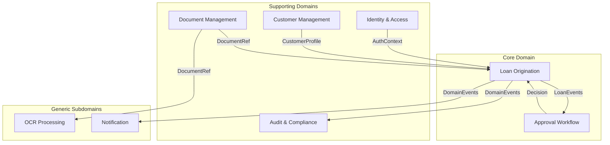

# Bounded Context Design — DDD Context Map

## Context Map Overview

---

## 1. Identity & Access (IAM) — Supporting Domain

| Aspect | Detail |
|---|---|
| **Responsibilities** | User registration, authentication (JWT), authorization (RBAC), session management |
| **Entities** | `User`, `Role` (enum: `CUSTOMER`, `LOAN_OFFICER`, `MANAGER`, `ADMINISTRATOR`), `Permission` (constants class), `RolePermissionRegistry` (role→permission mapping), `RefreshToken`, `UserId` (VO), `EmailAddress` (VO) |
| **Public Interface** | `AuthenticationPort.authenticate(token)`, `UserQueryPort.findById(id)` |
| **Events Published** | `UserRegisteredEvent`, `UserSuspendedEvent` |
| **Microservice Candidacy** | First to extract. Minimal domain coupling, well-defined API. |

---

## 2. Customer Management — Supporting Domain

| Aspect | Detail |
|---|---|
| **Responsibilities** | Customer profiles, employer info, salary tracking, KYC status, eligibility pre-checks |
| **Entities** | `Customer` (aggregate root), `PersonalInfo` (VO), `EmploymentInfo` (VO), `NationalId` (VO), `PhoneNumber` (VO), `EmailAddress` (VO) |
| **Public Interface** | `CustomerQueryPort.findByUserId(id)`, `CustomerQueryPort.checkEligibility(id)` |
| **Events Published** | `CustomerVerifiedEvent`, `CustomerProfileUpdatedEvent` |
| **Microservice Candidacy** | Second to extract |

---

## 3. Loan Origination — CORE DOMAIN

> Loan Origination is the core domain of the platform and is responsible for enforcing lending business rules. To maintain domain integrity, loan lifecycle transitions, eligibility policies, repayment calculations, and interest computations are owned by the Loan domain and must not be implemented in controllers, persistence adapters, or external services.

| Aspect | Detail |
|---|---|
| **Responsibilities** | Loan application lifecycle, product definition, eligibility, disbursement, repayment, interest/fee calculation, state machine |
| **Entities** | `LoanApplication` (aggregate root), `LoanProduct`, `Disbursement`, `RepaymentSchedule`, `Money` (VO), `LoanTerm` (VO), `InterestRate` (VO), `RejectionReason` (VO) |
| **State Machine** | `DRAFT → SUBMITTED → UNDER_REVIEW → PENDING_APPROVAL → APPROVED → DISBURSED → COMPLETED` (also `→ REJECTED`, `→ CANCELLED`) |
| **Public Interface** | `LoanApplicationPort.submit()`, `.getApplication()`, `.listApplications()` |
| **Events Published** | `LoanSubmittedEvent` (carries: loanId, customerId, productId, requestedAmount, submittedAt), `LoanReviewStartedEvent`, `LoanSentForApprovalEvent`, `LoanApprovedEvent`, `LoanRejectedEvent`, `LoanCancelledEvent`, `LoanDisbursedEvent`, `LoanCompletedEvent` |
| **Microservice Candidacy** | LAST to extract |

---

## 4. Approval Workflow — Core Domain

| Aspect | Detail |
|---|---|
| **Responsibilities** | Multi-level approval chains, approval rules engine (amount thresholds), delegation, escalation, SLA tracking |
| **Entities** | `ApprovalRequest` (aggregate root), `ApprovalStep`, `ApprovalRule`, `UserId` (VO), `RejectionReason` (VO) |
| **Public Interface** | `ApprovalPort.createRequest()`, `.submitDecision()`, `.getStatus()` |
| **Listens To** | `LoanSubmittedEvent` → creates approval request (event carries all needed data — no sync callback to Loan) |
| **Events Published** | `ApprovalCompletedEvent` → Loan module updates status, `ApprovalPendingEvent` |
| **Microservice Candidacy** | Can extract with or separate from Loan |

---

## 5. Document Management — Supporting Domain

| Aspect | Detail |
|---|---|
| **Responsibilities** | Upload, storage, metadata, versioning, type classification (ID card, payslip, contract), storage abstraction (local → S3) |
| **Entities** | `Document` (aggregate root), `StorageReference` (VO), `DocumentType` enum |
| **Public Interface** | `DocumentPort.upload()`, `.getMetadata()`, `.download()`, `.findByLoan()` |
| **Events Published** | `DocumentUploadedEvent`, `DocumentVerifiedEvent` |
| **Microservice Candidacy** | Self-contained, good extraction target |

---

## 6. OCR Processing — Generic Subdomain (Separate Python Service)

> NOT a Java module. This is a Python FastAPI service. Java side contains only a thin REST client adapter.

| Aspect | Detail |
|---|---|
| **Responsibilities** | Vietnamese TrOCR inference, document text extraction, field parsing |
| **Java Adapter** | `OcrProcessingPort.submitForProcessing(docId)`, `.getResult(jobId)` |
| **Python Service** | FastAPI + TrOCR model, async workers |
| **Microservice Candidacy** | Already separate by design |

---

## 7. Audit & Compliance — Supporting (Cross-Cutting)

| Aspect | Detail |
|---|---|
| **Responsibilities** | Immutable audit event logging, regulatory compliance, data retention, user action tracking |
| **Entities** | `AuditEvent` (append-only, NEVER updated) with JSONB payload for state snapshots |
| **Integration** | Consumes ALL domain events via `@ApplicationModuleListener`. Never publishes. Terminal consumer. Events are guaranteed at-least-once via the Event Publication Registry — the `event_publication` table records each event atomically with the originating business transaction. If the JVM crashes before a listener completes, the event is replayed on restart. |
| **Microservice Candidacy** | Remain within the monolith by default. Extraction is possible for large-scale compliance, archival, or regulatory workloads but is not expected within the current platform scope. |

---

## 8. Notification — Generic Subdomain (Future Phase 3+)

| Aspect | Detail |
|---|---|
| **Responsibilities** | Email, SMS (future), in-app notifications, template management |
| **Entities** | `Notification`, `NotificationTemplate` |
| **Consumes** | `LoanApprovedEvent`, `LoanDisbursedEvent`, `ApprovalPendingEvent` |
| **Microservice Candidacy** | Trivial to extract, fully event-driven |

---

## Communication Rules Summary

| Type | Allowed | Forbidden |
|---|---|---|
| **Sync** | IAM→Any (auth), Loan→Customer (eligibility) | Direct entity imports across modules |
| **Async** | All domain events via Spring `ApplicationEventPublisher` | Direct JPA repo access across modules |
| **Data** | Each module owns its tables exclusively | Shared tables, cross-module JOINs |
| **Reliability** | Spring Modulith Event Publication Registry (outbox) | Rolling your own outbox table; relying on in-memory delivery alone |

> **Approval ↔ Loan coupling is fully event-driven.** `LoanSubmittedEvent` carries sufficient context (amount, product, customer) for Approval to create approval requests without calling back to the Loan module. `ApprovalCompletedEvent` notifies Loan of the decision. No sync calls between these modules.

> **Event delivery is transactional, not fire-and-forget.**
> `spring-modulith-events-jdbc` writes every published event to the `event_publication`
> table within the same database transaction as the business operation. A listener marks
> its row complete only after successful processing. Incomplete rows are replayed on
> application restart. All `@ApplicationModuleListener` consumers must therefore be
> **idempotent** — they may be called more than once for the same event under failure
> conditions.
