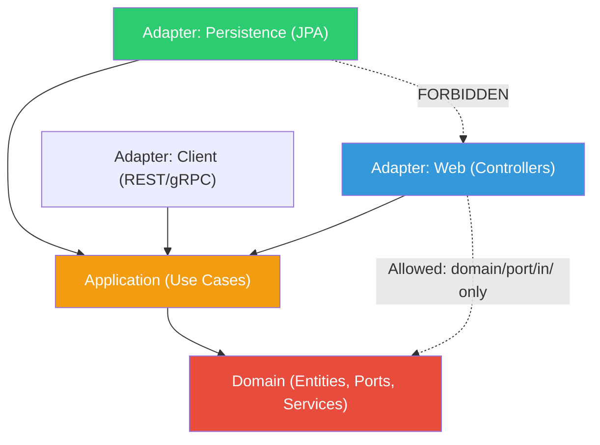

# Dependency Rules & Architecture Enforcement

## Layer Dependency Rules (Within Each Module)



> Controllers MAY depend on `domain/port/in/` interfaces (use case ports). Controllers MUST NOT depend on `domain/model/`, `domain/service/`, or `domain/port/out/`.

| Rule | From | To | Allowed? |
|---|---|---|---|
| 1 | Domain | Anything | NO - Domain has ZERO outward dependencies |
| 2 | Application | Domain | YES |
| 3 | Application | Infrastructure | NO |
| 4 | Infrastructure (adapters) | Application | YES - (implements ports) |
| 5 | Infrastructure (adapters) | Domain | YES - (reads domain models for mapping) |
| 6 | Controller → Use Case | Via Port interface | YES |
| 7 | Controller → Entity directly | — | NO - Controllers use DTOs only |

### The Rule
> **Dependencies point inward.** Domain knows nothing about the outside world. Application knows Domain. Infrastructure knows both but implements contracts defined by inner layers.

---

## Module Communication Rules

### Allowed Patterns

```java
// PATTERN 1: Sync — Call public port interface
// Loan module calling Customer module
// loan/domain/port/out/CustomerQueryPort.java
public interface CustomerQueryPort {
    Optional<CustomerSummaryDto> findById(CustomerId id);
}

// customer/infrastructure/.../CustomerModuleAdapter.java
@Component
public class CustomerModuleAdapter implements CustomerQueryPort {
    private final CustomerQueryService customerQueryService; // Customer's own service
    // ...
}
```

```java
// PATTERN 2: Async — Spring ApplicationEvents
// loan/application/service/SubmitLoanService.java
eventPublisher.publishEvent(new LoanSubmittedEvent(loanId, customerId));

// approval/infrastructure/listener/LoanEventListener.java
@Component
public class LoanEventListener {
    // @ApplicationModuleListener ensures the listener runs after the publishing transaction commits,
    // preventing listeners from seeing uncommitted data.
    @ApplicationModuleListener
    public void onLoanSubmitted(LoanSubmittedEvent event) {
        approvalService.createApprovalRequest(event.loanId());
    }
}
```

### Forbidden Anti-Patterns

```java
// ANTI-PATTERN 1: Direct entity import across modules
// loan/application/service/LoanService.java
import com.lending.platform.customer.domain.model.Customer; // FORBIDDEN!

// ANTI-PATTERN 2: Direct JPA repo access across modules
// loan/application/service/LoanService.java
@Autowired CustomerJpaRepository customerRepo; // FORBIDDEN!

// ANTI-PATTERN 3: Shared JPA entities
// Loan entity with @ManyToOne to Customer entity // FORBIDDEN!

// ANTI-PATTERN 4: Controller calling repository directly
// loan/infrastructure/web/LoanController.java
@Autowired LoanRepository loanRepo; // FORBIDDEN! Must go through use case port

// ANTI-PATTERN 5: Domain depending on Spring
// loan/domain/model/LoanApplication.java
@Entity @Table // FORBIDDEN in domain layer — JPA annotations go on infra JPA entities

// ANTI-PATTERN 6: Circular module dependency
// Loan → Customer AND Customer → Loan // FORBIDDEN! Use events to break cycles

// ANTI-PATTERN 7: Transaction spanning modules
@Transactional
public void crossModuleOperation() {
    loanService.approve(...);
    customerService.updateStatus(...); // FORBIDDEN! Different bounded context
}
```

---

## Enforcement Strategies

### 1. Spring Modulith Verification (Primary)

```java
@Test
void verifiesModularStructure() {
    ApplicationModules.of(LendingPlatformApplication.class).verify();
    // Automatically detects: cycle dependencies, illegal cross-module access
}
```

### 2. ArchUnit Rules (Supplementary)

```java
@AnalyzeClasses(packages = "com.lending.platform")
class ArchitectureRulesTest {

    // Rule: Domain layer must not depend on Spring
    @ArchTest
    static final ArchRule domainMustNotDependOnSpring =
        noClasses().that().resideInAPackage("..domain..")
            .should().dependOnClassesThat()
            .resideInAnyPackage("org.springframework..");

    // Rule: Domain models must not depend on JPA
    @ArchTest
    static final ArchRule domainModelMustNotUseJpa =
        noClasses().that().resideInAPackage("..domain.model..")
            .should().dependOnClassesThat()
            .resideInAnyPackage("jakarta.persistence..")
            .because("Domain models must not depend on JPA — use JPA entities in infrastructure");

    // Rule: Domain services must not use Spring annotations
    @ArchTest
    static final ArchRule domainServicesMustBePureJava =
        noClasses().that().resideInAPackage("..domain.service..")
            .should().beAnnotatedWith("org.springframework.stereotype.Service")
            .orShould().beAnnotatedWith("org.springframework.transaction.annotation.Transactional")
            .because("Domain services must be pure Java — Spring annotations belong in application layer");

    // Rule: Domain must not depend on infrastructure
    @ArchTest
    static final ArchRule domainMustNotDependOnInfra =
        noClasses().that().resideInAPackage("..domain..")
            .should().dependOnClassesThat()
            .resideInAPackage("..infrastructure..");

    // Rule: Application must not depend on infrastructure
    @ArchTest
    static final ArchRule applicationMustNotDependOnInfra =
        noClasses().that().resideInAPackage("..application..")
            .should().dependOnClassesThat()
            .resideInAPackage("..infrastructure..");

    // Rule: Controllers must only access use case ports (+ security + OpenAPI annotations)
    @ArchTest
    static final ArchRule controllersMustUsePortsOnly =
        classes().that().resideInAPackage("..adapter.in.web..")
            .should().onlyDependOnClassesThat()
            .resideInAnyPackage(
                "..application.dto..", "..domain.port.in..",
                "..application.mapper..",
                "..shared..", "java..", "jakarta..",
                "org.springframework.web..", "org.springframework.http..",
                "org.springframework.security.access.prepost..",  // @PreAuthorize
                "org.springframework.security.core..",             // Authentication
                "io.swagger.v3.oas.annotations.."                  // OpenAPI docs
            );

    // Rule: No circular dependencies between modules
    @ArchTest
    static final ArchRule noCyclicDependencies =
        slices().matching("com.lending.platform.(*)..")
            .should().beFreeOfCycles();

    // Rule: Prevent SQL injection via string concatenation in persistence layer
    @ArchTest
    static final ArchRule noNativeQueryStringConcat =
        noClasses().that().resideInAPackage("..persistence..")
            .should().callMethod(String.class, "concat", String.class)
            .orShould().callMethod(StringBuilder.class, "append", String.class)
            .because("Repository classes must not build queries via string concatenation");

    // Rule: Enforce Spring Boot 4 @MockitoBean over deprecated @MockBean
    @ArchTest
    static final ArchRule enforceModernMockitoBean =
        noClasses().should().beAnnotatedWith("org.springframework.boot.test.mock.mockito.MockBean")
            .because("Use @MockitoBean from org.springframework.test.context.bean.override.mockito in Spring Boot 4.0");

    // Rule: Enforce JUnit 5 over JUnit 4
    @ArchTest
    static final ArchRule enforceJUnit5 =
        noMethods().should().beAnnotatedWith("org.junit.Test")
            .because("Use org.junit.jupiter.api.Test (JUnit 5) instead of JUnit 4");
}
```

### 3. CI Pipeline Enforcement

```yaml
# .github/workflows/ci.yml
- name: Architecture Tests
  run: mvn test -Dtest="ArchitectureRulesTest,ModulithStructureTest"
  # Fail the build if any architectural rule is violated
```

### 4. Package Visibility (Java Modules)

Use `package-info.java` with Spring Modulith `@ApplicationModule` to control what each module exposes:

```java
// loan/package-info.java
@org.springframework.modulith.ApplicationModule(
    allowedDependencies = {"customer", "shared"}
)
package com.lending.platform.loan;

// approval/package-info.java — NO sync dependency on Loan; receives events only
@org.springframework.modulith.ApplicationModule(
    allowedDependencies = {"shared"}
)
package com.lending.platform.approval;

// identity/package-info.java
@org.springframework.modulith.ApplicationModule(
    allowedDependencies = {"shared"}
)
package com.lending.platform.identity;

// customer/package-info.java
@org.springframework.modulith.ApplicationModule(
    allowedDependencies = {"shared"}
)
package com.lending.platform.customer;

// document/package-info.java
@org.springframework.modulith.ApplicationModule(
    allowedDependencies = {"shared"}
)
package com.lending.platform.document;

// audit/package-info.java — receives events via @ApplicationModuleListener (no explicit dependency)
@org.springframework.modulith.ApplicationModule(
    allowedDependencies = {"shared"}
)
package com.lending.platform.audit;
```

> The `audit` module consumes events from ALL modules via `@ApplicationModuleListener`. Spring Modulith routes events without requiring explicit `allowedDependencies` declarations for event sources.

---

### Logging Rule: No PII in Log Statements

```java
// FORBIDDEN — PII in logs
log.info("Customer registered: {}", customer.getNationalId());
log.info("Processing loan for {}", customer.getFullName());

// CORRECT — Use IDs only, never PII
log.info("Customer registered", kv("customerId", customer.getId()));
log.info("Processing loan", kv("loanId", loanId), kv("customerId", customerId));
```

---

## Summary Matrix

| Source Module | Can Call (Sync) | Can Listen (Async) | Cannot Access |
|---|---|---|---|
| **Loan** | Customer, Document | — | Approval internals, IAM internals |
| **Approval** | — (no sync calls) | LoanSubmittedEvent | Customer, Document, Loan internals |
| **Document** | — | — | Loan internals, Customer |
| **Audit** | — | ALL domain events | All module internals |
| **Notification** | — | ALL domain events | All module internals |
| **IAM** | — | — | All business modules |


> **Approval receives all needed data from `LoanSubmittedEvent`** (loan amount, product, customer). It never calls Loan synchronously, eliminating bidirectional coupling.
