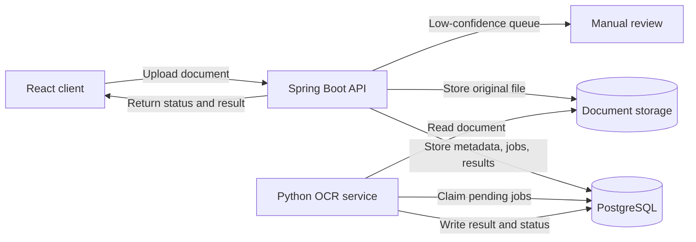
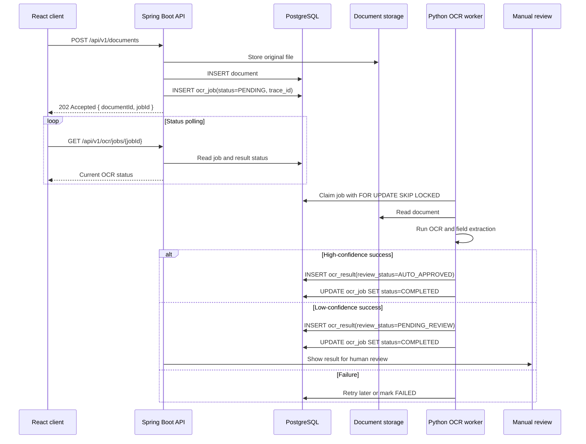

# OCR Processing Architecture
Status: Planned for Phase 2

## Purpose

Phase 2 adds asynchronous OCR processing for uploaded applicant documents. The Spring Boot API remains the public entry point and system of record. A separate Python OCR service owns model execution and document extraction. PostgreSQL stores the OCR jobs, results, retries, and review status.

The design favors simple operations over extra infrastructure. OCR work is expected to be moderate volume, bursty, and not latency-critical enough to justify a separate broker or gRPC service boundary at this stage.

---

## Main Decisions

| Decision | Phase 2 direction | Rationale |
|---|---|---|
| API style | REST over gRPC | REST is easier to debug, test, and operate with Spring Boot and FastAPI. gRPC can be revisited if streaming or much higher throughput becomes a real requirement. |
| OCR runtime | Separate Python service | OCR libraries, model loading, and GPU/CPU tuning fit better in Python and should not be coupled to the Spring Boot API process. |
| Job processing | PostgreSQL-backed queue | Jobs need durability, retry state, and simple polling. PostgreSQL already provides the locking primitives needed for safe worker concurrency. |
| Execution model | Asynchronous | Uploads should return quickly with a job id. OCR workers process documents outside the web request lifecycle. |
| Low confidence | Manual review | Results below the confidence threshold are stored but marked for review before downstream use. |
| Log correlation | `trace_id` | The API stores a trace id on each job so Python worker logs can be correlated with the original request. |

Kafka or RabbitMQ are intentionally deferred. For the expected Phase 2 workload, PostgreSQL-backed job processing is simpler to operate and sufficient for asynchronous OCR execution.

---

## Service Topology



The Python service may expose lightweight REST endpoints for health checks and operational tooling, but normal OCR execution is driven by database jobs rather than synchronous API calls from Spring Boot.

---

## OCR Job States

| State | Meaning |
|---|---|
| `PENDING` | Job is queued and available for a worker. |
| `PROCESSING` | A worker has claimed the job and holds a time-limited lease. |
| `COMPLETED` | OCR completed and a result row was stored. |
| `FAILED` | The job exhausted retries or hit a non-retryable error. |

Review state is tracked on the OCR result, not as a job state:

| Review state | Meaning |
|---|---|
| `AUTO_APPROVED` | Confidence is high enough for normal downstream processing. |
| `PENDING_REVIEW` | Confidence is below the threshold and needs a human check. |
| `REVIEWED` | A reviewer accepted or corrected the result. |

---

## Database Shape

The exact migration files can be written when Phase 2 is implemented. The important part is the shape of the tables and indexes.

```sql
CREATE TABLE ocr_jobs (
    id UUID PRIMARY KEY DEFAULT gen_random_uuid(),
    document_id UUID NOT NULL REFERENCES documents(id),
    status VARCHAR(20) NOT NULL DEFAULT 'PENDING',
    priority INT NOT NULL DEFAULT 0,
    attempts INT NOT NULL DEFAULT 0,
    max_attempts INT NOT NULL DEFAULT 3,
    error_message TEXT,
    locked_until TIMESTAMP,
    worker_id VARCHAR(50),
    document_type VARCHAR(50) NOT NULL DEFAULT 'UNKNOWN',
    trace_id VARCHAR(100),
    created_at TIMESTAMP NOT NULL DEFAULT NOW(),
    updated_at TIMESTAMP NOT NULL DEFAULT NOW()
);

CREATE INDEX idx_ocr_jobs_claim
    ON ocr_jobs (status, priority DESC, created_at)
    WHERE status = 'PENDING';

CREATE TABLE ocr_results (
    id UUID PRIMARY KEY DEFAULT gen_random_uuid(),
    job_id UUID NOT NULL REFERENCES ocr_jobs(id),
    document_id UUID NOT NULL,
    extracted_text TEXT,
    structured_data JSONB,
    confidence DECIMAL(5,4),
    review_status VARCHAR(20) NOT NULL DEFAULT 'AUTO_APPROVED',
    corrected_data JSONB,
    reviewed_by VARCHAR(50),
    reviewed_at TIMESTAMP,
    processing_ms INT,
    model_version VARCHAR(50),
    created_at TIMESTAMP NOT NULL DEFAULT NOW()
);

CREATE INDEX idx_ocr_results_data
    ON ocr_results USING GIN (structured_data);

CREATE INDEX idx_ocr_results_pending_review
    ON ocr_results (created_at)
    WHERE review_status = 'PENDING_REVIEW';
```

---

## Job Claiming

Workers claim one job at a time with `FOR UPDATE SKIP LOCKED`. This lets multiple OCR workers poll the same table without taking the same job.

```sql
UPDATE ocr_jobs
SET status = 'PROCESSING',
    worker_id = :worker_id,
    locked_until = NOW() + INTERVAL '5 minutes',
    attempts = attempts + 1,
    updated_at = NOW()
WHERE id = (
    SELECT id
    FROM ocr_jobs
    WHERE status = 'PENDING'
      AND attempts < max_attempts
    ORDER BY priority DESC, created_at ASC
    FOR UPDATE SKIP LOCKED
    LIMIT 1
)
RETURNING *;
```

Once claimed, the worker reads the document from storage, runs OCR, validates the output, writes `ocr_results`, and moves the job to `COMPLETED` or `FAILED`.

---

## Upload-to-Result Flow



The upload endpoint does not wait for OCR. It creates the document and job records, returns `202 Accepted`, and lets the client poll for progress.

---

## Failure Handling

| Scenario | Handling |
|---|---|
| Worker crashes mid-job | The job stays `PROCESSING` until `locked_until` expires, then a scheduler resets it to `PENDING` if attempts remain. |
| Python service is down | Jobs remain `PENDING` and are picked up when the service recovers. |
| Transient OCR/runtime error | Retry while `attempts < max_attempts`; keep the latest error message on the job. |
| Corrupt or unsupported file | Mark `FAILED` without repeated retries. |
| Low-confidence extraction | Store the result with `review_status = 'PENDING_REVIEW'`; do not treat it as a processing failure. |
| Database connection loss | Worker backs off and reconnects; uncommitted claims are not retained. |
| Duplicate upload/job request | Use idempotency at the document/job creation layer to avoid duplicate OCR jobs for the same document. |

The retry policy should be conservative: retry infrastructure and timeout failures, but fail fast on files that cannot be decoded or formats the OCR service does not support.

---

## Trace Correlation

Spring Boot creates or propagates a `trace_id` when the document is uploaded and stores it on `ocr_jobs`. Python workers include that same `trace_id` in structured logs when they claim and process the job.

This gives one correlation key across:

- the original upload request;
- job creation and polling in Spring Boot;
- OCR worker logs;
- result persistence and manual review events.

---

## Operational Notes

- OCR workers should run with a small, configurable concurrency limit so model execution does not exhaust CPU, memory, or GPU resources.
- The claim lease should be longer than normal OCR processing time, with room for slower documents.
- The confidence threshold can start at `0.70` and should be tuned with real document samples.
- Historical reprocessing can be added later by re-queuing completed jobs below a chosen confidence threshold, but it is not required for the initial Phase 2 path.
