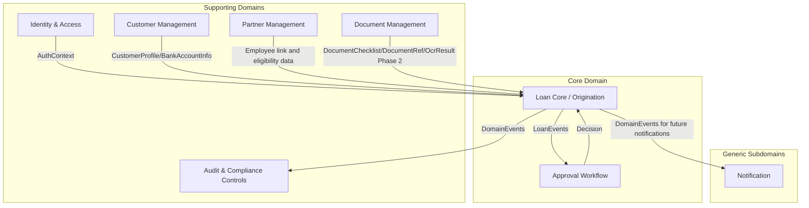

# Bounded Context Design — DDD Context Map

## Context Map Overview

> Public Interface entries refer to application/public ports exposed by a module. They are not domain-owned ports.

---

## 1. Identity & Access (IAM) — Supporting Domain

| Aspect | Detail |
|---|---|
| **Responsibilities** | User registration, authentication (JWT), authorization (RBAC), users, roles, refresh token/session management |
| **Entities** | `User`, `Role` (enum: `CUSTOMER`, `LOAN_OFFICER`, `APPROVER`, `ACCOUNTING_OFFICER`, `BACK_OFFICE_ADMIN`), `Permission` (constants class), `RolePermissionRegistry` (role→permission mapping), `RefreshToken`, `UserId` (VO), `EmailAddress` (VO) |
| **Public Interface** | `AuthenticationPort.authenticate(token)`, `UserQueryPort.findById(id)` |
| **Events Published** | `UserRegisteredEvent`, `UserSuspendedEvent` |
| **Microservice Candidacy** | First to extract. Minimal domain coupling, well-defined API. |

---

## 2. Customer Management — Supporting Domain

| Aspect | Detail |
|---|---|
| **Responsibilities** | Customer profile, verification status, bank account information, sensitive customer data protection |
| **Entities** | `Customer` (aggregate root), `CustomerProfile`, `PersonalInfo` (VO), `EmploymentInfo` (VO), `BankAccountInfo` (VO), `NationalId` (VO), `PhoneNumber` (VO), `EmailAddress` (VO), `VerificationStatus` |
| **Public Interface** | `CustomerQueryPort.findByUserId(id)`, `CustomerQueryPort.getBankAccountInfo(id)`, `CustomerProfilePort.updateVerificationStatus(id)` |
| **Events Published** | `CustomerVerifiedEvent`, `CustomerProfileUpdatedEvent` |
| **Microservice Candidacy** | Future extraction candidate. Keep customer data protection and ownership boundaries explicit. |

---

## 3. Partner Management — Supporting Domain

| Aspect | Detail |
|---|---|
| **Responsibilities** | Partner Companies, Partner Employees, monthly employee imports, import batches, reusable customer employee links for Salary Advance eligibility |
| **Entities** | `PartnerCompany` (aggregate root), `PartnerEmployee`, `PartnerEmployeeImportBatch`, `CustomerPartnerEmployeeLink`, `EmployeeEligibilityData` |
| **Public Interface** | `PartnerQueryPort.findCompany(id)`, `PartnerEmployeePort.verifyEmployee(...)`, `CustomerPartnerEmployeeLinkPort.getActiveLink(customerId, partnerCompanyId)`, `PartnerImportPort.importMonthlyEmployees(...)` |
| **Events Published** | `PartnerCompanyActivatedEvent`, `PartnerEmployeeImportCompletedEvent`, `CustomerPartnerEmployeeLinkedEvent`, `CustomerPartnerEmployeeLinkSuspendedEvent` |
| **Microservice Candidacy** | Future extraction candidate. In MVP it supports the Loan Core for Salary Advance policy checks. |

Partner Management owns Partner Company and Partner Employee source data. It also owns the reusable customer-to-partner-employee eligibility link because that link answers whether a customer is verified as an employee of a partner company. Loan Core may reference the link by ID and consume eligibility data through application/public ports, but it must not own Partner Employee records.

---

## 4. Loan Core / Origination — CORE DOMAIN

> Loan Core / Origination is the generic lending core of the platform and is responsible for enforcing lending business rules. To maintain domain integrity, loan lifecycle transitions, eligibility policies, repayment calculations, and interest computations are owned by the Loan domain and must not be implemented in controllers, persistence adapters, or external services.

> Salary Advance, Unsecured Consumer Loan, and Collateral Loan are product behaviors inside this context, not separate top-level bounded contexts. Product-specific behavior is handled by loan product policies and strategies. Salary Advance uses Partner Management data for employee eligibility, owns the Salary Advance limit state and usage workflow, and records an application-level verification snapshot. Unsecured Consumer Loan and Collateral Loan use the same shared loan lifecycle with streamlined product-specific review rules.

| Aspect | Detail |
|---|---|
| **Responsibilities** | Generic loan application lifecycle, product definition, `LoanProductPolicy` selection, product-specific policies/strategies, eligibility, Salary Advance limit state and usage, offer terms, manual disbursement confirmation state, repayment schedule, state machine |
| **Entities** | `LoanApplication` (aggregate root), `LoanProduct`, `LoanProductPolicy`, `SalaryAdvanceLimit`, `SalaryAdvanceLimitMovement`, `SalaryAdvanceVerification`, `LoanAccount`, `OfferTerms`, `DisbursementRecord`, `RepaymentSchedule`, `ProductVerificationResult`, `Money` (VO), `LoanTerm` (VO), `InterestRate` (VO), `RejectionReason` (VO) |
| **State Machine** | `DRAFT → SUBMITTED → VERIFICATION_PENDING/DOCUMENTS_PENDING → UNDER_REVIEW → APPROVAL_PENDING → APPROVED → CUSTOMER_ACCEPTANCE_PENDING → CONTRACT_PENDING → DISBURSEMENT_PENDING → DISBURSED → SETTLED/CLOSED` (also `→ RETURNED_FOR_REVISION`, `→ RETURNED_TO_REVIEW`, `→ REJECTED`, `→ CANCELLED`, `→ EXPIRED`) |
| **Public Interface** | `LoanApplicationPort.submit()`, `.getApplication()`, `.listApplications()`, `SalaryAdvanceLimitPort.getCurrentLimit()`, `.startApplicationUsingLimit()` |
| **Events Published** | `LoanSubmittedEvent` (carries: loanId, customerId, productId, requestedAmount, submittedAt), `SalaryAdvanceLimitReservedEvent`, `SalaryAdvanceLimitReleasedEvent`, `LoanReviewStartedEvent`, `LoanSentForApprovalEvent`, `LoanApprovedEvent`, `LoanRejectedEvent`, `LoanCancelledEvent`, `LoanDisbursedEvent`, `LoanCompletedEvent` |
| **Microservice Candidacy** | LAST to extract |

Loan Core owns the current Salary Advance limit because it is lending state: total, used, reserved, available, status, reservation, disbursement usage, repayment release, suspension, and disablement. The application-level `SalaryAdvanceVerification` snapshot belongs to the Salary Advance loan application workflow. It stores the employee link and limit values used for one application, but it is not the reusable employee relationship and not the current limit account.

---

## 5. Approval Workflow — Core Domain

| Aspect | Detail |
|---|---|
| **Responsibilities** | Loan Officer review, Approver decision, controlled review and approval, maker-checker controls, approval decision trail |
| **Entities** | `ReviewRecommendation`, `ApprovalDecision`, `ApprovalRequest` (aggregate root), `ApprovalStep`, `UserId` (VO), `RejectionReason` (VO) |
| **Public Interface** | `ApprovalPort.createReview()`, `.submitRecommendation()`, `.submitDecision()`, `.getDecisionTrail()` |
| **Listens To** | `LoanSentForApprovalEvent` → creates approval decision work item after Loan Officer review |
| **Events Published** | `LoanReviewRecommendedEvent`, `ApprovalDecisionRecordedEvent` → Loan module updates status |
| **Microservice Candidacy** | Future extraction candidate. Keep with the modular monolith for MVP controlled review and approval. |

---

## 6. Document Management — Supporting Domain

| Aspect | Detail |
|---|---|
| **Responsibilities** | Document upload, storage, metadata, checklist management, manual document review, replacement, waiver, readiness, and planned OCR-assisted processing |
| **Entities** | `Document` (aggregate root), `DocumentChecklist`, `DocumentChecklistItem`, `OcrJob`, `OcrResult`, `StorageReference` (VO), `DocumentType` enum |
| **Public Interface** | `DocumentPort.upload()`, `.getMetadata()`, `.download()`, `.findByLoan()` |
| **Events Published** | `DocumentUploadedEvent`, `DocumentReviewedEvent`, `DocumentChecklistReadyEvent` |
| **Microservice Candidacy** | Future extraction candidate. Keep checklist, review, and readiness controls in the modular monolith for MVP. |

---

### OCR-Assisted Processing Boundary

> OCR-assisted document processing is a planned Phase 2 capability within Document Management, not a separate top-level bounded context. The core MVP remains manual-review based, and manual document review remains authoritative for checklist readiness, replacement, waiver, and acceptance decisions.

| Aspect | Detail |
|---|---|
| **Responsibilities** | OCR-assisted document processing, Vietnamese TrOCR inference, document text extraction, field parsing |
| **Application/Output Port** | `OcrProcessingPort.submitForProcessing(docId)`, `.getResult(jobId)` |
| **Python Service** | FastAPI + TrOCR model and async workers when the OCR service is enabled |
| **Core MVP Boundary** | Manual upload, checklist handling, manual review, replacement, waiver, and readiness checks work without OCR. |
| **Phase 2 Boundary** | OCR is assistive only; checklist readiness, replacement, waiver, and acceptance remain controlled by Document Management and manual review. |

---

## 7. Audit & Compliance Controls — Supporting (Cross-Cutting)

| Aspect | Detail |
|---|---|
| **Responsibilities** | Immutable audit events, business action history, status transition history, compliance-oriented audit trail |
| **Entities** | `AuditEvent` (append-only, NEVER updated) with JSONB payload for state snapshots, `BusinessActionHistory`, `StatusTransitionHistory` |
| **Integration** | Consumes important domain events via `@ApplicationModuleListener`. Never publishes. Terminal consumer. Events are guaranteed at-least-once via the Event Publication Registry — the `event_publication` table records each event atomically with the originating business transaction. If the JVM crashes before a listener completes, the event is replayed on restart. |
| **Microservice Candidacy** | Remain within the monolith by default. Extraction is possible for large-scale compliance, archival, or regulatory workloads but is not expected within the current platform scope. |

---

## 8. Notification — Generic Subdomain (Optional Later)

| Aspect | Detail |
|---|---|
| **Responsibilities** | Future email, SMS, in-app notifications, template management |
| **Entities** | `Notification`, `NotificationTemplate` |
| **Consumes** | `LoanApprovedEvent`, `LoanDisbursedEvent`, `ApprovalPendingEvent` |
| **MVP Boundary** | Optional later; not required for the MVP core workflow. |
| **Microservice Candidacy** | Future extraction candidate if notification volume or channel complexity requires it. |

---

## Communication Rules Summary

| Type | Allowed | Forbidden |
|---|---|---|
| **Sync** | IAM→Any (auth), Loan→Customer (profile/bank account checks), Loan→Partner (Salary Advance eligibility data), Loan/Approval→Document (checklist readiness) | Direct entity imports across modules |
| **Async** | All domain events via Spring `ApplicationEventPublisher` | Direct JPA repo access across modules |
| **Data** | Each module owns its tables exclusively | Shared tables, cross-module JOINs |
| **Reliability** | Spring Modulith Event Publication Registry (outbox) | Rolling your own outbox table; relying on in-memory delivery alone |

> **Approval ↔ Loan coordination is event-driven for state changes.** Loan sends sufficient application context and Loan Officer recommendation when an approval decision is needed. Approval publishes the recorded decision so Loan can update the application lifecycle. No direct entity imports are allowed between these modules.

> **Salary Advance eligibility and limit coordination uses clear ownership.** Partner owns Partner Company, Partner Employee, and the reusable customer employee link. Loan owns Salary Advance limit state, limit movements, and application verification snapshots. Cross-context references use IDs and application/public ports, not shared JPA entity ownership.

> **Event delivery is transactional, not fire-and-forget.**
> `spring-modulith-events-jdbc` writes every published event to the `event_publication`
> table within the same database transaction as the business operation. A listener marks
> its row complete only after successful processing. Incomplete rows are replayed on
> application restart. All `@ApplicationModuleListener` consumers must therefore be
> **idempotent** — they may be called more than once for the same event under failure
> conditions.
