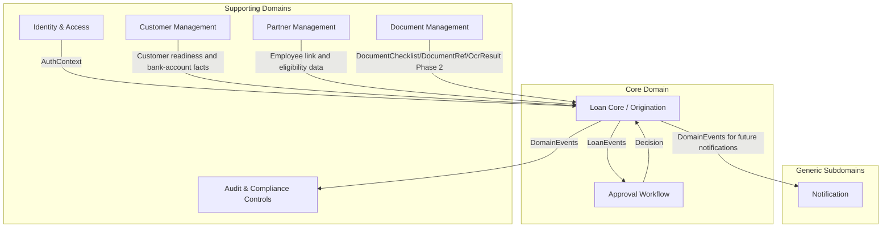

# Bounded Context Design — DDD Context Map

## Context Map Overview

> Public Interface entries refer to application/public ports exposed by a module. They are not domain-owned ports.

```mermaid
graph TB
    subgraph Core["Core Domain"]
        LOAN["Loan Core / Origination"]
        APPROVAL["Approval Workflow"]
    end
    subgraph Supporting["Supporting Domains"]
        IAM["Identity & Access"]
        CUSTOMER["Customer Management"]
        PARTNER["Partner Management"]
        DOC["Document Management"]
        AUDIT["Audit & Compliance Controls"]
    end
    subgraph Generic["Generic Subdomains"]
        NOTIF["Notification"]
    end
    IAM -->|AuthContext| LOAN
    CUSTOMER -->|Customer readiness and bank-account facts| LOAN
    PARTNER -->|Employee link and eligibility data| LOAN
    LOAN -->|LoanEvents| APPROVAL
    APPROVAL -->|Decision| LOAN
    DOC -->|DocumentChecklist/DocumentRef/OcrResult Phase 2| LOAN
    LOAN -->|DomainEvents| AUDIT
    LOAN -->|DomainEvents for future notifications| NOTIF
```

---

## 1. Identity & Access (IAM) — Supporting Domain

| Aspect | Detail |
|---|---|
| **Responsibilities** | User registration, authentication (JWT), authorization (RBAC), users, roles, refresh token/session management |
| **Entities** | `User`, `Role` (enum: `CUSTOMER`, `LOAN_OFFICER`, `APPROVER`, `ACCOUNTING_OFFICER`, `BACK_OFFICE_ADMIN`), `Permission` (constants class), `RolePermissionRegistry` (role→permission mapping), `RefreshToken`, `UserId` (VO), `EmailAddress` (VO) |
| **Public Interface** | `AuthenticationPort.authenticate(token)`, `UserQueryPort.findById(id)` |
| **Events Published** | `UserRegisteredEvent`, `UserSuspendedEvent` |
| **Microservice Candidacy** | First to extract. Minimal domain coupling, well-defined API. |

---

## 2. Customer Management — Supporting Domain

| Aspect | Detail |
|---|---|
| **Responsibilities** | Customer profile, verification status, bank account information, sensitive customer data protection |
| **Entities** | `Customer` (aggregate root), value-oriented `CustomerProfile` child, `CustomerBankAccount` child, `VerificationStatus`, `ProfileCompletionStatus`, `CustomerStatus` |
| **Public Interface** | Customer readiness query for lending, primary bank-account readiness query, internal identity-evidence query for Partner verification, own-profile/customer APIs through application input ports |
| **Events Published** | `CustomerVerifiedEvent`, `CustomerProfileUpdatedEvent` |
| **Microservice Candidacy** | Future extraction candidate. Keep customer data protection and ownership boundaries explicit. |

Identity owns the login-to-customer mapping through `users.customer_id`. Customer owns the Customer aggregate, profile, and bank-account data. Do not add a second `customers.user_id` ownership link.

Customer identity references and bank-account numbers are encrypted at rest. Public REST responses must not expose plaintext, ciphertext, fingerprints, or unrestricted evidence. Generic Audit records may contain only closed, PII-safe IDs and status codes.

---

## 3. Partner Management — Supporting Domain

| Aspect | Detail |
|---|---|
| **Responsibilities** | Partner Companies, Partner Employees, monthly employee imports, import batches, reusable customer employee links for Salary Advance eligibility |
| **Entities** | `PartnerCompany` (aggregate root), `PartnerEmployee`, `PartnerEmployeeImportBatch`, `CustomerPartnerEmployeeLink`, `EmployeeEligibilityData` |
| **Public Interface** | `PartnerQueryPort.findCompany(id)`, `PartnerEmployeePort.verifyEmployee(...)`, `CustomerPartnerEmployeeLinkPort.getActiveLink(customerId, partnerCompanyId)`, `PartnerImportPort.importMonthlyEmployees(...)` |
| **Events Published** | `PartnerCompanyActivatedEvent`, `PartnerEmployeeImportCompletedEvent`, `CustomerPartnerEmployeeLinkedEvent`, `CustomerPartnerEmployeeLinkSuspendedEvent` |
| **Microservice Candidacy** | Future extraction candidate. In MVP it supports the Loan Core for Salary Advance policy checks. |

Partner Management owns Partner Company and Partner Employee source data. It also owns the reusable customer-to-partner-employee eligibility link because that link answers whether a customer is verified as an employee of a partner company. Loan Core may reference the link by ID and consume eligibility data through application/public ports, but it must not own Partner Employee records.

---

## 4. Loan Core / Origination — CORE DOMAIN

> Loan Core / Origination is the generic lending core of the platform and is responsible for enforcing lending business rules. To maintain domain integrity, loan lifecycle transitions, eligibility policies, repayment calculations, and interest computations are owned by the Loan domain and must not be implemented in controllers, persistence adapters, or external services.

> Salary Advance, Unsecured Consumer Loan, and Collateral Loan are product behaviors inside this context, not separate top-level bounded contexts. Product-specific behavior is handled by loan product policies and strategies. Salary Advance uses Partner Management data for employee eligibility, owns the Salary Advance limit state and usage workflow, and records an application-level verification snapshot. Unsecured Consumer Loan and Collateral Loan use the same shared loan lifecycle with streamlined product-specific review rules.

| Aspect | Detail |
|---|---|
| **Responsibilities** | Generic loan application lifecycle, product definition, `LoanProductPolicy` selection, product-specific policies/strategies, eligibility, Salary Advance limit state and usage, offer terms, manual disbursement confirmation state, repayment schedule, state machine, Loan Application lifecycle history |
| **Entities** | `LoanApplication` (aggregate root), `LoanProduct`, `LoanProductPolicy`, `SalaryAdvanceLimit`, `SalaryAdvanceLimitMovement`, `SalaryAdvanceVerification`, `LoanApplicationStatusTransition`, `LoanAccount`, `OfferTerms`, `DisbursementRecord`, `RepaymentSchedule`, `ProductVerificationResult`, `Money` (VO), `LoanTerm` (VO), `InterestRate` (VO), `RejectionReason` (VO) |
| **State Machine** | `DRAFT → SUBMITTED → VERIFICATION_PENDING/DOCUMENTS_PENDING → UNDER_REVIEW → APPROVAL_PENDING → APPROVED → CUSTOMER_ACCEPTANCE_PENDING → CONTRACT_PENDING → DISBURSEMENT_PENDING → DISBURSED → SETTLED/CLOSED` (also `→ RETURNED_FOR_REVISION`, `→ RETURNED_TO_REVIEW`, `→ REJECTED`, `→ CANCELLED`, `→ EXPIRED`) |
| **Public Interface** | `LoanApplicationPort.submit()`, `.getApplication()`, `.listApplications()`, `SalaryAdvanceLimitPort.getCurrentLimit()`, `.startApplicationUsingLimit()` |
| **Events Published** | `LoanSubmittedEvent` (carries: loanId, customerId, productId, requestedAmount, submittedAt), `SalaryAdvanceLimitReservedEvent`, `SalaryAdvanceLimitReleasedEvent`, `LoanReviewStartedEvent`, `LoanSentForApprovalEvent`, `LoanApprovedEvent`, `LoanRejectedEvent`, `LoanCancelledEvent`, `LoanDisbursedEvent`, `LoanCompletedEvent` |
| **Microservice Candidacy** | LAST to extract |

Loan Core owns the current Salary Advance limit because it is lending state: total, used, reserved, available, status, reservation, disbursement usage, repayment release, suspension, and disablement. The application-level `SalaryAdvanceVerification` snapshot belongs to the Salary Advance loan application workflow. It stores the employee link and limit values used for one application, but it is not the reusable employee relationship and not the current limit account.

---

## 5. Approval Workflow — Core Domain

| Aspect | Detail |
|---|---|
| **Responsibilities** | Loan Officer review, Approver decision, controlled review and approval, maker-checker controls, approval decision trail |
| **Entities** | `ReviewRecommendation`, `ApprovalDecision`, `ApprovalRequest` (aggregate root), `ApprovalStep`, `UserId` (VO), `RejectionReason` (VO) |
| **Public Interface** | `ApprovalPort.createReview()`, `.submitRecommendation()`, `.submitDecision()`, `.getDecisionTrail()` |
| **Listens To** | `LoanSentForApprovalEvent` → creates approval decision work item after Loan Officer review |
| **Events Published** | `LoanReviewRecommendedEvent`, `ApprovalDecisionRecordedEvent` → Loan module updates status |
| **Microservice Candidacy** | Future extraction candidate. Keep with the modular monolith for MVP controlled review and approval. |

---

## 6. Document Management — Supporting Domain

| Aspect | Detail |
|---|---|
| **Responsibilities** | Document upload, storage, metadata, checklist management, manual document review, replacement, waiver, readiness, and planned OCR-assisted processing |
| **Entities** | `Document` (aggregate root), `DocumentChecklist`, `DocumentChecklistItem`, `OcrJob`, `OcrResult`, `StorageReference` (VO), `DocumentType` enum |
| **Public Interface** | `DocumentPort.upload()`, `.getMetadata()`, `.download()`, `.findByLoan()` |
| **Events Published** | `DocumentUploadedEvent`, `DocumentReviewedEvent`, `DocumentChecklistReadyEvent` |
| **Microservice Candidacy** | Future extraction candidate. Keep checklist, review, and readiness controls in the modular monolith for MVP. |

---

### OCR-Assisted Processing Boundary

> OCR-assisted document processing is a planned Phase 2 capability within Document Management, not a separate top-level bounded context. The core MVP remains manual-review based, and manual document review remains authoritative for checklist readiness, replacement, waiver, and acceptance decisions.

| Aspect | Detail |
|---|---|
| **Responsibilities** | OCR-assisted document processing, Vietnamese TrOCR inference, document text extraction, field parsing |
| **Application/Output Port** | `OcrProcessingPort.submitForProcessing(docId)`, `.getResult(jobId)` |
| **Python Service** | FastAPI + TrOCR model and async workers when the OCR service is enabled |
| **Core MVP Boundary** | Manual upload, checklist handling, manual review, replacement, waiver, and readiness checks work without OCR. |
| **Phase 2 Boundary** | OCR is assistive only; checklist readiness, replacement, waiver, and acceptance remain controlled by Document Management and manual review. |

---

## 7. Audit & Compliance Controls — Supporting (Cross-Cutting)

| Aspect | Detail |
|---|---|
| **Responsibilities** | Immutable audit events, cross-cutting business action history, compliance-oriented audit trail; observational only and not a workflow source of truth |
| **Entities** | `AuditEvent` (append-only, NEVER updated) with JSONB payload for state snapshots |
| **Integration** | Records explicit shared business audit events synchronously through Spring `@EventListener` for the current MVP checkpoint. Audit is a terminal consumer, never commands other modules, and audit failures propagate so the originating business transaction rolls back. The generic `event_publication` table remains a Spring Modulith infrastructure table but is not used as an async audit/outbox design in this checkpoint. |
| **Microservice Candidacy** | Remain within the monolith by default. Extraction is possible for large-scale compliance, archival, or regulatory workloads but is not expected within the current platform scope. |

---

## 8. Notification — Generic Subdomain (Optional Later)

| Aspect | Detail |
|---|---|
| **Responsibilities** | Future email, SMS, in-app notifications, template management |
| **Entities** | `Notification`, `NotificationTemplate` |
| **Consumes** | `LoanApprovedEvent`, `LoanDisbursedEvent`, `ApprovalPendingEvent` |
| **MVP Boundary** | Optional later; not required for the MVP core workflow. |
| **Microservice Candidacy** | Future extraction candidate if notification volume or channel complexity requires it. |

---

## Communication Rules Summary

| Type | Allowed | Forbidden |
|---|---|---|
| **Sync** | IAM→Any (auth), Loan→Customer (profile/bank account checks), Loan→Partner (Salary Advance eligibility data), Loan/Approval→Document (checklist readiness) | Direct entity imports across modules |
| **Async** | Future after-commit or replayable domain events where explicitly designed | Direct JPA repo access across modules |
| **Data** | Each module owns its tables exclusively | Shared tables, cross-module JOINs |
| **Reliability** | Current Approval-to-Loan and Audit recording are synchronous and transaction-participating; future async delivery requires explicit retry/idempotency design | Rolling your own outbox table; relying on in-memory delivery alone |

> **Approval ↔ Loan coordination is event-driven for state changes.** Loan sends sufficient application context and Loan Officer recommendation when an approval decision is needed. Approval publishes the recorded decision so Loan can update the application lifecycle. No direct entity imports are allowed between these modules.

> **Salary Advance eligibility and limit coordination uses clear ownership.** Partner owns Partner Company, Partner Employee, and the reusable customer employee link. Loan owns Salary Advance limit state, limit movements, and application verification snapshots. Cross-context references use IDs and application/public ports, not shared JPA entity ownership.

> **Current workflow coordination is synchronous for this checkpoint.**
> Approval-to-Loan listeners and Audit recording use Spring `@EventListener` and participate in the originating transaction. The `event_publication` table remains a Spring Modulith infrastructure table, but this checkpoint does not introduce async audit, after-commit listeners, outbox processing, or retry infrastructure.

### Document and correction ownership

- Document owns application checklists, checklist items, logical documents, immutable
  versions, the current-version pointer, review decisions, staging, and local storage.
- Loan owns `RETURNED_FOR_REVISION`, review cycles, correction requests/tasks,
  correction actor authorization, resubmission, Salary Advance revalidation, and
  every Loan Application status transition.
- Approval owns immutable recommendation/decision source records and the exact
  structured correction-plan request contract. A recommendation references the
  Loan-owned active review cycle by ID; a decision derives its cycle through its
  recommendation.
- Document calls narrow Loan application ports for workflow locking, ownership, and
  correction-task proof. Loan calls a narrow Document readiness/checklist port.
- Customer document and correction APIs derive Customer identity from
  `CurrentUserProvider`. Storage keys, hashes, paths, content, restricted notes, and
  staff instructions never cross the public contracts.
- Staff APIs require narrow correction, upload, review, or waiver permissions. Staff upload additionally requires an open Staff task, while task completion enforces maker-checker against the correction-request creator.
- Document content is streamed only through ownership-checked Customer or review-authorized Staff endpoints with attachment, no-store, private-cache, and nosniff response controls.
- Storage references, local paths, hashes, restricted notes, and document content never cross broad JSON contracts.
- Audit and Loan history use safe IDs, states, actor types, reason codes, and timestamps.
- The local-filesystem storage adapter is an MVP infrastructure choice behind a port; it does not leak into Document domain or application contracts.
