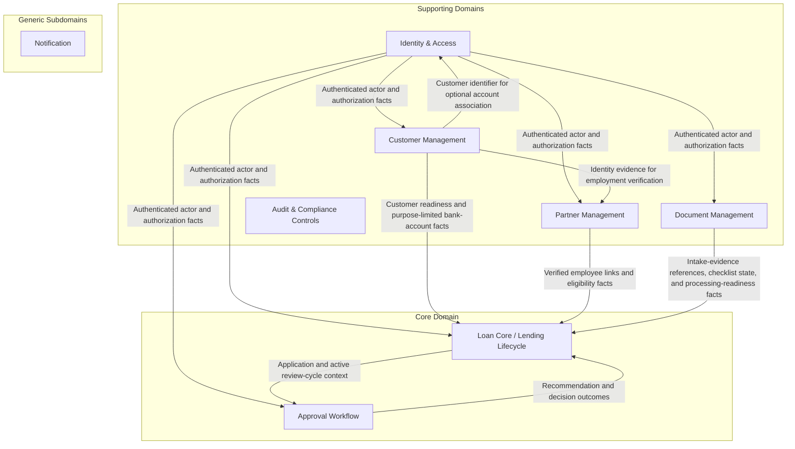

# Meridian Bounded Context Design — DDD Context Map

## Purpose and Interpretation

This document defines Meridian's intended bounded contexts, ownership boundaries, public capabilities, and collaboration rules.

Public capabilities are application-level contracts exposed by a context. They do not prescribe exact Java interface names, method signatures, HTTP endpoints, or package structures.

Entity and event names are representative architecture vocabulary unless another authoritative specification defines an exact contract. Implementation and delivery status belong in the project roadmap and follow-up register.

`shared` is a technical shared kernel, not a bounded context. It may contain only minimal, stable cross-cutting abstractions such as common exceptions, actor representations, audit contracts, time configuration, and generic value types. It must not own lending behavior or depend on a feature context.

---

## Context Map Overview

```mermaid
graph TB
    subgraph Core["Core Domain"]
        LOAN["Loan Core / Lending Lifecycle"]
        APPROVAL["Approval Workflow"]
    end

    subgraph Supporting["Supporting Domains"]
        IAM["Identity & Access"]
        CUSTOMER["Customer Management"]
        PARTNER["Partner Management"]
        DOC["Document Management"]
        AUDIT["Audit & Compliance Controls"]
    end

    subgraph Generic["Generic Subdomains"]
        NOTIF["Notification"]
    end

    CUSTOMER -->|Customer identifier for optional account association| IAM

    IAM -->|Authenticated actor and authorization facts| LOAN
    IAM -->|Authenticated actor and authorization facts| APPROVAL
    IAM -->|Authenticated actor and authorization facts| CUSTOMER
    IAM -->|Authenticated actor and authorization facts| PARTNER
    IAM -->|Authenticated actor and authorization facts| DOC

    CUSTOMER -->|Customer readiness and purpose-limited bank-account facts| LOAN
    CUSTOMER -->|Identity evidence for employment verification| PARTNER
    PARTNER -->|Verified employee links and eligibility facts| LOAN
    DOC -->|Intake-evidence references, checklist state, and processing-readiness facts| LOAN

    LOAN -->|Application and active review-cycle context| APPROVAL
    APPROVAL -->|Recommendation and decision outcomes| LOAN
```

Business contexts may publish PII-safe auditable facts to Audit & Compliance Controls.

Business contexts may publish notification-triggering events to Notification without transferring workflow ownership.

---

## Strategic Classification

| Classification | Contexts | Rationale |
|---|---|---|
| **Core Domain** | Loan Core / Lending Lifecycle, Approval Workflow | Contains Meridian's differentiating lending rules, controlled decision workflow, product behavior, financial state, and servicing lifecycle. |
| **Supporting Domain** | Identity & Access, Customer Management, Partner Management, Document Management, Audit & Compliance Controls | Provide identity, Customer, employment, evidence, and compliance capabilities required by the lending workflow. |
| **Generic Subdomain** | Notification | Provides reusable communication capabilities without owning lending decisions or workflow state. |

---

## 1. Identity & Access (IAM) — Supporting Domain

| Aspect | Detail |
|---|---|
| **Responsibilities** | User registration, authentication, access-token issuance and validation, refresh-token and session lifecycle, logout and revocation, account status and security controls, roles, permissions, role assignments, and authorization facts. |
| **Owns** | User accounts, credentials and credential metadata, role and permission definitions, role assignments, session records, refresh-token records, account-security state, and the association between a user account and an optional Customer identity. |
| **Public Capabilities** | Authenticate a principal; issue, refresh, validate, and revoke sessions or tokens; resolve the authenticated actor; query authorization facts; manage users, roles, permissions, and account status. |
| **Publishes** | Representative events include user registration, authentication success or failure, role assignment, session revocation, account suspension, and account reactivation. |
| **Consumes** | A Customer identity identifier when associating a user account with a Customer; administrative inputs used to create or manage Staff accounts and role assignments. |
| **Must Not Own** | Customer profile data, Partner employee data, Loan applications, approval decisions, documents, or lending permissions implemented as domain rules outside the authorization model. |

Identity remains the only owner of the login-to-Customer association. Customer owns the Customer aggregate and its business data and must not maintain a competing association. A Customer business record does not require a User account. Staff-assisted work authenticates the Staff user; Identity must not create a Customer login or impersonation session for that workflow.

---

## 2. Customer Management — Supporting Domain

| Aspect | Detail |
|---|---|
| **Responsibilities** | Customer lifecycle, profile management, profile completeness, identity and verification status, bank-account management, Customer ownership checks, Staff-assisted Customer intake support, and protection of sensitive Customer data. |
| **Owns** | `Customer`, Customer profile information, verification state, Customer status, bank accounts, primary-account designation, and source identity or bank-account evidence. |
| **Public Capabilities** | Manage Customer profile and bank-account data through Customer self-service or authorized Staff-assisted commands; select or create a Customer for Staff-assisted intake; query Customer readiness for lending; resolve purpose-limited identity evidence for employment verification; provide eligible bank-account facts for contract preparation and disbursement. |
| **Publishes** | Representative events include Customer created, profile updated, verification status changed, bank account added or deactivated, primary bank account changed, and Customer suspended or reactivated. |
| **Consumes** | Authenticated Customer or Staff actor and authorization facts from Identity & Access. |
| **Must Not Own** | User credentials, Partner employee relationships, `LoanApplication` state, lending exposure, operational contracts, approval decisions, or repayment servicing. |

Customer owns source identity and bank-account information and protects sensitive values at rest. Other contexts receive only purpose-limited facts, masked representations, or explicitly protected values through narrow application contracts.

A Customer business record is independent of a login account. Customer self-service resolves the Customer through the authenticated Customer identity. Staff-assisted commands instead authenticate the Staff user and identify the selected Customer as the business subject. They must use purpose-specific Staff capabilities and must not obtain Customer authority by treating Staff as the Customer.

When Staff-assisted intake creates a new Customer, Customer owns the atomic creation of the Customer and required identity-bearing profile, including duplicate protected-identity checks. A failed duplicate-identity attempt must not leave a separate incomplete Customer created solely by that attempt.

Audit records may contain only PII-safe identifiers, statuses, reason codes, and timestamps required for the audited action. Audit must not become a secondary store of unrestricted Customer evidence.

---

## 3. Partner Management — Supporting Domain

| Aspect | Detail |
|---|---|
| **Responsibilities** | Partner Company lifecycle, Partner Employee source data, monthly employee imports, import validation, employment matching, authorized manual-review outcomes, and reusable Customer–Partner Employee relationships used for Salary Advance eligibility. |
| **Owns** | `PartnerCompany`, `PartnerEmployee`, employee import batches and row outcomes, Partner eligibility reviews and decisions, reusable `CustomerPartnerEmployeeLink`, employment-verification evidence, and Partner-owned eligibility facts. |
| **Public Capabilities** | Manage Partner Companies; import and validate employee data; verify Customer employment; queue and decide Partner eligibility reviews; query or refresh an active verified employee link; provide purpose-limited eligibility facts to Loan. |
| **Publishes** | Representative events include Partner Company activated or suspended, employee import completed, Customer employee link verified, refreshed, suspended, rejected, or expired. |
| **Consumes** | Purpose-limited Customer identity evidence and authenticated actor information. |
| **Must Not Own** | Salary Advance limit state, `LoanApplication` verification snapshots, lending exposure, `LoanAccount` state, approved offers, or repayment servicing. |

Partner owns the reusable Customer-to-Partner Employee relationship because it answers whether a Customer is verified as an employee of a Partner Company.

Partner also owns unresolved employment matches and their authorized manual-review outcomes. The review record remains separate from the reusable link and from LoanApplication verification. An approved review may create or refresh the link; it does not create Loan state or lending exposure.

Loan may reference that relationship by identifier and consume eligibility facts through application-level contracts. Loan must not own or duplicate Partner Employee source records.

---

## 4. Loan Core / Lending Lifecycle — Core Domain

Loan Core owns the lending lifecycle from product eligibility and application submission through disbursement, servicing, contractual payoff or Administrative Full-Balance Settlement, and administrative closure.

Salary Advance, Unsecured Consumer Loan, and Collateral Loan are product behaviors inside Loan Core rather than separate top-level bounded contexts. Product policies specialize behavior that differs by product while preserving the common lending lifecycle.

| Aspect | Detail |
|---|---|
| **Responsibilities** | Loan product definitions and policy configuration; origination-channel policy; Staff-assisted pre-application intake; `LoanApplication` lifecycle; product-specific application data, eligibility, and verification snapshots; Salary Advance limit and exposure; review-cycle and correction workflow state; approved offers; operational contracts and readiness; disbursement evidence; `LoanAccount` activation; final repayment schedules; repayment transactions and allocations; overdue servicing; contractual payoff; Administrative Full-Balance Settlement; administrative closure; and application, account, and installment histories. |
| **Owns** | `LoanProduct`, product-policy configuration, Staff-assisted intake state, origination-channel state, `LoanApplication`, product-specific application details, product verification snapshots, `SalaryAdvanceLimit` and limit movements, review cycles, correction requests and tasks, approved offers, operational loan contracts, immutable contract-bound destinations, disbursement evidence, `LoanAccount`, final repayment schedules, repayment transactions, allocations, servicing progress, contractual-payoff evidence, Administrative Full-Balance Settlement evidence, administrative-closure evidence, and lifecycle histories. Product-specific application details include one Collateral Loan asset's type, description, estimated value, ownership status, and condition facts. |
| **Public Capabilities** | Query products and eligibility; manage Staff-assisted intake; create or save drafts; originate and submit applications through an allowed channel; query application state and Salary Advance limits; start Loan Officer review; manage correction workflows and resubmit completed corrections; apply recommendation and approval outcomes; view offers and record Customer-sourced responses through the allowed channel; prepare contracts and record Customer acknowledgment through the allowed channel; confirm contract readiness; record manual disbursement; query LoanAccounts and schedules; record and query repayments; evaluate overdue state; perform contractual payoff or Administrative Full-Balance Settlement; and close eligible settled accounts administratively. |
| **Publishes** | Representative events include Staff-assisted intake confirmed, application submitted, verification recorded, limit reserved or released, review started, correction requested, recommendation applied, application approved or rejected, offer generated or resolved, contract prepared or acknowledged, readiness confirmed, loan disbursed, repayment recorded, account status changed, account settled by contractual payoff or Administrative Full-Balance Settlement, and account closed administratively. |
| **Consumes** | Customer readiness and purpose-limited Customer intake or bank-account facts; Partner employee-link and eligibility facts; Document intake-evidence references, checklist state, and processing-readiness facts; Approval recommendation and decision outcomes; authenticated actor and authorization facts. |
| **Must Not Own** | User credentials, Customer source profile or bank-account aggregates, Partner Employee source records, document binaries or document-review decisions, or Approval's immutable recommendation and decision records. |

### LoanApplication and LoanAccount State Ownership

`LoanApplication` governs origination from draft or submission through verification, document readiness, controlled review, approval, Customer acceptance, contract readiness, disbursement, and pre-disbursement terminal outcomes. It preserves the origination channel so later Customer-sourced corrections, offer responses, and contract acknowledgments follow the permitted interaction path without changing financial or approval authority.

After disbursement, `LoanAccount` becomes the authoritative servicing aggregate. It moves among `ACTIVE`, `OVERDUE`, `SETTLED`, and `CLOSED` according to repayment, overdue, contractual-payoff, Administrative Full-Balance Settlement, and administrative-closure policies.

`LoanApplication` status must not become the source of truth for post-disbursement balances or servicing state.

### Origination Channel and Staff-Assisted Intake Ownership

Branch interaction is an origination channel, not a bounded context. `MER-BIZ-001` owns the exact product and channel rules; this document defines their ownership boundaries. Loan owns the channel policy and the temporary Staff-assisted intake lifecycle used before a UCL or Collateral Loan `LoanApplication` exists. Salary Advance permits only Customer-digital origination; UCL and Collateral Loan may use Customer-digital or Staff-assisted origination.

Staff-assisted intake is not a `LoanApplication` draft. It creates no financial exposure and does not enter product verification, Loan Officer review, or Approval. It may reference a selected Customer and Document-owned paper evidence while Staff confirms the Customer-provided structured facts needed for origination.

Identity authenticates the Staff actor. Customer owns the selected Customer's profile, bank accounts, consent state, and protected identity data. Document owns the paper evidence and immutable document versions. Loan coordinates those owners through public application contracts and stable identifiers; it must not duplicate their persistence as its own source of truth.

When confirmed intake becomes a `LoanApplication`, Loan records the origination channel and applies the normal product lifecycle. The channel determines how Customer-sourced actions are recorded. It does not create a second lending lifecycle, transfer Customer ownership to Staff, or weaken product, review, approval, contract, disbursement, servicing, or maker-checker rules.

### Product-Specific Application Data

Loan owns the structured lending facts needed to evaluate and service a product.

Document Management owns uploaded supporting files, document versions, and document-review decisions. For Collateral Loan, Document owns the required ownership-evidence file and its review state, while Loan owns the submitted ownership status and other structured Collateral facts. A supporting document may evidence a Loan-owned fact without transferring that lending concept to Document Management.

### Salary Advance Ownership

Partner owns Partner Companies, Partner Employees, employee imports, and the reusable Customer employee link.

Loan owns Salary Advance lending state:

- total, used, reserved, and available limit;
- limit status and movements;
- reservation and release;
- disbursement conversion from reserved to used exposure;
- repayment-driven principal exposure release;
- application-level verification snapshots.

The application verification snapshot records the Partner relationship and limit evidence used for one `LoanApplication`. It does not replace the reusable Partner-owned employee relationship or the current Loan-owned limit account.

### Contract and Disbursement Destination Ownership

Customer owns mutable source bank-account data.

Loan owns the immutable, contract-bound disbursement destination used after Customer acceptance. Loan obtains eligible destination facts through a narrow, purpose-limited Customer contract. It must not access Customer persistence or reuse Customer's encryption ownership.

A material change to a contract-bound destination before readiness requires a new contract version. Supersession must not silently alter accepted financial terms, repayment items, or Customer acknowledgment evidence.

For a Staff-assisted application, the Customer remains the source of the offer decision and contract acknowledgment while authorized Staff records the evidenced action. Loan owns the resulting offer-response and contract-acknowledgment state; Document owns any paper evidence that supports the recorded action. Staff must not be represented as the Customer actor.

### Product Policy Ownership

Loan's common lifecycle remains generic. Product policies own only behavior that legitimately differs by product, including:

- eligibility, allowed origination channels, and required evidence;
- amount and term constraints;
- pricing and repayment construction;
- activation effects;
- exposure reservation and release;
- collateral-specific controls;
- contractual-payoff, Administrative Full-Balance Settlement, and administrative-closure effects.

A product policy must not bypass common lifecycle, security, audit, document-readiness, or maker-checker controls.

---

## 5. Approval Workflow — Core Domain

| Aspect | Detail |
|---|---|
| **Responsibilities** | Authoritative Loan Officer recommendation records, Approver decision records, decision authority, maker-checker controls, structured correction intent, and immutable recommendation and decision history. |
| **Owns** | `ReviewRecommendation`, `ApprovalDecision`, controlled reason codes, decision metadata, decision authority evidence, and the immutable trail linking a recommendation to its resulting decision. |
| **Public Capabilities** | Record a Loan Officer recommendation; record an Approver decision; validate maker-checker separation; query recommendation and decision history; publish structured outcomes for Loan to apply. |
| **Publishes** | Representative events include recommendation recorded, approval decision recorded, correction requested, returned to Loan Officer review, approved, and rejected. |
| **Consumes** | `LoanApplication` identity, the Loan-owned active review-cycle identifier, application context required for the decision, and authenticated Staff identity and authorization facts. |
| **Must Not Own** | `LoanApplication` status, review-cycle lifecycle, correction tasks, resubmission, product revalidation, approved offers, contracts, disbursement, or `LoanAccount` servicing. |

Loan owns the active review cycle and every `LoanApplication` transition.

Approval owns the immutable recommendation and decision records. It references the Loan-owned application and active review cycle by identifier and publishes structured outcomes for Loan to apply to the `LoanApplication` lifecycle.

A recommendation or decision must not directly mutate Loan-owned persistence.

---

## 6. Document Management — Supporting Domain

| Aspect | Detail |
|---|---|
| **Responsibilities** | Staff-assisted pre-application paper evidence; application checklists and checklist items; document upload and storage; logical documents; immutable document versions; current-version selection; metadata; authorized content access; manual review; replacement; waiver; expiration; and processing readiness. |
| **Owns** | Staff-assisted paper intake evidence, application document checklists, checklist items, logical documents, immutable versions, storage references, review decisions, review status, replacement and waiver evidence, and document-processing results. |
| **Public Capabilities** | Upload and retrieve authorized Staff-assisted intake evidence before `LoanApplication` creation; create and query application checklists; upload and retrieve authorized application document content; review a document version; accept, waive, or request replacement; query upload completeness and processing readiness; provide purpose-limited evidence references and readiness facts to Loan. |
| **Publishes** | Representative events include document uploaded, version superseded, document reviewed, replacement requested, checklist upload-complete, and checklist processing-ready. |
| **Consumes** | Staff-assisted intake or `LoanApplication` ownership and workflow facts, correction-task proof, and authenticated Customer or Staff authorization facts. |
| **Must Not Own** | Staff-assisted intake lifecycle state, `LoanApplication` status, review cycles, correction requests or tasks, product eligibility, approval decisions, contract readiness, lending exposure, or the structured Customer or lending facts merely evidenced by uploaded documents. |

### Paper Intake Evidence Boundary

Document Management owns paper evidence independently of whether a `LoanApplication` already exists. Staff-assisted intake may therefore reference immutable identity evidence and the signed paper loan application before application creation without transferring those document bytes or versions to Loan.

Loan owns the Staff-assisted intake lifecycle and the structured lending facts confirmed from that evidence. Customer owns Customer profile, bank-account, identity, and consent state. A signed paper application may evidence Customer consent while Document owns the artifact and Customer owns the resulting consent state.

Document must not create or submit a `LoanApplication`, mutate Staff-assisted intake lifecycle state, or make Customer or lending facts authoritative merely because they appear in an uploaded document. Confirmed facts flow through the public command of the context that owns those facts.

### OCR-Assisted Processing Boundary

OCR-assisted processing belongs inside Document Management as an advisory document-processing capability rather than a separate top-level bounded context.

Document Management may own OCR jobs, extracted text, parsed fields, confidence scores, and processing history for an exact immutable document version, whether the version belongs to Staff-assisted intake or an application workflow. OCR results remain Document-owned evidence.

OCR must not independently:

- create or submit a `LoanApplication`;
- mutate Customer profile, bank-account, identity, or consent state;
- approve or reject a `LoanApplication`;
- mark a checklist item accepted;
- waive required evidence;
- decide processing readiness;
- mutate Staff-assisted intake or `LoanApplication` state.

Authorized review remains the source of checklist acceptance, replacement, waiver, and readiness decisions. Loan consumes purpose-limited evidence and readiness facts rather than treating raw OCR output as authoritative lending state. Staff confirmation of OCR transcription does not establish Customer verification, document acceptance, product verification, or approval. Confirmed values must pass through the owning Customer or Loan command. Document remains the owner of OCR evidence.

---

## 7. Audit & Compliance Controls — Supporting Cross-Cutting Domain

| Aspect | Detail |
|---|---|
| **Responsibilities** | Immutable records of important business actions, actor and time evidence, compliance-oriented state-change history, and secure audit querying. Audit observes business outcomes and never becomes a workflow source of truth. |
| **Owns** | Append-only audit events, PII-safe audit payloads, audit correlation identifiers, retention and archival policy, and compliance-oriented query models. |
| **Public Capabilities** | Record an auditable business action; query authorized audit history; correlate actions belonging to one business operation; support retention, archival, and compliance review. |
| **Consumes** | Explicit, PII-safe auditable facts published by business contexts. |
| **Must Not Own** | `LoanApplication` state, balances, approval authority, document readiness, Customer evidence, Partner eligibility, or commands that change another context. |

Audit recording must either participate in the originating transaction or use durable delivery with defined retry and reconciliation. The selected mechanism must prevent a completed business outcome from becoming permanently unaudited.

Audit payloads must remain closed and purpose-limited. Audit is not a secondary document store, Customer evidence store, or financial ledger.

For Staff-assisted actions, Audit records the authenticated Staff user as actor and the selected Customer, intake, application, or other business reference as the subject of the action. Audit must not rewrite the Staff actor as the Customer.

---

## 8. Notification — Generic Subdomain

| Aspect | Detail |
|---|---|
| **Responsibilities** | Message templates, notification requests, channel selection, delivery attempts, delivery status, retry policy, and Customer or Staff communication preferences. |
| **Owns** | `Notification`, `NotificationTemplate`, delivery attempts, channel-specific delivery metadata, and notification status. |
| **Public Capabilities** | Request a notification; render a template; select an eligible channel; deliver or retry a message; query delivery status. |
| **Consumes** | Notification-triggering business events from Identity, Customer, Partner, Document, Approval, and Loan. |
| **Must Not Own** | Lending workflow state, approval decisions, eligibility, repayment balances, or the business rule that determines whether an event occurred. |

A notification failure must not rewrite or reverse the business outcome that triggered the message. The publishing context remains authoritative for that outcome.

---

## Context Ownership Matrix

| Capability or Information | Authoritative Context |
|---|---|
| User accounts, credentials, roles, permissions, sessions | Identity & Access |
| Login-to-Customer association | Identity & Access |
| Customer profile, verification state, source bank accounts, Customer consent state | Customer Management |
| Partner Companies and Partner Employees | Partner Management |
| Employee import batches and employment matching | Partner Management |
| Reusable Customer–Partner Employee link | Partner Management |
| Loan products and product policies | Loan Core |
| Staff-assisted intake lifecycle and origination-channel policy | Loan Core |
| `LoanApplication` lifecycle, status, and origination channel | Loan Core |
| Product-specific structured application and lending facts | Loan Core |
| Salary Advance limit and exposure movements | Loan Core |
| Application-level eligibility and verification snapshots | Loan Core |
| Review cycles, correction requests, tasks, and resubmission | Loan Core |
| Loan Officer recommendation and Approver decision records | Approval Workflow |
| Approved offers and Customer response state | Loan Core |
| Operational contracts and contract-bound destinations | Loan Core |
| Contract readiness and disbursement evidence | Loan Core |
| LoanAccounts, schedules, repayments, overdue state, contractual payoff, Administrative Full-Balance Settlement, administrative closure | Loan Core |
| Staff-assisted paper evidence, application checklists, document versions, review decisions, readiness | Document Management |
| OCR jobs and extracted document evidence | Document Management |
| Immutable cross-cutting audit evidence | Audit & Compliance Controls |
| Templates and message-delivery state | Notification |

---

## Context Communication Rules

This section defines collaboration at the bounded-context level. `MER-ARCH-003-dependency-rules.md` owns Java and package dependency rules and their enforcement.

| Collaboration | Rule | Boundary |
|---|---|---|
| **Synchronous application contracts** | A context may query immediate authentication, authorization, ownership, readiness, eligibility, or other purpose-limited facts through another context's public application contract. | The caller must not mutate the provider's aggregates or use its repositories, persistence entities, or internal services. |
| **Business events** | A context may publish a state-change fact for another context. Transaction-participating consumers preserve the originating outcome's atomicity; durable asynchronous consumers handle delivery idempotently. Both preserve the publisher's authority over the originating state. | A consumer projection must not become the publishing context's source of truth. |
| **References and data** | Contexts exchange stable identifiers and the minimum immutable facts required by the collaboration. | They must not exchange cross-context aggregate object graphs or unrestricted sensitive evidence. |
| **Persistence authority** | Each context owns its aggregates, repositories, and tables. | Contexts must not share aggregate ownership, create cross-context JPA relationships, perform direct cross-context joins, or use another context's persistence as their own model. |
| **Reliability** | Transaction-participating collaboration or durable asynchronous delivery must define atomicity, retry, idempotency, ordering, reconciliation, and replay behavior required by the business outcome. | Business-critical coordination must not rely on fire-and-forget delivery without defined failure and recovery semantics. |
| **Security and privacy** | Contracts expose only the facts required for the caller's purpose and apply ownership and authorization checks. Sensitive values remain masked or protected according to their owner. | Contexts must not propagate unrestricted PII or expose infrastructure secrets through public contracts. |

Public application contracts and event schemas must evolve without exposing internal classes, tables, storage keys, or implementation frameworks. `MER-ARCH-003-dependency-rules.md` defines the corresponding code-level dependency restrictions and enforcement.

### Identity Coordination

Identity supplies authenticated actor and authorization facts to protected contexts.

Each business context remains responsible for its own ownership and business-rule checks. A permission authorizes an attempted capability; it does not prove that the requested Customer, application, document, contract, or account belongs to the actor.

Customer self-service resolves the Customer through the login-to-Customer association. Staff-assisted capabilities authenticate the Staff user and carry the selected Customer separately as the business subject. No context may satisfy a Customer-owned check by impersonating Staff as the Customer or by creating a synthetic Customer session.

### Staff-Assisted Origination Coordination

Staff-assisted origination spans existing bounded contexts; it does not introduce a Branch bounded context.

Identity authenticates and authorizes the Staff actor. Customer owns the selected Customer and mutable Customer facts. Loan owns Staff-assisted intake state, allowed origination channels, and the resulting lending lifecycle. Document owns the paper evidence and later OCR evidence. The contexts exchange stable identifiers and purpose-limited facts through public application contracts.

A Staff-assisted UCL or Collateral Loan remains Staff-assisted for Customer-sourced corrections, offer response, and contract acknowledgment. The Customer remains the source of those facts or decisions while authorized Staff records the evidenced action. This actor-versus-subject distinction must remain visible in authorization and audit evidence.

### Document and Correction Coordination

Document owns checklist and document evidence, versions, review decisions, and processing readiness.

Loan owns Staff-assisted intake state, `LoanApplication` state, review cycles, correction requests and tasks, resubmission, and product revalidation. Approval owns immutable recommendation and decision records and may produce structured correction intent.

For a Staff-assisted application, a Customer-sourced correction remains Customer-sourced even though authorized Staff coordinates the Customer contact, records or uploads the Customer-provided information, and performs resubmission. A Staff correction remains correction of Staff-controlled work; the two must not be collapsed into one ownership model.

The contexts collaborate through identifiers and public application contracts. Document does not change Staff-assisted intake or `LoanApplication` status, and Loan does not decide document acceptance by modifying Document-owned evidence.

---

## Extraction Principles

Bounded contexts are logical ownership boundaries inside the modular monolith. They do not require independent deployment.

Consider extracting a context only when:

- its application contracts are stable;
- data ownership is already independent;
- cross-context consistency requirements are understood;
- operational scale or organizational ownership justifies the cost;
- retry, idempotency, observability, and failure-handling requirements are designed.

Strategic extraction suitability:

| Context | Extraction Suitability |
|---|---|
| Identity & Access | High |
| Notification | High |
| Customer Management | Medium to high |
| Partner Management | Medium to high |
| Document Management | Medium to high |
| Audit & Compliance Controls | Medium |
| Approval Workflow | Medium |
| Loan Core / Lending Lifecycle | Low; consider last |

The modular monolith remains the preferred deployment model while Meridian benefits from strong transactional consistency, simpler operations, and close collaboration among the core lending contexts.
