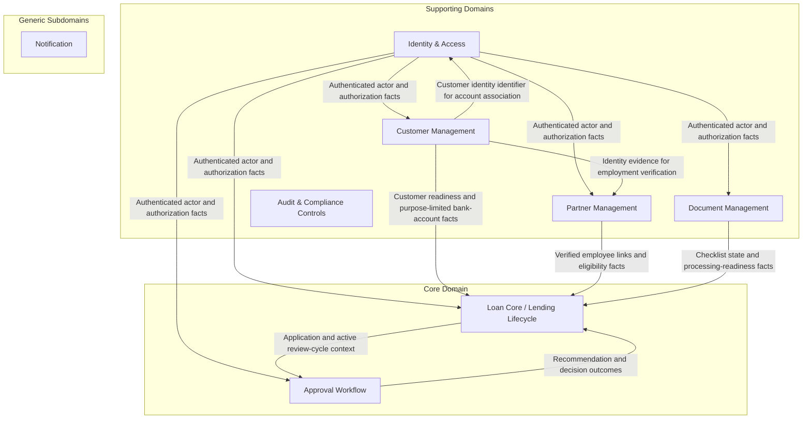

# Bounded Context Design — DDD Context Map

## Purpose and Interpretation

This document defines Meridian’s intended bounded-context responsibilities, ownership boundaries, published capabilities, and collaboration rules.

Public-capability descriptions refer to application-level contracts exposed by a context. They do not prescribe exact Java interface names, method signatures, HTTP endpoints, or package structures.

Entity and event names are representative architecture vocabulary unless another authoritative specification defines an exact contract. Implementation and delivery status are maintained separately in the project roadmap and follow-up register.

`shared` is a technical shared kernel, not a bounded context. It may contain only minimal, stable cross-cutting abstractions such as common exceptions, actor representations, audit contracts, time configuration, and generic value types. It must not own lending behavior or depend on a feature context.

---

## Context Map Overview

```mermaid
graph TB
    subgraph Core["Core Domain"]
        LOAN["Loan Core / Lending Lifecycle"]
        APPROVAL["Approval Workflow"]
    end

    subgraph Supporting["Supporting Domains"]
        IAM["Identity & Access"]
        CUSTOMER["Customer Management"]
        PARTNER["Partner Management"]
        DOC["Document Management"]
        AUDIT["Audit & Compliance Controls"]
    end

    subgraph Generic["Generic Subdomains"]
        NOTIF["Notification"]
    end

    CUSTOMER -->|Customer identity identifier for account association| IAM

    IAM -->|Authenticated actor and authorization facts| LOAN
    IAM -->|Authenticated actor and authorization facts| APPROVAL
    IAM -->|Authenticated actor and authorization facts| CUSTOMER
    IAM -->|Authenticated actor and authorization facts| PARTNER
    IAM -->|Authenticated actor and authorization facts| DOC

    CUSTOMER -->|Customer readiness and purpose-limited bank-account facts| LOAN
    CUSTOMER -->|Identity evidence for employment verification| PARTNER
    PARTNER -->|Verified employee links and eligibility facts| LOAN
    DOC -->|Checklist state and processing-readiness facts| LOAN

    LOAN -->|Application and active review-cycle context| APPROVAL
    APPROVAL -->|Recommendation and decision outcomes| LOAN
```

All business contexts may publish PII-safe auditable facts to Audit & Compliance Controls.

Business contexts may publish notification-triggering events to Notification without transferring workflow ownership.

---

## Strategic Classification

| Classification | Contexts | Rationale |
|---|---|---|
| **Core Domain** | Loan Core / Lending Lifecycle, Approval Workflow | Contains Meridian’s differentiating lending rules, controlled decision workflow, product behavior, financial state, and servicing lifecycle. |
| **Supporting Domain** | Identity & Access, Customer Management, Partner Management, Document Management, Audit & Compliance Controls | Enables the lending workflow while preserving clear ownership of identity, Customer, employment, evidence, and compliance capabilities. |
| **Generic Subdomain** | Notification | Provides reusable communication capabilities without owning lending decisions or workflow state. |

---

## 1. Identity & Access (IAM) — Supporting Domain

| Aspect | Detail |
|---|---|
| **Responsibilities** | User registration, authentication, access-token issuance and validation, refresh-token and session lifecycle, logout and revocation, account status and security controls, roles, permissions, role assignments, and authorization facts. |
| **Owns** | User accounts, credentials and credential metadata, role and permission definitions, role assignments, session records, refresh-token records, account-security state, and the association between a user account and an optional Customer identity. |
| **Public Capabilities** | Authenticate a principal; issue, refresh, validate, and revoke sessions or tokens; resolve the authenticated actor; query authorization facts; manage users, roles, permissions, and account status. |
| **Publishes** | Representative events include user registration, authentication success or failure, role assignment, session revocation, account suspension, and account reactivation. |
| **Consumes** | A Customer identity identifier when associating a user account with a Customer; administrative inputs used to create or manage Staff accounts and role assignments. |
| **Must Not Own** | Customer profile data, Partner employee data, Loan applications, approval decisions, documents, or lending permissions embedded as domain logic outside the authorization model. |

Identity owns the login-to-Customer association. Customer owns the Customer aggregate and its business data. The two contexts must not maintain competing bidirectional ownership relationships.

---

## 2. Customer Management — Supporting Domain

| Aspect | Detail |
|---|---|
| **Responsibilities** | Customer lifecycle, profile management, profile completeness, identity and verification status, bank-account management, Customer ownership checks, and protection of sensitive Customer data. |
| **Owns** | `Customer`, Customer profile information, verification state, Customer status, bank accounts, primary-account designation, and source identity or bank-account evidence. |
| **Public Capabilities** | Manage a Customer’s own profile and bank accounts; query Customer readiness for lending; resolve purpose-limited identity evidence for employment verification; provide eligible bank-account facts for contract preparation and disbursement. |
| **Publishes** | Representative events include Customer created, profile updated, verification status changed, bank account added or deactivated, primary bank account changed, and Customer suspended or reactivated. |
| **Consumes** | Authenticated Customer identity and authorization facts from Identity & Access. |
| **Must Not Own** | User credentials, Partner employee relationships, LoanApplication state, lending exposure, operational contracts, approval decisions, or repayment servicing. |

Customer owns source identity and bank-account information and protects sensitive values at rest. Other contexts receive only purpose-limited facts, masked representations, or explicitly protected values through narrow application contracts.

Generic audit records may contain only closed, PII-safe identifiers, statuses, reason codes, and timestamps. They must not become a secondary store of unrestricted Customer evidence.

---

## 3. Partner Management — Supporting Domain

| Aspect | Detail |
|---|---|
| **Responsibilities** | Partner Company lifecycle, Partner Employee source data, monthly employee imports, import validation, employment matching, authorized manual-review outcomes, and reusable Customer–Partner Employee relationships used for Salary Advance eligibility. |
| **Owns** | `PartnerCompany`, `PartnerEmployee`, employee import batches and row outcomes, reusable `CustomerPartnerEmployeeLink`, employment-verification evidence, and Partner-owned eligibility facts. |
| **Public Capabilities** | Manage Partner Companies; import and validate employee data; verify Customer employment; query or refresh an active verified employee link; provide purpose-limited eligibility facts to Loan. |
| **Publishes** | Representative events include Partner Company activated or suspended, employee import completed, Customer employee link verified, refreshed, suspended, rejected, or expired. |
| **Consumes** | Purpose-limited Customer identity evidence and authenticated actor information. |
| **Must Not Own** | Salary Advance limit state, LoanApplication verification snapshots, lending exposure, LoanAccount state, approved offers, or repayment servicing. |

Partner Management owns the reusable Customer-to-Partner Employee relationship because it answers whether a Customer is verified as an employee of a Partner Company.

Loan may reference that relationship by identifier and consume eligibility facts through application-level contracts. Loan must not own or duplicate Partner Employee source records.

---

## 4. Loan Core / Lending Lifecycle — Core Domain

Loan Core is Meridian’s generic lending core. It owns the complete business lifecycle from product eligibility and application submission through disbursement, servicing, settlement, and closure.

Salary Advance, Unsecured Consumer Loan, and Collateral Loan are product behaviors inside Loan Core rather than separate top-level bounded contexts. Product-specific policies specialize eligibility, verification, pricing, activation, exposure, repayment, settlement, and collateral behavior while sharing the common lending lifecycle.

| Aspect | Detail |
|---|---|
| **Responsibilities** | Loan product definitions and policy configuration; LoanApplication lifecycle; product-specific application data, eligibility, and verification snapshots; Salary Advance limit and exposure; review-cycle and correction workflow state; approved offers; operational contracts and readiness; disbursement evidence; LoanAccount activation; final repayment schedules; repayment transactions and allocations; overdue servicing; settlement; administrative closure; and application, account, and installment histories. |
| **Owns** | `LoanProduct`, product-policy configuration, `LoanApplication`, product-specific application details, product verification snapshots, `SalaryAdvanceLimit` and limit movements, review cycles, correction requests and tasks, approved offers, operational loan contracts, immutable contract-bound destinations, disbursement evidence, `LoanAccount`, final repayment schedules, repayment transactions, allocations, servicing progress, settlement and closure evidence, and lifecycle histories. Product-specific application details include income and employment facts for Unsecured Consumer Loan and structured collateral, ownership, and valuation facts for Collateral Loan. |
| **Public Capabilities** | Query products and eligibility; create or save drafts; submit applications; query application state and Salary Advance limits; start Loan Officer review; manage correction workflows and resubmit completed corrections; apply recommendation and approval outcomes; view and respond to offers; prepare and acknowledge contracts; confirm contract readiness; record manual disbursement; query LoanAccounts and schedules; record and query repayments; evaluate overdue state; settle and close eligible accounts. |
| **Publishes** | Representative events include application submitted, verification recorded, limit reserved or released, review started, correction requested, recommendation applied, application approved or rejected, offer generated or resolved, contract prepared or acknowledged, readiness confirmed, loan disbursed, repayment recorded, account status changed, account settled, and account closed. |
| **Consumes** | Customer readiness and eligible bank-account facts; Partner employee-link and eligibility facts; Document checklist and processing-readiness facts; Approval recommendation and decision outcomes; authenticated actor and authorization facts. |
| **Must Not Own** | User credentials, Customer source profile or bank-account aggregates, Partner Employee source records, document binaries or document-review decisions, or Approval’s immutable recommendation and decision records. |

### LoanApplication and LoanAccount State Ownership

`LoanApplication` governs origination from draft or submission through verification, document readiness, controlled review, approval, Customer acceptance, contract readiness, disbursement, and pre-disbursement terminal outcomes.

After disbursement, `LoanAccount` becomes the authoritative servicing aggregate. It moves among `ACTIVE`, `OVERDUE`, `SETTLED`, and `CLOSED` according to repayment, settlement, overdue, and administrative-closure policies.

LoanApplication status must not be reused as the source of truth for post-disbursement balances or servicing state.

### Product-Specific Application Data

Loan owns the structured lending facts needed to evaluate and service a product.

Document Management owns uploaded supporting files, document versions, and document-review decisions. A supporting document may evidence a Loan-owned fact, but storing the file does not transfer ownership of the underlying income, employment, collateral, ownership, valuation, or other lending concept to Document Management.

### Salary Advance Ownership

Partner owns Partner Companies, Partner Employees, employee imports, and the reusable Customer employee link.

Loan owns Salary Advance lending state:

- total, used, reserved, and available limit;
- limit status and movements;
- reservation and release;
- disbursement conversion from reserved to used exposure;
- repayment-driven principal exposure release;
- application-level verification snapshots.

The application verification snapshot records the Partner relationship and limit evidence used for one LoanApplication. It does not replace the reusable Partner-owned employee relationship or the current Loan-owned limit account.

### Contract and Disbursement Destination Ownership

Customer owns mutable source bank-account data.

Loan owns the immutable, contract-bound disbursement destination used after Customer acceptance. Loan obtains eligible destination facts through a narrow, purpose-limited Customer contract and must not access Customer persistence or reuse Customer’s encryption ownership.

A new contract version is required when a material contract-bound destination changes before readiness. Supersession must not silently alter accepted financial terms, repayment items, or Customer acknowledgment evidence.

### Product Policy Ownership

The shared lifecycle remains generic. Product policies own only the behavior that legitimately varies by product, including:

- eligibility and required evidence;
- amount and term constraints;
- pricing and repayment construction;
- activation effects;
- exposure reservation and release;
- collateral-specific controls;
- settlement and closure effects.

A product policy must not bypass common lifecycle, security, audit, document-readiness, or maker-checker controls.

---

## 5. Approval Workflow — Core Domain

| Aspect | Detail |
|---|---|
| **Responsibilities** | Authoritative Loan Officer recommendation records, Approver decision records, decision authority, maker-checker controls, structured correction intent, and immutable recommendation and decision history. |
| **Owns** | `ReviewRecommendation`, `ApprovalDecision`, controlled reason codes, decision metadata, decision authority evidence, and the immutable trail linking a recommendation to its resulting decision. |
| **Public Capabilities** | Record a Loan Officer recommendation; record an Approver decision; validate maker-checker separation; query recommendation and decision history; publish structured outcomes for Loan to apply. |
| **Publishes** | Representative events include recommendation recorded, approval decision recorded, correction requested, returned to Loan Officer review, approved, and rejected. |
| **Consumes** | LoanApplication identity, the Loan-owned active review-cycle identifier, application context required for the decision, and authenticated Staff identity and authorization facts. |
| **Must Not Own** | LoanApplication status, review-cycle lifecycle, correction tasks, resubmission, product revalidation, approved offers, contracts, disbursement, or LoanAccount servicing. |

Loan owns the active review cycle and every LoanApplication transition.

Approval owns the immutable recommendation and decision records. It references the Loan-owned application and active review cycle by identifier and publishes structured outcomes for Loan to apply to the LoanApplication lifecycle.

A recommendation or decision must not directly mutate Loan-owned persistence.

---

## 6. Document Management — Supporting Domain

| Aspect | Detail |
|---|---|
| **Responsibilities** | Application checklists, checklist items, document upload and storage, logical documents, immutable document versions, current-version selection, metadata, authorized content access, manual review, replacement, waiver, expiration, and processing readiness. |
| **Owns** | Application document checklists, checklist items, logical documents, immutable versions, storage references, review decisions, review status, replacement and waiver evidence, and document-processing results. |
| **Public Capabilities** | Create and query checklists; upload and retrieve authorized document content; review a document version; accept, reject, waive, or request replacement; query upload completeness and processing readiness; provide narrow readiness facts to Loan. |
| **Publishes** | Representative events include document uploaded, version superseded, document reviewed, replacement requested, checklist upload-complete, and checklist processing-ready. |
| **Consumes** | LoanApplication ownership and workflow facts, correction-task proof, and authenticated Customer or Staff authorization facts. |
| **Must Not Own** | LoanApplication status, review cycles, correction requests or tasks, product eligibility, approval decisions, contract readiness, lending exposure, or the structured lending facts merely evidenced by uploaded documents. |

### OCR-Assisted Processing Boundary

OCR-assisted processing belongs inside Document Management as an advisory document-processing capability rather than a separate top-level bounded context.

Document Management may own OCR jobs, extracted text, parsed fields, confidence scores, and processing history. OCR results remain Document-owned evidence.

OCR must not independently:

- approve or reject a LoanApplication;
- mark a checklist item accepted;
- waive required evidence;
- decide processing readiness;
- mutate LoanApplication state.

Authorized review remains the source of checklist acceptance, replacement, waiver, and readiness decisions. Loan consumes checklist and readiness facts rather than raw OCR ownership.

---

## 7. Audit & Compliance Controls — Supporting Cross-Cutting Domain

| Aspect | Detail |
|---|---|
| **Responsibilities** | Immutable records of important business actions, actor and time evidence, compliance-oriented state-change history, and secure audit querying. Audit is observational and never becomes a workflow source of truth. |
| **Owns** | Append-only audit events, PII-safe audit payloads, audit correlation identifiers, retention and archival policy, and compliance-oriented query models. |
| **Public Capabilities** | Record an auditable business action; query authorized audit history; correlate actions belonging to one business operation; support retention, archival, and compliance review. |
| **Consumes** | Explicit, PII-safe auditable facts published by business contexts. |
| **Must Not Own** | LoanApplication state, balances, approval authority, document readiness, Customer evidence, Partner eligibility, or commands that change another context. |

Audit reliability must preserve consistency with the originating business outcome. The selected coordination mechanism must define failure and recovery semantics appropriate to the audited action.

Audit payloads must remain closed and purpose-limited. Audit is not a secondary document store, Customer evidence store, or financial ledger.

---

## 8. Notification — Generic Subdomain

| Aspect | Detail |
|---|---|
| **Responsibilities** | Message templates, notification requests, channel selection, delivery attempts, delivery status, retry policy, and Customer or Staff communication preferences. |
| **Owns** | `Notification`, `NotificationTemplate`, delivery attempts, channel-specific delivery metadata, and notification status. |
| **Public Capabilities** | Request a notification; render a template; select an eligible channel; deliver or retry a message; query delivery status. |
| **Consumes** | Notification-triggering business events from Identity, Customer, Partner, Document, Approval, and Loan. |
| **Must Not Own** | Lending workflow state, approval decisions, eligibility, repayment balances, or the business rule that determines whether an event occurred. |

Notification failures must not silently rewrite or reverse the business outcome that triggered the message. Business contexts remain authoritative for their own state.

---

## Context Ownership Matrix

| Capability or Information | Authoritative Context |
|---|---|
| User accounts, credentials, roles, permissions, sessions | Identity & Access |
| Login-to-Customer association | Identity & Access |
| Customer profile, verification state, source bank accounts | Customer Management |
| Partner Companies and Partner Employees | Partner Management |
| Employee import batches and employment matching | Partner Management |
| Reusable Customer–Partner Employee link | Partner Management |
| Loan products and product policies | Loan Core |
| LoanApplication lifecycle and status | Loan Core |
| Product-specific structured application and lending facts | Loan Core |
| Salary Advance limit and exposure movements | Loan Core |
| Application-level eligibility and verification snapshots | Loan Core |
| Review cycles, correction requests, tasks, and resubmission | Loan Core |
| Loan Officer recommendation and Approver decision records | Approval Workflow |
| Approved offers and Customer response state | Loan Core |
| Operational contracts and contract-bound destinations | Loan Core |
| Contract readiness and disbursement evidence | Loan Core |
| LoanAccounts, schedules, repayments, overdue state, settlement, closure | Loan Core |
| Checklists, document versions, review decisions, readiness | Document Management |
| OCR jobs and extracted document evidence | Document Management |
| Immutable cross-cutting audit evidence | Audit & Compliance Controls |
| Templates and message-delivery state | Notification |

---

## Communication and Dependency Rules

| Type | Allowed | Forbidden |
|---|---|---|
| **Synchronous contracts** | Immediate authentication, authorization, ownership, readiness, eligibility, and purpose-limited fact queries through published application contracts | Cross-context aggregate mutation, repository access, or invocation of another context’s non-public application or domain services |
| **Business events** | State-change notifications and decoupled reactions using explicit schemas and idempotent handling | Treating a consumer projection as the publishing context’s source of truth |
| **References** | Stable identifiers and purpose-limited immutable facts | Direct entity imports or cross-context object graphs |
| **Persistence** | Each context owns its aggregates, repositories, and tables | Shared aggregate ownership, cross-context JPA relationships, direct cross-context joins, or foreign repository access |
| **Reliability** | Synchronous transaction-participating coordination or durable asynchronous coordination with explicit atomicity, retry, idempotency, ordering, reconciliation, and replay rules appropriate to the business outcome | Fire-and-forget handling or business-critical delivery without explicit failure, consistency, and recovery semantics |
| **Security and privacy** | Minimal disclosure, masked or protected sensitive values, ownership checks, and least-privilege application contracts | Broad evidence sharing, unrestricted PII propagation, or leaking infrastructure secrets into public contracts |
| **Evolution** | Stable application contracts and versioned event schemas | Depending on another context’s internal classes, tables, storage keys, or implementation framework |

### Identity Coordination

Identity supplies authenticated actor and authorization facts to protected contexts.

Business contexts remain responsible for their own ownership and business-rule checks. A permission authorizes an attempted capability; it does not prove that the requested Customer, application, document, contract, or account belongs to the actor.

### Document and Correction Coordination

Document owns checklist and document evidence, versions, review decisions, and processing readiness.

Loan owns LoanApplication state, review cycles, correction requests and tasks, resubmission, and product revalidation. Approval owns immutable recommendation and decision records and may produce structured correction intent.

The contexts collaborate through identifiers and published application contracts. Document does not change LoanApplication status, and Loan does not decide document acceptance by modifying Document-owned evidence.

---

## Extraction Principles

Bounded contexts are logical ownership boundaries inside the modular monolith. They are not a commitment to deploy each context as an independent service.

A context should be considered for extraction only when:

- its application contracts are stable;
- data ownership is already independent;
- cross-context consistency requirements are understood;
- operational scale or organizational ownership justifies the cost;
- retry, idempotency, observability, and failure-handling requirements are designed.

Recommended strategic suitability:

| Context | Extraction Suitability |
|---|---|
| Identity & Access | High |
| Notification | High |
| Customer Management | Medium to high |
| Partner Management | Medium to high |
| Document Management | Medium to high |
| Audit & Compliance Controls | Medium |
| Approval Workflow | Medium |
| Loan Core / Lending Lifecycle | Low; consider last |

The modular monolith remains the preferred deployment model while Meridian benefits from strong transactional consistency, simple operations, and close collaboration among the core lending contexts.
