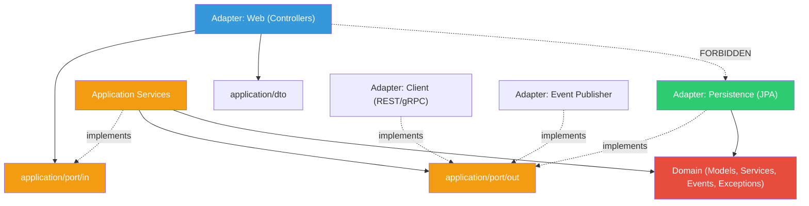

# Dependency Rules & Architecture Enforcement

> The MVP remains one backend and one database. Modules are bounded contexts inside the modular monolith, not separate services by default.
> Architecture Standard v2 follows the Practical Meridian Architecture Standard: MVP limits feature scope, not architecture consistency.

## Layer Dependency Rules (Within Each Module)



> Controllers MAY depend on `application/port/in/` interfaces and `application/dto/` types. Controllers MUST NOT depend on `domain/model/`, `domain/service/`, `application/port/out/`, JPA repositories, or JPA entities.

| Rule | From | To | Allowed? |
|---|---|---|---|
| 1 | Feature domain | Shared domain model/exception types | YES |
| 2 | Domain | Application, infrastructure, DTOs, Spring, JPA, web | NO |
| 3 | Application services | Domain models, domain services, domain exceptions, domain events | YES |
| 4 | Application services | `application/port/in` and `application/port/out` | YES - implement input ports and call output ports |
| 5 | Application | Infrastructure | NO |
| 6 | Infrastructure adapters | `application/port/out` | YES - implements output ports |
| 7 | Infrastructure persistence adapters | Domain | YES - maps JPA entities to domain objects |
| 8 | Controllers | `application/port/in` and `application/dto` | YES |
| 9 | Controllers | JPA repositories, JPA entities, domain services, output ports | NO |
| 10 | Application services | `CurrentUserProvider` | YES - shared application abstraction |
| 11 | Domain/Application | Spring Security or JWT classes | NO - use shared abstractions instead |

### The Rule
> **Dependencies point inward.** Domain knows nothing about the outside world. Application owns use-case orchestration and its input/output ports. Infrastructure knows application ports and domain models only to implement adapters and perform mapping.

`AuthenticatedUser` is a shared representation of the current actor. `CurrentUserProvider` is a shared application-level abstraction used by modules that need the current user.

---

## Module Communication Rules

- Modules should not directly access each other's internals.
- Cross-module interaction should happen through application/public ports, published interfaces, or Spring Modulith events where appropriate.
- Loan workflows should not directly own Partner Company or Partner Employee data. Salary Advance loan workflows may reference partner/customer employee link IDs and eligibility result records only.
- Salary Advance limit state belongs to Loan; Partner employee source data and reusable customer employee links belong to Partner/Customer eligibility boundaries.
- Shared concepts should live in `shared`; product-specific policies must not leak into the top-level package structure.
- `shared` must not depend on any feature module.
- `identity` may depend on `shared`; customer, partner, loan, approval, document, audit, and notification may depend on `shared`.
- `shared/application/security` contains abstractions only. `identity/infrastructure/security` contains concrete Spring Security/JWT implementation.
- `JwtAuthFilter`, `JwtTokenProvider`, and Spring Security adapters belong to identity infrastructure.
- OCR integration should be treated as an external or infrastructure-facing capability behind a document/OCR port.
- Audit should record events without controlling the core workflow.
- Modules must not share JPA entity ownership across bounded contexts. Cross-context relationships are stored as IDs and resolved through application/public ports or events.
- Repository ports return domain objects, not DTOs. Other output ports return domain objects or application contract records, not REST DTOs.

### Allowed Patterns

```java
// PATTERN 1: Sync — Call public port interface
// Loan module calling Customer module through a port
// loan/application/port/out/CustomerQueryPort.java
public interface CustomerQueryPort {
    Optional<CustomerProfileSnapshot> findById(CustomerId id);
}

// customer/infrastructure/.../CustomerModuleAdapter.java
@Component
public class CustomerModuleAdapter implements CustomerQueryPort {
    private final CustomerQueryService customerQueryService; // Customer's own service
    // ...
}
```

```java
// PATTERN 2: Async — Spring ApplicationEvents
// loan/application/service/ReviewLoanService.java
eventPublisher.publishEvent(new LoanSentForApprovalEvent(loanId, customerId, productCode, recommendation));

// approval/infrastructure/listener/LoanEventListener.java
@Component
public class LoanEventListener {
    // @ApplicationModuleListener ensures the listener runs after the publishing transaction commits,
    // preventing listeners from seeing uncommitted data.
    @ApplicationModuleListener
    public void onLoanSentForApproval(LoanSentForApprovalEvent event) {
        approvalService.createApprovalDecisionWorkItem(event.loanId(), event.recommendation());
    }
}
```

```java
// PATTERN 3: Sync — Product-supporting data through clear ports
// loan/application/port/out/PartnerEligibilityPort.java
public interface PartnerEligibilityPort {
    CustomerEmployeeLinkData verifyOrGetEmployeeLink(EmployeeLinkQuery query);
    SalaryAdvanceEligibilityData getEligibilityData(CustomerEmployeeLinkId linkId);
}

// loan/application/port/out/DocumentReadinessPort.java
public interface DocumentReadinessPort {
    DocumentReadinessResult checkReadiness(LoanApplicationId loanApplicationId);
}
```

> Product-specific behavior belongs under the `loan` module through product policies and strategies. Partner data remains in `partner`; reusable customer employee links are exposed to Loan through IDs and eligibility records; document and OCR behavior remains in `document` or behind document/OCR ports.

```java
// PATTERN 4: Current actor access through shared abstraction
// loan/application/service/SubmitLoanService.java
public class SubmitLoanService {
    private final CurrentUserProvider currentUserProvider;

    public void submit(...) {
        AuthenticatedUser actor = currentUserProvider.currentUser();
        // use actor.id() and role/permission data without depending on Spring Security
    }
}
```

> `SpringSecurityCurrentUserProvider` is an identity infrastructure adapter that implements `CurrentUserProvider` using Spring Security. `JwtAuthFilter` and `JwtTokenProvider` belong to identity because identity owns authentication, JWT, users, roles, refresh tokens, and RBAC.

### Forbidden Anti-Patterns

```java
// ANTI-PATTERN 1: Direct entity import across modules
// loan/application/service/LoanService.java
import com.meridian.platform.customer.domain.model.Customer; // FORBIDDEN!

// ANTI-PATTERN 2: Direct JPA repo access across modules
// loan/application/service/LoanService.java
@Autowired CustomerJpaRepository customerRepo; // FORBIDDEN!

// ANTI-PATTERN 3: Shared JPA entities
// Loan entity with @ManyToOne to Customer entity // FORBIDDEN!

// ANTI-PATTERN 4: Controller calling repository directly
// loan/infrastructure/adapter/in/web/LoanController.java
@Autowired JpaLoanRepository loanRepo; // FORBIDDEN! Must go through application input port

// ANTI-PATTERN 5: Domain depending on Spring
// loan/domain/model/LoanApplication.java
@Entity @Table // FORBIDDEN in domain layer — JPA annotations go on infra JPA entities

// ANTI-PATTERN 6: Circular module dependency
// Loan → Customer AND Customer → Loan // FORBIDDEN! Use events to break cycles

// ANTI-PATTERN 7: Transaction spanning modules
@Transactional
public void crossModuleOperation() {
    loanService.approve(...);
    customerService.updateStatus(...); // FORBIDDEN! Different bounded context
}

// ANTI-PATTERN 8: Top-level modules for individual loan products
// com.meridian.platform.salaryadvance        // FORBIDDEN!
// com.meridian.platform.unsecuredloan        // FORBIDDEN!
// com.meridian.platform.collateralloan       // FORBIDDEN!

// ANTI-PATTERN 9: Product-specific behavior leaking outside Loan Core
// partner/application/service/SalaryAdvanceApprovalService.java // FORBIDDEN!
// Product policies and strategies belong under loan/domain/product or loan/application policy orchestration.

// ANTI-PATTERN 9B: Loan owning partner employee source data
// loan/domain/model/PartnerEmployee.java // FORBIDDEN!
// loan/application/service/SalaryAdvanceService.java imports PartnerEmployeeJpaEntity // FORBIDDEN!
// Loan stores customerEmployeeLinkId/partnerEmployeeId snapshots and calls Partner ports for eligibility data.

// ANTI-PATTERN 10: OCR integration called directly from Loan
// loan/infrastructure/client/OcrRestClientAdapter.java // FORBIDDEN!
// OCR integration is an external/infrastructure-facing capability behind a document/OCR port.

// ANTI-PATTERN 11: Audit controlling business workflow
// audit/application/service/AuditEventService.java calls loan.approve(...) // FORBIDDEN!
// Audit records events and history; it does not own business decision logic.

// ANTI-PATTERN 12: Shared importing feature module classes
// shared/infrastructure/config/SecurityConfig.java imports com.meridian.platform.identity.infrastructure.security.JwtAuthFilter // FORBIDDEN!
// shared must not depend on identity or any other feature module.

// ANTI-PATTERN 13: Spring Security/JWT classes in domain or application services
// loan/application/service/SubmitLoanService.java imports org.springframework.security.core.Authentication // FORBIDDEN!
// loan/domain/service/LoanEligibilityService.java imports io.jsonwebtoken.Claims // FORBIDDEN!
// Application code should use CurrentUserProvider; domain code should stay pure.

// ANTI-PATTERN 14: JWT implementation in shared
// shared/infrastructure/security/JwtTokenProvider.java // FORBIDDEN!
// shared/application/security contains abstractions only.
```

---

## Enforcement Strategies

### 1. Spring Modulith Verification (Primary)

```java
@Test
void verifiesModularStructure() {
    ApplicationModules.of(MeridianPlatformApplication.class).verify();
    // Automatically detects: cycle dependencies, illegal cross-module access
}
```

### 2. ArchUnit Rules (Supplementary)

```java
@AnalyzeClasses(packages = "com.meridian.platform")
class ArchitectureRulesTest {

    // Rule: Domain layer must not depend on Spring
    @ArchTest
    static final ArchRule domainMustNotDependOnSpring =
        noClasses().that().resideInAPackage("..domain..")
            .should().dependOnClassesThat()
            .resideInAnyPackage("org.springframework..");

    // Rule: Domain and application code must not depend on Spring Security or JWT implementation classes
    @ArchTest
    static final ArchRule domainAndApplicationMustNotDependOnSecurityImplementations =
        noClasses().that().resideInAnyPackage("..domain..", "..application..")
            .should().dependOnClassesThat()
            .resideInAnyPackage(
                "org.springframework.security..",
                "io.jsonwebtoken..",
                "com.auth0.jwt.."
            )
            .because("Use shared CurrentUserProvider/AuthenticatedUser abstractions outside identity infrastructure");

    // Rule: Domain must not depend on JPA
    @ArchTest
    static final ArchRule domainMustNotUseJpa =
        noClasses().that().resideInAPackage("..domain..")
            .should().dependOnClassesThat()
            .resideInAnyPackage("jakarta.persistence..")
            .because("Domain must not depend on JPA — use JPA entities in infrastructure persistence");

    // Rule: Domain services must not use Spring annotations
    @ArchTest
    static final ArchRule domainServicesMustBePureJava =
        noClasses().that().resideInAPackage("..domain.service..")
            .should().beAnnotatedWith("org.springframework.stereotype.Service")
            .orShould().beAnnotatedWith("org.springframework.transaction.annotation.Transactional")
            .because("Domain services must be pure Java — Spring annotations belong in application layer");

    // Rule: Domain must not depend on application or infrastructure
    @ArchTest
    static final ArchRule domainMustNotDependOnApplicationOrInfra =
        noClasses().that().resideInAPackage("..domain..")
            .should().dependOnClassesThat()
            .resideInAnyPackage("..application..", "..infrastructure..");

    // Rule: Domain must not depend on DTO packages
    @ArchTest
    static final ArchRule domainMustNotDependOnDtos =
        noClasses().that().resideInAPackage("..domain..")
            .should().dependOnClassesThat()
            .resideInAnyPackage("..dto..", "..application.dto..")
            .because("DTOs belong to application/API boundaries, not domain logic");

    // Rule: Application must not depend on infrastructure
    @ArchTest
    static final ArchRule applicationMustNotDependOnInfra =
        noClasses().that().resideInAPackage("..application..")
            .should().dependOnClassesThat()
            .resideInAPackage("..infrastructure..");

    // Rule: Shared module must not depend on feature modules
    @ArchTest
    static final ArchRule sharedMustNotDependOnFeatureModules =
        noClasses().that().resideInAPackage("com.meridian.platform.shared..")
            .should().dependOnClassesThat()
            .resideInAnyPackage(
                "com.meridian.platform.identity..",
                "com.meridian.platform.customer..",
                "com.meridian.platform.partner..",
                "com.meridian.platform.loan..",
                "com.meridian.platform.approval..",
                "com.meridian.platform.document..",
                "com.meridian.platform.audit..",
                "com.meridian.platform.notification.."
            );

    // Rule: Controllers must only access application input ports and DTO-facing concerns
    @ArchTest
    static final ArchRule controllersMustUsePortsOnly =
        classes().that().resideInAPackage("..adapter.in.web..")
            .should().onlyDependOnClassesThat()
            .resideInAnyPackage(
                "..application.dto..", "..application.port.in..",
                "..shared..", "java..", "jakarta..",
                "org.springframework.web..", "org.springframework.http..",
                "org.springframework.security.access.prepost..",  // @PreAuthorize
                "org.springframework.security.core..",             // Authentication
                "io.swagger.v3.oas.annotations.."                  // OpenAPI docs
            );

    // Rule: Controllers must not call repositories or use JPA entities directly
    @ArchTest
    static final ArchRule controllersMustNotUseRepositoriesOrJpaEntities =
        noClasses().that().resideInAPackage("..adapter.in.web..")
            .should().dependOnClassesThat()
            .resideInAnyPackage(
                "..infrastructure.adapter.out.persistence..",
                "..infrastructure.persistence..",
                "org.springframework.data.repository..",
                "org.springframework.data.jpa.repository..",
                "jakarta.persistence.."
            );

    // Rule: No circular dependencies between modules
    @ArchTest
    static final ArchRule noCyclicDependencies =
        slices().matching("com.meridian.platform.(*)..")
            .should().beFreeOfCycles();

    // Rule: Product-specific policies must stay inside the Loan module
    @ArchTest
    static final ArchRule noTopLevelProductModules =
        noClasses().should().resideInAnyPackage(
            "com.meridian.platform.salaryadvance..",
            "com.meridian.platform.unsecuredloan..",
            "com.meridian.platform.collateralloan.."
        );

    // Rule: Prevent SQL injection via string concatenation in persistence layer
    @ArchTest
    static final ArchRule noNativeQueryStringConcat =
        noClasses().that().resideInAPackage("..persistence..")
            .should().callMethod(String.class, "concat", String.class)
            .orShould().callMethod(StringBuilder.class, "append", String.class)
            .because("Repository classes must not build queries via string concatenation");

    // Rule: Enforce Spring Boot 4 @MockitoBean over deprecated @MockBean
    @ArchTest
    static final ArchRule enforceModernMockitoBean =
        noClasses().should().beAnnotatedWith("org.springframework.boot.test.mock.mockito.MockBean")
            .because("Use @MockitoBean from org.springframework.test.context.bean.override.mockito in Spring Boot 4.0");

    // Rule: Enforce JUnit 5 over JUnit 4
    @ArchTest
    static final ArchRule enforceJUnit5 =
        noMethods().should().beAnnotatedWith("org.junit.Test")
            .because("Use org.junit.jupiter.api.Test (JUnit 5) instead of JUnit 4");
}
```

### 3. CI Pipeline Enforcement

```yaml
# .github/workflows/ci.yml
- name: Architecture Tests
  run: mvn test -Dtest="ArchitectureRulesTest,ModulithStructureTest"
  # Fail the build if any architectural rule is violated
```

### 4. Package Visibility (Java Modules)

Use `package-info.java` with Spring Modulith `@ApplicationModule` to control what each module exposes:

Named public interfaces should expose application/public ports or event packages, not `domain/port` packages.

```java
// shared/package-info.java — shared kernel and cross-cutting abstractions only
@org.springframework.modulith.ApplicationModule(
    allowedDependencies = {}
)
package com.meridian.platform.shared;

// loan/package-info.java
@org.springframework.modulith.ApplicationModule(
    allowedDependencies = {"customer::public", "partner::public", "document::public", "shared"}
)
package com.meridian.platform.loan;

// approval/package-info.java — receives Loan workflow events and publishes decisions
@org.springframework.modulith.ApplicationModule(
    allowedDependencies = {"loan::events", "shared"}
)
package com.meridian.platform.approval;

// identity/package-info.java
@org.springframework.modulith.ApplicationModule(
    allowedDependencies = {"shared"}
)
package com.meridian.platform.identity;

// customer/package-info.java
@org.springframework.modulith.ApplicationModule(
    allowedDependencies = {"shared"}
)
package com.meridian.platform.customer;

// partner/package-info.java
@org.springframework.modulith.ApplicationModule(
    allowedDependencies = {"shared"}
)
package com.meridian.platform.partner;

// document/package-info.java
@org.springframework.modulith.ApplicationModule(
    allowedDependencies = {"shared"}
)
package com.meridian.platform.document;

// audit/package-info.java — receives events via @ApplicationModuleListener (no explicit dependency)
@org.springframework.modulith.ApplicationModule(
    allowedDependencies = {"shared"}
)
package com.meridian.platform.audit;

// notification/package-info.java — optional later
@org.springframework.modulith.ApplicationModule(
    allowedDependencies = {"shared"}
)
package com.meridian.platform.notification;
```

> The `audit` module consumes events from ALL modules via `@ApplicationModuleListener`. Spring Modulith routes events without requiring explicit `allowedDependencies` declarations for event sources.

---

### Logging Rule: No PII in Log Statements

```java
// FORBIDDEN — PII in logs
log.info("Customer registered: {}", customer.getNationalId());
log.info("Processing loan for {}", customer.getFullName());

// CORRECT — Use IDs only, never PII
log.info("Customer registered", kv("customerId", customer.getId()));
log.info("Processing loan", kv("loanId", loanId), kv("customerId", customerId));
```

---

## Summary Matrix

| Source Module | Can Call (Sync) | Can Listen (Async) | Cannot Access |
|---|---|---|---|
| **Shared** | — | — | All feature modules, including Identity |
| **Loan** | Customer, Partner, Document | — | Approval internals, IAM internals, top-level product modules |
| **Approval** | — (no sync calls) | LoanSentForApprovalEvent | Customer, Partner, Document, Loan internals |
| **Customer** | — | — | Loan internals, Partner internals |
| **Partner** | — | — | Loan internals, Customer internals |
| **Document** | — | — | Loan internals, Customer, Partner |
| **Audit** | — | Business/domain events | All module internals, business decision logic |
| **Notification** | — | Future notification events | All module internals; optional later |
| **IAM** | Shared | — | All business modules |


> **Approval receives all needed data from Loan workflow events** (loan amount, product, customer, Loan Officer recommendation). It never calls Loan synchronously, eliminating bidirectional coupling.

> **Salary Advance uses Partner through application/public eligibility ports only.** Loan may store customer employee link IDs, partner employee IDs, and application snapshots, but Partner remains the owner of Partner Employee source rows and reusable customer employee links.

> **Audit receives business events and records immutable history.** It does not approve, reject, disburse, calculate eligibility, or otherwise control the core workflow.

> **Current user access flows through shared abstractions.** Application services may depend on `CurrentUserProvider`; concrete Spring Security and JWT implementation stays in `identity/infrastructure/security`.
