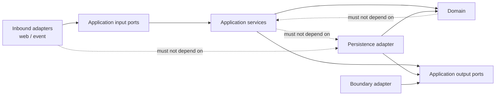

# Dependency Rules and Architecture Enforcement

## Purpose and Document Authority

This document defines Meridian’s normative source-dependency rules for the Java backend modular monolith and the strategy used to enforce them.

| Document | Authority |
|---|---|
| `MER-ARCH-001-bounded-contexts.md` | Business ownership, source-of-truth boundaries, published capabilities, and context collaboration |
| `MER-ARCH-002-project-structure.md` | Backend source layout and package placement |
| `MER-ARCH-003-dependency-rules.md` | Legal compile-time dependencies, public module surfaces, adapters, and architecture enforcement |
| `MER-ARCH-006-api-request-flow-and-dependencies.md` | Concrete request flows, transactions, retries, locks, and runtime security behavior |

This document translates the ownership in `MER-ARCH-001` into source-code constraints. It does not redefine which context owns business data or workflow state.

Implementation progress and temporary conformance gaps belong in the project roadmap and follow-up register. Executable tests remain authoritative for what is automatically enforced.

---

## 1. Core Dependency Principle

> **Dependencies point inward.**


```mermaid
graph LR
    WEB["Inbound adapters<br/>web / event"] --> IN["Application input ports"]
    IN --> APP["Application services"]
    APP --> DOMAIN["Domain"]
    APP --> OUT["Application output ports"]
    PERSIST["Persistence adapter"] --> OUT
    PERSIST --> DOMAIN
    BOUNDARY["Boundary adapter"] --> OUT

    DOMAIN -.->|"must not depend on"| APP
    APP -.->|"must not depend on"| PERSIST
    WEB -.->|"must not depend on"| PERSIST
```

The domain contains business state and policy. The application layer orchestrates use cases and owns its ports. Infrastructure implements technical concerns and boundary translation.

Framework convenience must not reverse this direction.

---

## 2. Layer Dependency Rules

| From | May depend on | Must not depend on |
|---|---|---|
| **Domain** | Java, its own domain types, minimal shared-domain abstractions | Spring, JPA, application, infrastructure, DTOs, foreign feature modules |
| **Application** | Its own domain, ports, DTOs, shared application abstractions, explicitly published foreign contracts | Infrastructure, JPA entities, web adapters, concrete security/JWT implementation, foreign internal application types |
| **Inbound web adapter** | Input ports, application DTOs, HTTP and authorization annotations, shared web abstractions | Repositories, output ports, JPA entities, domain services, foreign internals |
| **Inbound event adapter** | Published event contracts, input ports, event framework types | Foreign repositories, direct aggregate mutation, foreign infrastructure |
| **Persistence adapter** | Its module’s output ports, domain models, JPA/JDBC, persistence mapping | Controllers, foreign repositories or entities, workflow orchestration |
| **Boundary adapter** | Consumer-owned output port and provider’s published application contract | Provider domain, repositories, JPA entities, or internal services |
| **Shared kernel** | Java and stable cross-cutting abstractions | Every feature module |

### Domain

Domain code remains pure Java. It must not perform HTTP, database, storage, messaging, authentication-context, or framework operations.

### Application

Application services own orchestration, transactions, idempotency coordination, and policy selection. They may use `CurrentUserProvider`, but not Spring Security principals, JWT claims, or Identity infrastructure types.

### Adapters

Controllers and event listeners enter through application input ports. Persistence and boundary adapters implement output ports. Adapters translate protocols and records; they do not decide business state transitions.

---

## 3. Module Public Surfaces

Every feature module exposes an intentionally small application surface.

Published surfaces may include:

- application input ports;
- purpose-limited application contract records;
- business-event schemas;
- identifiers and closed value representations intended for collaboration.

Internal by default:

- domain models and services;
- repositories and output ports;
- application service implementations;
- persistence entities and adapters;
- controllers and web DTOs;
- configuration and concrete security implementation;
- storage keys, encryption envelopes, and provider-specific types.

Java `public` visibility alone does not make a type a cross-module contract. Public contracts must be deliberate, stable, and placed in a package intended for collaboration.

Spring Modulith named interfaces, package visibility, or equivalent ArchUnit rules may enforce these surfaces. Exact declarations belong in executable source rather than duplicated here.

---

## 4. Cross-Module Contracts and Adapters

These directions are different:

| Direction | Meaning |
|---|---|
| **Business collaboration** | Which context needs a capability or fact; defined in `MER-ARCH-001` |
| **Runtime invocation** | Which component calls a contract during execution |
| **Compile-time dependency** | Which package imports another package |
| **Persistence ownership** | Which context owns and mutates the data |

A runtime call never grants permission to import the provider’s domain or persistence model.

### Preferred Synchronous Pattern

```text
Consumer application
    → consumer-owned output port
    → consumer infrastructure adapter
    → provider published application contract
    → provider application
```

A boundary adapter may translate identifiers, immutable records, errors, redaction, and bounded sensitive values.

It must not expose provider aggregates, call provider repositories, retain unrestricted evidence, bypass provider checks, or perform foreign persistence writes.

### Cross-Module Rules

1. Domain and application packages must not depend on another feature’s domain, infrastructure, persistence, or web packages.
2. Foreign application types are allowed only when explicitly designated as published contracts or events.
3. Cross-context references use identifiers and purpose-limited immutable facts, not aggregate object graphs.
4. Each module owns its repositories, JPA entities, mappings, and tables.
5. Bidirectional collaboration uses separate explicit contracts or events; direct module cycles are forbidden.
6. Repository ports return domain objects or explicit application records, never REST DTOs.

---

## 5. Business Events and Reliability

Business events are published contracts representing facts that occurred or outcomes another context must apply.

Events should contain stable identifiers, closed action or reason values, timestamps, correlation data, and purpose-limited immutable facts.

They must not contain JPA entities, aggregate graphs, unrestricted evidence, secrets, encryption internals, or mutable shared collections.

An event listener is an inbound adapter. It translates the event into an application command and invokes an input port; it does not write repositories directly.

Two reliability models are valid when explicit:

- **Synchronous transaction participation** when downstream failure must roll back the originating outcome.
- **Durable asynchronous delivery** with defined retry, idempotency, ordering, reconciliation, and replay.

Fire-and-forget handling is forbidden for business-critical outcomes.

Audit and Notification consume events without becoming authorities over the workflow that produced them.

---

## 6. Persistence, Shared, Security, and Product Boundaries

### Persistence Isolation

Permitted cross-context references use stable identifiers, immutable snapshots, purpose-limited records, and published events.

Forbidden:

- importing a foreign JPA entity;
- calling a foreign repository or persistence adapter;
- sharing one entity between modules;
- using cross-context aggregate graphs;
- treating direct cross-context joins as application integration;
- writing another context’s tables.

A database foreign key may protect integrity without transferring aggregate ownership.

### Shared Kernel

`shared` contains only minimal stable abstractions such as common exceptions, actor representations, operation context, audit contracts, and generic time or identifier support.

It must not contain feature behavior or depend on `identity`, `customer`, `partner`, `loan`, `approval`, `document`, `audit`, or `notification`.

### Security Isolation

Concrete Spring Security and JWT code belongs to Identity infrastructure.

Feature domain and application code may use `AuthenticatedUser`, `CurrentUserProvider`, or explicit actor facts. They must not depend on security-context access, JWT libraries, Identity principals, filters, token services, or security configuration.

Authorization permits attempting a capability; the owning context still enforces resource ownership and business invariants.

### Product and Supporting Capabilities

Product-specific lending behavior remains inside `loan`. Top-level modules for Salary Advance, Unsecured Consumer Loan, or Collateral Loan are forbidden.

External OCR integration remains behind a Document-owned output port and Document infrastructure adapter. Loan consumes Document readiness rather than calling an OCR provider.

Audit and Notification observe published facts and never command a feature workflow.

Authoritative business ownership remains in `MER-ARCH-001`.

---

## 7. Security and Privacy at Boundaries

Contracts, events, errors, audit payloads, and logs follow least disclosure.

They may carry identifiers, masked values, closed statuses, reason codes, and authorized purpose-limited facts.

They must not expose unrestricted national identifiers or bank-account numbers; passwords, tokens, secrets, or keys; persistence entities; encryption or storage internals; or document evidence outside an authorized Document boundary.

Sensitive temporary values must be bounded to the operation that requires them and cleared when mutable memory handling is available.

Detailed HTTP disclosure and request-specific security rules belong in API and request-flow documentation.

---

## 8. Forbidden Dependency Patterns

| Forbidden pattern | Reason |
|---|---|
| Domain imports Spring, JPA, application, or infrastructure | Breaks domain independence |
| Application imports infrastructure | Reverses the dependency direction |
| Controller calls a repository or domain service | Bypasses the application use case |
| Event listener writes a repository directly | Bypasses consumer validation and orchestration |
| Module imports a foreign entity, repository, or internal service | Violates ownership and public surfaces |
| Shared imports a feature module | Reverses the shared-kernel dependency |
| Feature application imports Identity security implementation | Couples business code to authentication technology |
| Cross-context aggregate object graph | Creates shared ownership and hidden mutation |
| Top-level package for one loan product | Fragments the common lending lifecycle |
| Loan calls an OCR provider directly | Bypasses Document ownership |
| Audit or Notification commands a business workflow | Lets an observer become an authority |
| Business-critical fire-and-forget event | Leaves consistency and recovery undefined |
| Contract, event, error, or log exposes unrestricted PII or secrets | Violates privacy and least disclosure |

---

## 9. Architecture Rule Catalogue

| Rule ID | Normative rule | Preferred enforcement |
|---|---|---|
| `LAYER-DOMAIN-001` | Domain must not depend on Spring, JPA, application, or infrastructure | ArchUnit |
| `LAYER-APPLICATION-001` | Application must not depend on infrastructure | ArchUnit |
| `SECURITY-ISOLATION-001` | Domain and application must not depend on concrete security, JWT, or Identity security implementation | ArchUnit |
| `SHARED-001` | Shared must not depend on feature modules | ArchUnit |
| `WEB-BOUNDARY-001` | Web adapters must not depend on repositories, entities, domain services, or output ports | ArchUnit |
| `EVENT-BOUNDARY-001` | Event listeners enter through input ports and avoid direct persistence | ArchUnit plus review |
| `MODULE-PERSISTENCE-001` | Modules must not import or mutate foreign persistence models | ArchUnit plus review |
| `MODULE-PUBLIC-001` | Cross-module imports use explicit published contracts or events | Spring Modulith or ArchUnit |
| `MODULE-CYCLE-001` | Direct feature-module dependency cycles are forbidden | Spring Modulith or ArchUnit slices |
| `PRODUCT-BOUNDARY-001` | Product-specific lending behavior remains under Loan | ArchUnit package rules |
| `EVENT-RELIABILITY-001` | Critical event coordination defines failure and recovery semantics | Integration tests |
| `PRIVACY-BOUNDARY-001` | Public boundaries do not disclose unrestricted PII or secrets | Serialization, security, and logging tests |

---

## 10. Enforcement and Evolution

Mechanically checkable rules belong in `ArchitectureRulesTest` or focused architecture-test classes and run in the normal Maven verification lifecycle.

| Mechanism | Responsibility |
|---|---|
| Compiler and package visibility | Block accidental access to non-public types |
| ArchUnit | Layer imports, shared independence, security isolation, web boundaries, products, and cycles |
| Spring Modulith or equivalent rules | Module public surfaces and legal module dependencies |
| Unit and integration tests | Transactions, event failure behavior, adapter translation, persistence isolation, and privacy |
| Code review | Semantic ownership and purpose limitation |
| CI | Run architecture and verification tests on protected changes |

A rule must not be described as automatically enforced unless an executable test exists. Narrow negative rules are preferred over brittle framework allowlists or unreliable heuristics.

When architecture evolves:

1. update `MER-ARCH-001` when business ownership changes;
2. update `MER-ARCH-002` when package placement changes;
3. update this document when the legal dependency model changes;
4. add or revise executable architecture tests where practical;
5. record temporary source conformance gaps separately rather than weakening the durable rule;
6. version externally consumed contracts when compatibility requires it.

The modular monolith remains one deployable backend while its contexts preserve explicit ownership, controlled public surfaces, inward dependency direction, and enforceable boundaries.
