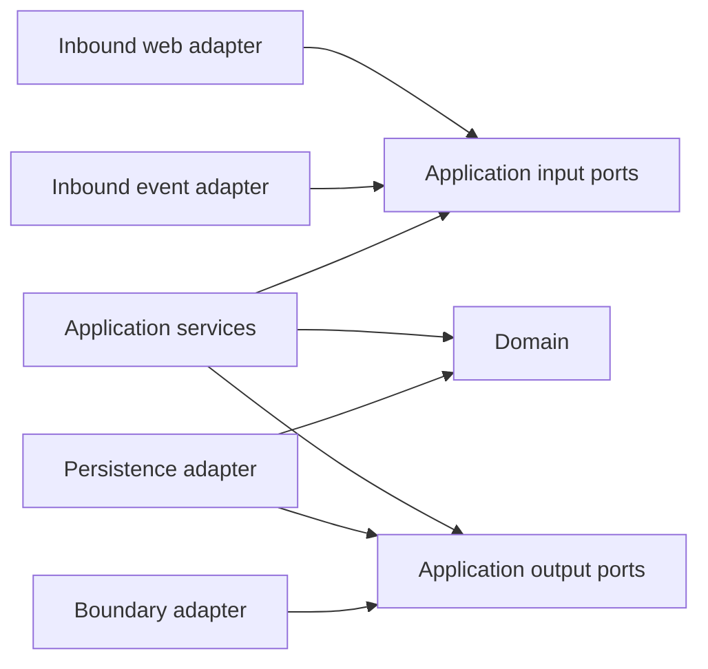

# Meridian Dependency Rules and Architecture Enforcement

## Purpose and Document Authority

This document defines the legal Java source dependencies for the `meridian-platform` modular monolith and how Meridian enforces them.

| Document | Authority |
|---|---|
| `MER-ARCH-001-bounded-contexts.md` | Business ownership, source-of-truth boundaries, public capabilities, and context collaboration |
| `MER-ARCH-002-project-structure.md` | Source layout, feature-module structure, and package placement |
| `MER-ARCH-003-dependency-rules.md` | Legal compile-time dependencies, public module surfaces, adapters, and architecture enforcement |
| `MER-ARCH-006-api-request-flow-and-dependencies.md` | Concrete request flows, transactions, retries, locks, and runtime security behavior |

Each bounded context is represented by a feature module as defined in `MER-ARCH-002`. `shared` is a technical package, not a feature module or bounded context.

This document translates the ownership rules in `MER-ARCH-001` into source-code constraints. It does not redefine business ownership or workflow state.

Implementation progress and temporary conformance gaps belong in the project roadmap and follow-up register. Executable architecture tests remain authoritative for rules described as automatically enforced.

---

## 1. Dependency Direction

> **Dependencies point inward.**

The arrows below show allowed source dependencies.


```mermaid
graph LR
    WEB["Inbound web adapter"] --> IN["Application input ports"]
    EVENT["Inbound event adapter"] --> IN
    APP["Application services"] --> IN
    APP --> DOMAIN["Domain"]
    APP --> OUT["Application output ports"]
    PERSIST["Persistence adapter"] --> OUT
    PERSIST --> DOMAIN
    BOUNDARY["Boundary adapter"] --> OUT
```

The domain owns business state and policy. The application layer implements use cases, coordinates transactions, and owns its input and output ports. Infrastructure handles protocols, persistence, providers, and cross-module translation.

Framework convenience must not reverse this direction.

---

## 2. Layer Dependency Rules

| From | May depend on | Must not depend on |
|---|---|---|
| **Domain** | Java, its own domain types, and stable shared abstractions | Spring, JPA, application, infrastructure, boundary DTOs, or foreign feature modules |
| **Application** | Its own domain, input and output ports, application DTOs, stable shared application abstractions, and explicitly published foreign contracts when the dependency is intentional | Infrastructure, JPA entities, web adapters, concrete security or JWT implementation, or foreign internal application types |
| **Inbound web adapter** | Application input ports and DTOs, HTTP and authorization annotations, and shared web abstractions | Repositories, output ports, JPA entities, domain services, or foreign internals |
| **Inbound event adapter** | Published event schemas, application input ports, and event-framework types | Repositories, direct aggregate mutation, or foreign infrastructure |
| **Persistence adapter** | Its module's output ports and domain models, JPA or JDBC, and persistence mapping | Controllers, foreign repositories or entities, or workflow orchestration |
| **Boundary adapter** | A consumer-owned output port and the provider's published application contract | Provider domain models, repositories, JPA entities, or internal services |
| **Shared kernel** | Java and stable cross-cutting technical abstractions | Any feature module |

### Domain

Domain code remains pure Java. It must not perform HTTP, database, storage, messaging, authentication-context, or framework operations.

### Application

Application services implement input ports and own use-case orchestration, transaction boundaries, idempotency coordination, and policy selection. They may use `CurrentUserProvider` or explicit actor facts, but not Spring Security principals, JWT claims, or Identity infrastructure types.

### Adapters

Controllers and event listeners invoke application input ports. Persistence and boundary adapters implement output ports. Adapters translate protocols and records; they must not decide business state transitions.

---

## 3. Module Public Surfaces

A feature module publishes only the contracts required for collaboration.

Published surfaces may include:

- application input ports intended for another module;
- purpose-limited application contract records;
- business-event schemas;
- identifiers and closed value representations intended for collaboration.

The following remain internal unless an owning architecture decision explicitly publishes them:

- domain models and services;
- repositories and output ports;
- application service implementations;
- persistence entities and adapters;
- controllers and web DTOs;
- configuration and concrete security implementation;
- storage keys, encryption envelopes, and provider-specific types.

Java `public` visibility alone does not make a type a cross-module contract. A published contract must be deliberate, stable, and placed in a package intended for collaboration.

Spring Modulith named interfaces, package visibility, or ArchUnit rules may enforce module surfaces. Exact declarations remain in executable source rather than being duplicated here.

---

## 4. Cross-Module Contracts and Adapters

Business collaboration, runtime calls, source dependencies, and persistence ownership describe different relationships.

| Relationship | Meaning |
|---|---|
| **Business collaboration** | Which context needs a capability or fact; defined in `MER-ARCH-001` |
| **Runtime invocation** | Which component calls a contract during execution |
| **Compile-time dependency** | Which package imports another package |
| **Persistence ownership** | Which context owns and mutates the data |

A runtime call does not grant permission to import the provider's domain or persistence model.

### Synchronous Collaboration

The preferred synchronous boundary is:

```text
consumer application
    → consumer-owned output port
    → consumer boundary adapter
    → provider public application contract
    → provider application
```

A boundary adapter may translate identifiers, immutable records, errors, redaction, and bounded sensitive values. It must not expose provider aggregates, call provider repositories, retain unrestricted evidence, bypass provider checks, or write provider-owned persistence.

### Cross-Module Source Rules

1. Domain and application packages must not depend on another feature's domain, infrastructure, persistence, or web packages.
2. Foreign application types are legal only when they are explicitly published contracts or event schemas.
3. Cross-context references use stable identifiers and purpose-limited immutable facts, not aggregate object graphs.
4. Each module owns its repositories, JPA entities, persistence mappings, and tables.
5. Bidirectional collaboration uses separate explicit contracts or events. Direct feature-module dependency cycles are forbidden.
6. Repository ports return domain objects or explicit application records, never REST DTOs.

---

## 5. Business Events and Reliability

Business events are published schemas representing facts that occurred or outcomes another context must apply.

Event schemas should contain stable identifiers, closed action or reason values, timestamps, correlation data, and purpose-limited immutable facts. They must not contain JPA entities, aggregate graphs, unrestricted evidence, secrets, encryption internals, or mutable shared collections.

An event listener is an inbound adapter. It translates the event into an application command and invokes an input port; it must not write repositories directly.

Meridian uses one of two explicit reliability models:

- **Synchronous transaction participation** when downstream failure must roll back the originating outcome.
- **Durable asynchronous delivery** when processing is decoupled and retry, idempotency, ordering, reconciliation, and replay are defined.

Business-critical coordination must not rely on fire-and-forget delivery.

Audit and Notification consume published facts without becoming authorities over the workflow that produced them.

---

## 6. Code-Level Boundary Rules

### Persistence Isolation

Cross-context references may use stable identifiers, immutable snapshots, purpose-limited records, and published events.

A module must not:

- import a foreign JPA entity;
- call a foreign repository or persistence adapter;
- share one persistence entity with another module;
- use a cross-context aggregate object graph;
- treat a direct cross-context join as application integration;
- write another context's tables.

A database foreign key may protect integrity without transferring aggregate ownership.

### Shared Kernel

`shared` must not contain feature behavior or depend on `identity`, `customer`, `partner`, `loan`, `approval`, `document`, `audit`, or `notification`. `MER-ARCH-001` and `MER-ARCH-002` define its permitted responsibility and placement.

### Security Isolation

Concrete Spring Security and JWT code belongs to Identity infrastructure.

Feature domain and application code may use `AuthenticatedUser`, `CurrentUserProvider`, or explicit actor facts. They must not depend on security-context access, JWT libraries, Identity principals, filters, token services, or security configuration.

Authorization permits an actor to attempt a capability. The owning context still enforces resource ownership and business invariants.

### Product and Supporting Capabilities

Product-specific lending code remains inside `loan`. Top-level feature modules for Salary Advance, Unsecured Consumer Loan, or Collateral Loan are forbidden.

External OCR integration remains behind a Document-owned output port and Document infrastructure adapter. Loan may consume Document's published readiness contract but must not import or call an OCR provider directly.

Audit and Notification consume published event schemas through their own inbound adapters. They must not import producer internals or command the workflow that produced an event.

`MER-ARCH-001` remains authoritative for the underlying business ownership.

---

## 7. Security and Privacy at Boundaries

Public contracts, event schemas, errors, audit payloads, and logs follow least disclosure.

They may carry identifiers, masked values, closed statuses, reason codes, and authorized purpose-limited facts.

They must not expose:

- unrestricted national identifiers or bank-account numbers;
- passwords, tokens, secrets, or keys;
- persistence entities;
- encryption or storage internals;
- document evidence outside an authorized Document boundary.

Detailed HTTP disclosure, sensitive-value handling, and request-specific security rules belong in API, security, and request-flow documentation.

---

## 8. Architecture Rule Catalogue

| Rule ID | Normative rule | Preferred enforcement |
|---|---|---|
| `LAYER-DOMAIN-001` | Domain must not depend on Spring, JPA, application, or infrastructure | ArchUnit |
| `LAYER-APPLICATION-001` | Application must not depend on infrastructure | ArchUnit |
| `SECURITY-ISOLATION-001` | Domain and application must not depend on concrete security, JWT, or Identity security implementation | ArchUnit |
| `SHARED-001` | Shared must not depend on feature modules | ArchUnit |
| `WEB-BOUNDARY-001` | Web adapters must not depend on repositories, entities, domain services, or output ports | ArchUnit |
| `EVENT-BOUNDARY-001` | Event listeners enter through input ports and avoid direct persistence | ArchUnit plus review |
| `MODULE-PERSISTENCE-001` | Modules must not import or mutate foreign persistence models | ArchUnit plus review |
| `MODULE-PUBLIC-001` | Cross-module imports use explicit published contracts or events | Spring Modulith or ArchUnit |
| `MODULE-CYCLE-001` | Direct feature-module dependency cycles are forbidden | Spring Modulith or ArchUnit slices |
| `PRODUCT-BOUNDARY-001` | Product-specific lending behavior remains under Loan | ArchUnit package rules |
| `EVENT-RELIABILITY-001` | Critical event coordination defines failure and recovery semantics | Integration tests |
| `PRIVACY-BOUNDARY-001` | Public boundaries do not disclose unrestricted PII or secrets | Serialization, security, and logging tests |

---

## 9. Enforcement and Evolution

Mechanically checkable rules belong in `ArchitectureRulesTest` or focused architecture-test classes and run in the normal Maven verification lifecycle.

| Mechanism | Responsibility |
|---|---|
| Compiler and package visibility | Block accidental access to non-public types |
| ArchUnit | Layer imports, shared independence, security isolation, web boundaries, product placement, and cycles |
| Spring Modulith or equivalent rules | Module public surfaces and legal module dependencies |
| Unit and integration tests | Transactions, event failure behavior, adapter translation, persistence isolation, and privacy |
| Code review | Semantic ownership, purpose limitation, and rules that cannot be checked mechanically |
| CI | Run architecture and verification tests on protected changes |

A rule must not be described as automatically enforced unless an executable test exists. Narrow negative rules are preferred over brittle framework allowlists or unreliable heuristics.

When the architecture evolves:

1. update `MER-ARCH-001` when business ownership changes;
2. update `MER-ARCH-002` when package placement changes;
3. update this document when the legal dependency model changes;
4. add or revise executable tests for every mechanically checkable rule, and identify code review when enforcement is semantic;
5. record temporary source conformance gaps separately rather than weakening the durable rule;
6. version published contracts when compatibility requires it.
