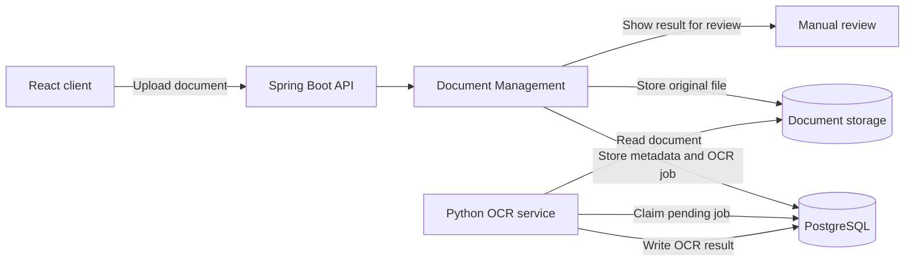
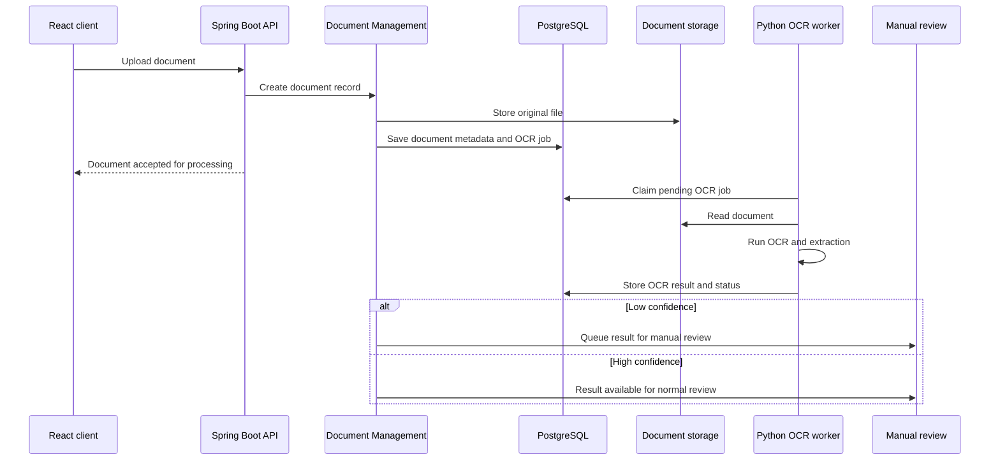

# MER-ARCH-005 — OCR Architecture

## 1. Purpose

This document defines the planned OCR-assisted document processing architecture for Meridian.

## 2. Scope

### In Scope

- OCR job creation for uploaded documents
- Asynchronous OCR processing
- Python OCR service for model execution
- OCR result persistence
- OCR confidence tracking
- Manual review of OCR-assisted results
- Trace correlation between Spring Boot and OCR workers

### Out of Scope

- Fully automated document approval
- Fully automated loan approval
- Dataset management platform
- Complex MLOps workflow
- Kafka/RabbitMQ-based orchestration
- Real external verification providers

---

## 3. Architectural Position

OCR belongs under the **Document Management** bounded context.

It is not a separate top-level bounded context.

```text
Document Management
├── Document upload
├── Document checklist
├── Manual document review
├── Document readiness
└── OCR-assisted processing
```

The Java backend remains the public entry point and system of record. The Python OCR service is an external processing component behind a document/OCR port.

```text
Spring Boot Document Module
→ OcrProcessingPort
→ Python OCR Service
```

Manual document review remains authoritative for checklist readiness, replacement, waiver, and acceptance decisions.

---

## 4. Main Decisions

| Decision | Phase 2 Direction | Rationale |
|---|---|---|
| OCR ownership | Document Management | OCR supports document processing and should not become a separate business bounded context. |
| Runtime | Separate Python service | OCR libraries, model loading, and CPU/GPU tuning fit better in Python. |
| API style | REST | REST is simpler to debug and operate with Spring Boot and FastAPI. |
| Execution model | Asynchronous | Document upload should not wait for OCR processing. |
| Job queue | PostgreSQL-backed queue | Sufficient for moderate Phase 2 workload and avoids extra infrastructure. |
| Low-confidence handling | Manual review | OCR assists reviewers but does not make final readiness decisions. |
| Observability | Shared trace ID | Spring Boot and OCR worker logs should be correlated. |

---

## 5. Service Topology



---

## 6. OCR Job Lifecycle

| State | Meaning |
|---|---|
| `PENDING` | OCR job is queued and waiting for a worker. |
| `PROCESSING` | A worker has claimed the job. |
| `COMPLETED` | OCR finished and a result is available. |
| `FAILED` | OCR failed after retry handling or encountered a non-retryable error. |

OCR result review is tracked separately:

| Review State | Meaning |
|---|---|
| `AUTO_APPROVED` | Confidence is high enough for normal assisted use. |
| `PENDING_REVIEW` | Confidence is low and a reviewer should check the result. |
| `REVIEWED` | A reviewer accepted or corrected the OCR result. |

---

## 7. Upload-to-Result Flow



The upload request does not wait for OCR completion.

---

## 8. Failure Handling

| Scenario | Handling |
|---|---|
| OCR worker is unavailable | Jobs remain pending until workers recover. |
| Worker crashes mid-job | The job can be retried after the processing lease expires. |
| Transient OCR error | Retry according to configured attempt limits. |
| Unsupported or corrupt file | Mark the job as failed and route document review manually. |
| Low-confidence result | Store the result and require manual review. |
| Duplicate job request | Use idempotency around document/job creation where needed. |

OCR failure should not block the entire loan workflow if manual document review can still proceed.

---

## 9. Data Model Direction

At a conceptual level, OCR needs records for:

- OCR job
- OCR result
- processing status
- confidence score
- review status
- model/version metadata
- trace ID
- retry metadata

---

## 10. Security and Privacy Notes

- OCR workers should access only the documents required for assigned jobs.
- OCR result data may contain sensitive customer information.
- OCR result access must follow document and back-office authorization rules.
- Logs must not expose raw personal or financial data.
- Trace IDs should be used for correlation without leaking sensitive payloads.

---

## 11. Observability Notes

Spring Boot creates or propagates a trace ID when a document is uploaded. The OCR job stores that trace ID so Python worker logs can be correlated with the original request.

Useful operational signals include:

- pending OCR job count
- failed job count
- average processing time
- low-confidence result count
- worker health
- retry count