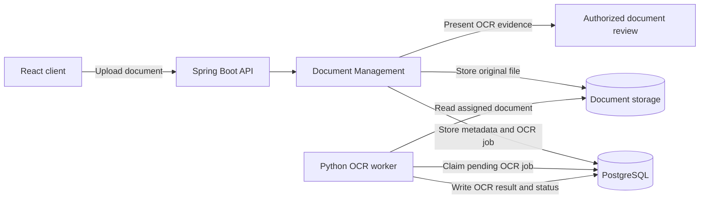
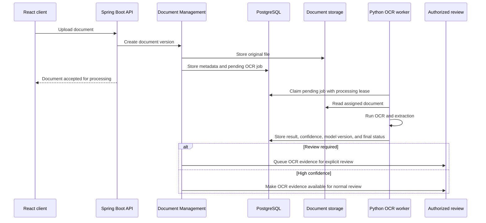

# MER-ARCH-005 — OCR-Assisted Document Processing

## Purpose and Authority

This document defines Meridian's intended OCR-assisted document-processing architecture.

OCR belongs to Document Management. This document owns the OCR service topology, job lifecycle, result handling, failure model, security boundary, and observability requirements. `MER-ARCH-001-bounded-contexts.md` remains authoritative for bounded-context ownership, while API documents define any external HTTP contracts.

OCR is a planned capability. Implementation status belongs in the project roadmap and follow-up register.

---

## 1. Scope

### In Scope

- OCR job creation for uploaded document versions
- asynchronous OCR processing
- a Python service for model execution
- OCR result and confidence persistence
- authorized review of OCR-assisted results
- retry and worker-recovery behavior
- trace correlation between Spring Boot and OCR workers

### Out of Scope

- automatic document acceptance or waiver
- automatic LoanApplication approval or rejection
- model training and dataset management
- a full MLOps platform
- Kafka or RabbitMQ orchestration
- OCR ownership outside Document Management

---

## 2. Architectural Position

OCR-assisted processing is a Document Management capability, not a separate bounded context.

```text
Document Management
├── Document upload and storage
├── Application checklists
├── Manual document review
├── Document readiness
└── OCR-assisted processing
```

The Spring Boot backend remains Meridian's public entry point and system of record. The Python OCR service performs model execution as an external processing component within the Document boundary.

```text
Document application
    → Document-owned OCR job port
    → PostgreSQL-backed OCR queue
    ← Python OCR worker
```

The worker may process Document-owned OCR jobs and results. It must not access another context's tables, repositories, or business state.

OCR output is advisory evidence. Authorized Document review remains authoritative for document acceptance, replacement, waiver, checklist state, and processing readiness.

---

## 3. Architecture Decisions

| Decision | Direction | Reason |
|---|---|---|
| Business ownership | Document Management | OCR processes document evidence and does not own lending decisions |
| Model runtime | Separate Python service | Python provides the required OCR libraries, model loading, and CPU/GPU execution support |
| Processing model | Asynchronous | Document upload must not wait for OCR completion |
| Job coordination | PostgreSQL-backed queue | The expected workload does not require a separate message broker |
| Worker access | Purpose-limited OCR tables and document objects | The worker needs only the job, source file, and result boundary |
| Operational API | REST for health, model readiness, and controlled administration | Operational calls remain simple to inspect and secure; job execution stays queue-driven |
| Low-confidence handling | Authorized manual review | OCR does not decide document acceptance or checklist readiness |
| Traceability | Shared trace and model-version metadata | A result must be traceable to its upload, worker execution, and model version |

---

## 4. Service Topology


```mermaid
flowchart LR
    Client[React client]
    API[Spring Boot API]
    Document[Document Management]
    DB[(PostgreSQL)]
    Storage[(Document storage)]
    OCR[Python OCR worker]
    Review[Authorized document review]

    Client -->|Upload document| API
    API --> Document
    Document -->|Store metadata and OCR job| DB
    Document -->|Store original file| Storage
    OCR -->|Claim pending OCR job| DB
    OCR -->|Read assigned document| Storage
    OCR -->|Write OCR result and status| DB
    Document -->|Present OCR evidence| Review
```

The client communicates only with the Spring Boot API. The OCR worker has no public lending or document-management API responsibility.

Direct worker access is limited to the Document-owned OCR queue, OCR result records, and assigned storage objects. Document Management remains authoritative for the resulting document workflow.

---

## 5. OCR Job Lifecycle

| State | Meaning |
|---|---|
| `PENDING` | The job is queued and waiting for a worker |
| `PROCESSING` | A worker holds the active processing lease |
| `COMPLETED` | OCR completed and a result is available |
| `FAILED` | Processing exhausted its retry policy or encountered a non-retryable error |

A processing lease prevents an abandoned `PROCESSING` job from remaining locked indefinitely. Another worker may reclaim the job after the lease expires.

OCR-result disposition is separate from job execution:

| Disposition | Meaning |
|---|---|
| `HIGH_CONFIDENCE` | The result is available for normal authorized review; it is not automatically accepted |
| `PENDING_REVIEW` | Confidence or extraction quality requires explicit reviewer attention |
| `REVIEWED` | An authorized reviewer accepted or corrected the OCR-assisted result |

These dispositions describe OCR evidence handling. They do not replace document-review decisions or checklist-item states.

---

## 6. Upload-to-Result Flow


```mermaid
sequenceDiagram
    participant Client as React client
    participant API as Spring Boot API
    participant Document as Document Management
    participant DB as PostgreSQL
    participant Storage as Document storage
    participant OCR as Python OCR worker
    participant Review as Authorized review

    Client->>API: Upload document
    API->>Document: Create document version
    Document->>Storage: Store original file
    Document->>DB: Store metadata and pending OCR job
    API-->>Client: Document accepted for processing

    OCR->>DB: Claim pending job with processing lease
    OCR->>Storage: Read assigned document
    OCR->>OCR: Run OCR and extraction
    OCR->>DB: Store result, confidence, model version, and final status

    alt Review required
        Document->>Review: Queue OCR evidence for explicit review
    else High confidence
        Document->>Review: Make OCR evidence available for normal review
    end
```

The upload request returns after the document version and OCR job are stored. It does not wait for OCR completion.

---

## 7. Result Ownership and Review

Document Management owns:

- OCR jobs and processing status
- extracted text and structured fields
- confidence scores
- model and version metadata
- reviewer corrections to OCR output
- OCR processing and review history

OCR results remain evidence attached to a document version. They must not directly:

- accept or reject a document
- waive required evidence
- mark a checklist item complete
- decide document-processing readiness
- approve, reject, or transition a LoanApplication

An authorized reviewer may use OCR output to inspect a document faster, correct extracted fields, and support a Document-owned review decision.

---

## 8. Failure and Retry Handling

| Scenario | Required handling |
|---|---|
| OCR worker unavailable | Jobs remain `PENDING` until a worker becomes available |
| Worker crashes during processing | The job becomes claimable after its processing lease expires |
| Retryable OCR failure | Record the attempt and retry under the configured limit and backoff policy |
| Non-retryable or corrupt input | Mark the job `FAILED` and preserve the original document for authorized manual review |
| Low-confidence result | Store the result and set its disposition to `PENDING_REVIEW` |
| Repeated creation for the same document version | Return or reuse the existing active or completed job instead of creating competing jobs |

OCR failure does not block document processing when the original document remains available and Document rules allow manual review. Failure must remain visible to reviewers and operational monitoring.

---

## 9. Conceptual Data Model

The OCR capability requires conceptual records for:

### OCR Job

- job identifier
- document and document-version identifiers
- processing state
- processing lease owner and expiry
- attempt count and retry timing
- failure category
- trace identifier
- creation and update timestamps

### OCR Result

- result identifier
- job identifier
- extracted text
- structured extracted fields
- confidence measures
- result disposition
- model and model-version metadata
- processing duration
- creation timestamp

### OCR Review

- result identifier
- reviewer identity
- reviewed or corrected values
- controlled review outcome
- review timestamp

Exact tables, columns, constraints, and indexes belong in database design and migrations.

---

## 10. Security and Privacy

- OCR workers may access only assigned document objects and Document-owned OCR records.
- Worker credentials must not grant access to Loan, Customer, Partner, Approval, or Identity persistence.
- OCR results and extracted fields inherit Document authorization rules.
- Logs must not contain raw identity, financial, account, or document content.
- Errors must not expose storage keys, model internals, credentials, or unrestricted extracted evidence.
- Trace identifiers correlate processing without carrying sensitive payloads.
- Temporary files must be deleted after processing or retained only under an explicit secure-retention rule.

The OCR service does not expose document content directly to clients. Authorized access remains through the Spring Boot Document boundary.

---

## 11. Observability

Spring Boot creates or propagates a trace identifier when accepting a document upload. The OCR job retains that identifier so API, database, storage, and worker activity can be correlated.

Operational monitoring includes:

- pending-job count and oldest pending-job age
- active processing leases
- completed and failed job counts
- processing duration
- retry count and exhausted retries
- low-confidence result count
- worker health and model readiness
- results by model version

Alerts should distinguish worker unavailability, queue growth, repeated model failure, storage failure, and database coordination failure.
