# MER-ARCH-006 — API Request Flow and Dependency Diagrams

## 1. One-Minute Mental Model

`Client -> Controller -> Input Port -> Application Service -> Output Port -> Persistence Adapter -> JPA -> PostgreSQL -> Domain -> DTO -> JSON`

Infrastructure receives and adapts.
Application orchestrates.
Domain holds business truth.
Database and JPA stay outside.

## 2. High-Level Hexagonal Flow

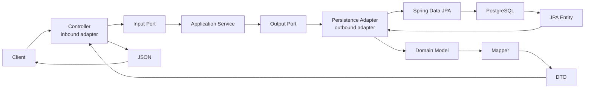

Notes:

- Controllers adapt HTTP into use-case calls.
- Services orchestrate through ports.
- Adapters translate infrastructure data into domain models.
- DTOs are the API response shape.

## 3. Runtime Flow vs Source Dependency

Runtime calls move outward to the database and then return.

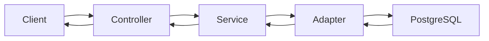

Source dependencies point inward toward business rules.

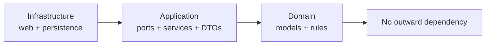

Runtime flow and source dependency direction are related, but not identical.
Runtime is "who calls whom right now."
Source dependency is "what code is allowed to import what."
Meridian keeps source dependencies pointing inward.

## 4. Loan Product Endpoint Flow

`GET /api/v1/loan-products`

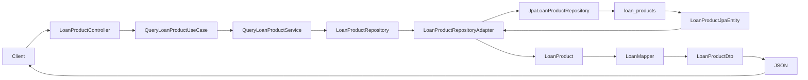

Read this as: controller calls the query use case, the service reads active products through the repository port, persistence maps rows to `LoanProduct`, and the mapper returns `LoanProductDto` JSON.

## 5. Partner Company Endpoint Flow

`GET /api/v1/partner-companies/{partnerCompanyId}`

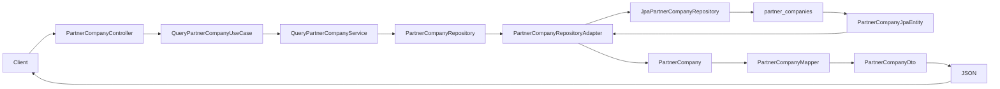

Error flow:

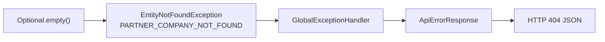

## 6. Protected Partner Employee Endpoint Flow

`GET /api/v1/partner-companies/{partnerCompanyId}/employees?activeOnly=true`

Security posture:

- Requires authentication through the current Spring Security gate.
- Intended as an internal/back-office endpoint.
- Returns detailed `PartnerEmployeeDto`, including employee evidence and salary/limit fields, only behind this protected endpoint.
- Do not reuse this DTO for public/customer-facing responses.

```mermaid
flowchart LR
    Client["Client"]
    Controller["PartnerEmployeeController"]
    InPort["QueryPartnerEmployeeUseCase"]
    Service["QueryPartnerEmployeeService"]
    Decision{"activeOnly?"}

    PortAll["PartnerEmployeeRepository<br/>findByPartnerCompanyId"]
    AdapterAll["PartnerEmployeeRepositoryAdapter"]
    JpaAll["JpaPartnerEmployeeRepository<br/>findByPartnerCompanyIdOrderByEmployeeCodeAsc"]

    PortActive["PartnerEmployeeRepository<br/>findActiveByPartnerCompanyId"]
    AdapterActive["PartnerEmployeeRepositoryAdapter"]
    JpaActive["JpaPartnerEmployeeRepository<br/>findByPartnerCompanyIdAndActiveTrueOrderByEmployeeCodeAsc"]

    Table["partner_employees"]
    Entity["PartnerEmployeeJpaEntity"]
    AdapterMap["PartnerEmployeeRepositoryAdapter<br/>toDomain"]
    Domain["PartnerEmployee"]
    Mapper["PartnerEmployeeMapper"]
    Dto["PartnerEmployeeDto"]
    Json["JSON"]

    Client --> Controller --> InPort --> Service --> Decision
    Decision -->|"false / omitted"| PortAll --> AdapterAll --> JpaAll --> Table
    Decision -->|"true"| PortActive --> AdapterActive --> JpaActive --> Table
    Table --> Entity --> AdapterMap --> Domain --> Mapper --> Dto --> Json --> Client
```

`activeOnly=true` is pushed down to the Spring Data query.

## 7. Import Batch Endpoint Flow

`GET /api/v1/partner-companies/{partnerCompanyId}/employee-import-batches`

```mermaid
flowchart LR
    Client["Client"]
    Controller["PartnerEmployeeImportBatchController"]
    InPort["QueryPartnerEmployeeImportBatchUseCase"]
    Service["QueryPartnerEmployeeImportBatchService"]

    CompanyPort["PartnerCompanyRepository<br/>findById"]
    CompanyAdapter["PartnerCompanyRepositoryAdapter"]
    CompanyJpa["JpaPartnerCompanyRepository"]
    CompanyTable["partner_companies"]
    Exists{"company exists?"}

    Missing["EntityNotFoundException"]
    Handler["GlobalExceptionHandler"]
    NotFound["HTTP 404 JSON"]

    BatchPort["PartnerEmployeeImportBatchRepository<br/>findByPartnerCompanyId"]
    BatchAdapter["PartnerEmployeeImportBatchRepositoryAdapter"]
    BatchJpa["JpaPartnerEmployeeImportBatchRepository<br/>findByPartnerCompanyIdOrderByEffectiveMonthDesc"]
    BatchTable["partner_employee_import_batches"]
    Entity["PartnerEmployeeImportBatchJpaEntity"]
    AdapterMap["PartnerEmployeeImportBatchRepositoryAdapter<br/>toDomain"]
    Domain["PartnerEmployeeImportBatch"]
    Mapper["PartnerEmployeeImportBatchMapper"]
    Dto["PartnerEmployeeImportBatchDto"]
    Json["JSON"]

    Client --> Controller --> InPort --> Service --> CompanyPort --> CompanyAdapter --> CompanyJpa --> CompanyTable --> Exists
    Exists -->|"no"| Missing --> Handler --> NotFound --> Client
    Exists -->|"yes"| BatchPort --> BatchAdapter --> BatchJpa --> BatchTable --> Entity --> AdapterMap --> Domain --> Mapper --> Dto --> Json --> Client
```

The service checks the partner company first, then loads import batches.

## 8. Employee Verification Endpoint Flow

`POST /api/v1/partner-companies/{partnerCompanyId}/employee-verifications`

Security posture:

- Requires authentication through the current Spring Security gate.
- This endpoint can support the customer employee-verification journey, but it is not public/anonymous.
- Current MVP request still includes `customerId`; ownership enforcement remains tracked in MER-FU-004.
- The response is PII-safe and does not echo raw `identityReference`, `employeeCode`, salary, salary advance limit, or raw matching evidence.

Request fields:

| Field | Notes |
| --- | --- |
| `customerId` | Temporary MVP shortcut until derived from authenticated principal or admin permission. |
| `identityReference` | Used for matching only; not returned in the response. |
| `employeeCode` | Used for matching only; not returned in the response. |

Response fields:

| Field | Notes |
| --- | --- |
| `customerId` | Customer reference. |
| `partnerCompanyId` | Partner Company reference. |
| `partnerEmployeeId` | Present only when a single employee record was matched. |
| `customerPartnerEmployeeLinkId` | Present when a reusable verified link exists or is created. |
| `outcome` | Employee verification outcome such as `MATCHED_ACTIVE`, `MATCHED_INACTIVE`, or `PENDING_MANUAL_REVIEW`. |
| `linkStatus` | Link status when a link is involved. |
| `manualReviewRequired` | Whether the result must go to authorized manual review. |

Business-rule notes:

- Partner Company existence is checked first.
- Non-active Partner Companies are rejected with `PARTNER_COMPANY_INACTIVE` before import-batch lookup, employee matching, link creation, or manual-review routing.
- Active Partner Company plus one active employee match creates or refreshes the reusable customer-partner-employee link.
- Missing or ambiguous employee evidence may route to manual review according to the Partner verification policy, but inactive Partner Companies are hard stops.

```mermaid
flowchart LR
    Client["Authenticated client"]
    Controller["PartnerEmployeeVerificationController"]
    InPort["VerifyPartnerEmployeeUseCase"]
    Service["VerifyPartnerEmployeeService"]
    CompanyPort["PartnerCompanyRepository"]
    Policy["PartnerEmployeeVerificationPolicy"]
    BatchPort["PartnerEmployeeImportBatchRepository"]
    EmployeePort["PartnerEmployeeRepository"]
    LinkPort["CustomerPartnerEmployeeLinkRepository"]
    Mapper["PartnerEmployeeVerificationMapper"]
    Dto["Safe PartnerEmployeeVerificationDto"]
    Json["JSON"]

    Client --> Controller --> InPort --> Service --> CompanyPort --> Policy
    Policy --> BatchPort --> EmployeePort --> LinkPort --> Mapper --> Dto --> Json
```

## 9. Salary Advance Application Endpoint Flow

`POST /api/v1/loan-applications/salary-advance`

Security posture:

- Requires authentication through the current Spring Security gate.
- Current MVP request still includes `customerId`; ownership enforcement remains tracked in MER-FU-004.
- This endpoint is protected but not yet role/action-authorized because full JWT/RBAC remains a future IAM milestone.

Request fields:

| Field | Notes |
| --- | --- |
| `customerId` | Temporary MVP shortcut until ownership is derived from authentication. |
| `customerPartnerEmployeeLinkId` | Reusable verified employee-link reference. |
| `requestedAmount` | Requested Salary Advance amount. |
| `requestedTermMonths` | Requested term, currently validated by Salary Advance policy. |

Response fields:

| Field group | Notes |
| --- | --- |
| Application IDs/status | `loanApplicationId`, `applicationNumber`, `customerId`, product code/type, status, and submitted timestamp. |
| Request summary | Requested amount and term. |
| Salary Advance references | Customer employee link, Salary Advance limit, and verification snapshot IDs. |
| Verification/limit snapshot | Product verification result plus total, used, reserved, and available limit snapshots. |

PII behavior:

- The response does not expose Partner Employee salary, identity reference, employee code, bank account data, or raw evidence.
- Limit snapshots are retained because they explain the lending decision and reservation state for the application.

```mermaid
flowchart LR
    Client["Authenticated client"]
    Controller["SalaryAdvanceLoanApplicationController"]
    InPort["StartSalaryAdvanceApplicationUseCase"]
    Service["StartSalaryAdvanceApplicationService"]
    ProductPort["LoanProductRepository"]
    PartnerPort["PartnerEligibilityPort"]
    LimitPort["SalaryAdvanceLimitRepository"]
    LoanPort["LoanApplicationRepository"]
    VerificationPort["SalaryAdvanceVerificationRepository"]
    Mapper["LoanMapper"]
    Dto["SalaryAdvanceApplicationDto"]
    Json["JSON"]

    Client --> Controller --> InPort --> Service --> ProductPort
    Service --> PartnerPort --> LimitPort --> LoanPort --> VerificationPort --> Mapper --> Dto --> Json
```

## 10. Database / Flyway Flow

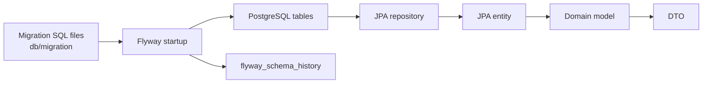

Notes:

- Flyway applies schema changes before normal API usage.
- PostgreSQL stores both application tables and Flyway history.
- JPA repositories query tables and hydrate JPA entities.
- Adapters convert JPA entities to domain models before DTO mapping.

## 11. Rules To Remember

- Controller calls input port, never JPA.
- Service calls output port, never adapter implementation.
- Output port returns domain model, not DTO.
- Adapter maps JPA entity to domain model.
- Mapper maps domain model to DTO.
- Domain imports no Spring, no JPA, no DTO, no web.
- Flyway owns database schema changes.
