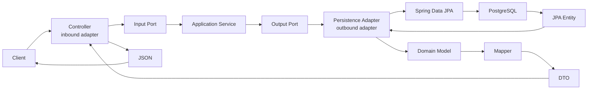
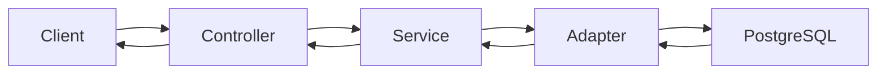
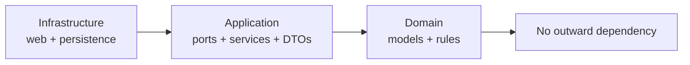
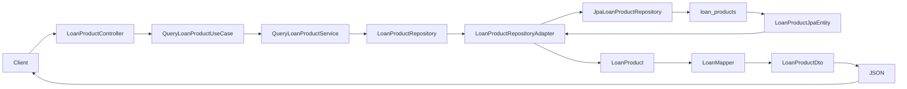
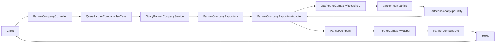
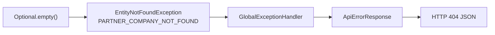
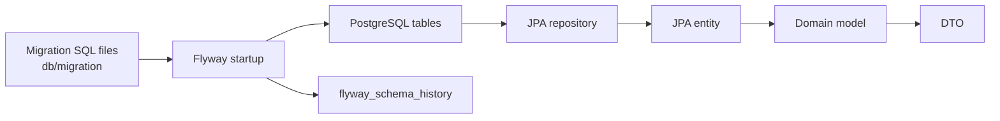
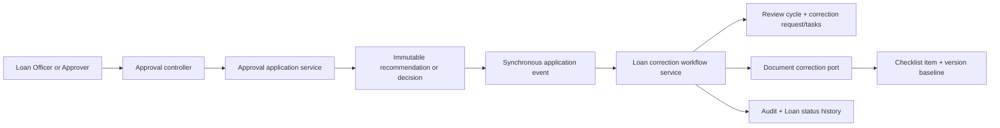
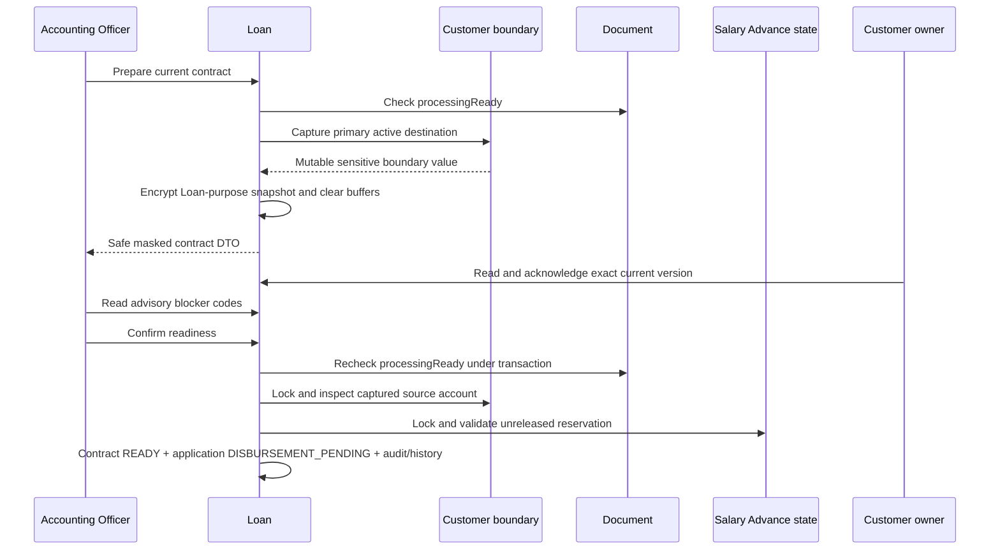

# MER-ARCH-006 — API Request Flow and Dependency Diagrams

## 1. One-Minute Mental Model

`Client -> Controller -> Input Port -> Application Service -> Output Port -> Persistence Adapter -> JPA -> PostgreSQL -> Domain -> DTO -> JSON`

Infrastructure receives and adapts.
Application orchestrates.
Domain holds business truth.
Database and JPA stay outside.

## 2. High-Level Hexagonal Flow

```mermaid
flowchart LR
    Client["Client"]
    Controller["Controller<br/>inbound adapter"]
    InPort["Input Port"]
    Service["Application Service"]
    OutPort["Output Port"]
    Adapter["Persistence Adapter<br/>outbound adapter"]
    Jpa["Spring Data JPA"]
    Db["PostgreSQL"]
    Entity["JPA Entity"]
    Domain["Domain Model"]
    Mapper["Mapper"]
    Dto["DTO"]
    Json["JSON"]

    Client --> Controller --> InPort --> Service --> OutPort --> Adapter --> Jpa --> Db
    Db --> Entity --> Adapter --> Domain --> Mapper --> Dto --> Controller --> Json --> Client
```

Notes:

- Controllers adapt HTTP into use-case calls.
- Services orchestrate through ports.
- Adapters translate infrastructure data into domain models.
- DTOs are the API response shape.

## 3. Runtime Flow vs Source Dependency

Runtime calls move outward to the database and then return.

```mermaid
flowchart LR
    Client --> Controller --> Service --> Adapter --> Db["PostgreSQL"]
    Db --> Adapter --> Service --> Controller --> Client
```

Source dependencies point inward toward business rules.

```mermaid
flowchart LR
    Infra["Infrastructure<br/>web + persistence"] --> App["Application<br/>ports + services + DTOs"]
    App --> Domain["Domain<br/>models + rules"]
    Domain --> Nobody["No outward dependency"]
```

Runtime flow and source dependency direction are related, but not identical.
Runtime is "who calls whom right now."
Source dependency is "what code is allowed to import what."
Meridian keeps source dependencies pointing inward.

## 4. Loan Product Endpoint Flow

`GET /api/v1/loan-products`

```mermaid
flowchart LR
    Client["Client"]
    Controller["LoanProductController"]
    InPort["QueryLoanProductUseCase"]
    Service["QueryLoanProductService"]
    OutPort["LoanProductRepository"]
    Adapter["LoanProductRepositoryAdapter"]
    Jpa["JpaLoanProductRepository"]
    Table["loan_products"]
    Entity["LoanProductJpaEntity"]
    Domain["LoanProduct"]
    Mapper["LoanMapper"]
    Dto["LoanProductDto"]
    Json["JSON"]

    Client --> Controller --> InPort --> Service --> OutPort --> Adapter --> Jpa --> Table
    Table --> Entity --> Adapter --> Domain --> Mapper --> Dto --> Json --> Client
```

Read this as: controller calls the query use case, the service reads active products through the repository port, persistence maps rows to `LoanProduct`, and the mapper returns `LoanProductDto` JSON.

## 5. Partner Company Endpoint Flow

`GET /api/v1/partner-companies/{partnerCompanyId}`

```mermaid
flowchart LR
    Client["Client"]
    Controller["PartnerCompanyController"]
    InPort["QueryPartnerCompanyUseCase"]
    Service["QueryPartnerCompanyService"]
    OutPort["PartnerCompanyRepository"]
    Adapter["PartnerCompanyRepositoryAdapter"]
    Jpa["JpaPartnerCompanyRepository"]
    Table["partner_companies"]
    Entity["PartnerCompanyJpaEntity"]
    Domain["PartnerCompany"]
    Mapper["PartnerCompanyMapper"]
    Dto["PartnerCompanyDto"]
    Json["JSON"]

    Client --> Controller --> InPort --> Service --> OutPort --> Adapter --> Jpa --> Table
    Table --> Entity --> Adapter --> Domain --> Mapper --> Dto --> Json --> Client
```

Error flow:

```mermaid
flowchart LR
    Empty["Optional.empty()"]
    Exception["EntityNotFoundException<br/>PARTNER_COMPANY_NOT_FOUND"]
    Handler["GlobalExceptionHandler"]
    Error["ApiErrorResponse"]
    Json["HTTP 404 JSON"]

    Empty --> Exception --> Handler --> Error --> Json
```

## 6. Protected Partner Employee Endpoint Flow

`GET /api/v1/partner-companies/{partnerCompanyId}/employees?activeOnly=true`

Security posture:

- Requires JWT Bearer authentication plus `partner:read`.
- Intended as an internal/back-office endpoint.
- Returns detailed `PartnerEmployeeDto`, including employee evidence and salary/limit fields, only behind this protected endpoint.
- Do not reuse this DTO for public/customer-facing responses.

```mermaid
flowchart LR
    Client["Client"]
    Controller["PartnerEmployeeController"]
    InPort["QueryPartnerEmployeeUseCase"]
    Service["QueryPartnerEmployeeService"]
    Decision{"activeOnly?"}

    PortAll["PartnerEmployeeRepository<br/>findByPartnerCompanyId"]
    AdapterAll["PartnerEmployeeRepositoryAdapter"]
    JpaAll["JpaPartnerEmployeeRepository<br/>findByPartnerCompanyIdOrderByEmployeeCodeAsc"]

    PortActive["PartnerEmployeeRepository<br/>findActiveByPartnerCompanyId"]
    AdapterActive["PartnerEmployeeRepositoryAdapter"]
    JpaActive["JpaPartnerEmployeeRepository<br/>findByPartnerCompanyIdAndActiveTrueOrderByEmployeeCodeAsc"]

    Table["partner_employees"]
    Entity["PartnerEmployeeJpaEntity"]
    AdapterMap["PartnerEmployeeRepositoryAdapter<br/>toDomain"]
    Domain["PartnerEmployee"]
    Mapper["PartnerEmployeeMapper"]
    Dto["PartnerEmployeeDto"]
    Json["JSON"]

    Client --> Controller --> InPort --> Service --> Decision
    Decision -->|"false / omitted"| PortAll --> AdapterAll --> JpaAll --> Table
    Decision -->|"true"| PortActive --> AdapterActive --> JpaActive --> Table
    Table --> Entity --> AdapterMap --> Domain --> Mapper --> Dto --> Json --> Client
```

`activeOnly=true` is pushed down to the Spring Data query.

## 7. Import Batch Endpoint Flow

`GET /api/v1/partner-companies/{partnerCompanyId}/employee-import-batches`

```mermaid
flowchart LR
    Client["Client"]
    Controller["PartnerEmployeeImportBatchController"]
    InPort["QueryPartnerEmployeeImportBatchUseCase"]
    Service["QueryPartnerEmployeeImportBatchService"]

    CompanyPort["PartnerCompanyRepository<br/>findById"]
    CompanyAdapter["PartnerCompanyRepositoryAdapter"]
    CompanyJpa["JpaPartnerCompanyRepository"]
    CompanyTable["partner_companies"]
    Exists{"company exists?"}

    Missing["EntityNotFoundException"]
    Handler["GlobalExceptionHandler"]
    NotFound["HTTP 404 JSON"]

    BatchPort["PartnerEmployeeImportBatchRepository<br/>findByPartnerCompanyId"]
    BatchAdapter["PartnerEmployeeImportBatchRepositoryAdapter"]
    BatchJpa["JpaPartnerEmployeeImportBatchRepository<br/>findByPartnerCompanyIdOrderByEffectiveMonthDesc"]
    BatchTable["partner_employee_import_batches"]
    Entity["PartnerEmployeeImportBatchJpaEntity"]
    AdapterMap["PartnerEmployeeImportBatchRepositoryAdapter<br/>toDomain"]
    Domain["PartnerEmployeeImportBatch"]
    Mapper["PartnerEmployeeImportBatchMapper"]
    Dto["PartnerEmployeeImportBatchDto"]
    Json["JSON"]

    Client --> Controller --> InPort --> Service --> CompanyPort --> CompanyAdapter --> CompanyJpa --> CompanyTable --> Exists
    Exists -->|"no"| Missing --> Handler --> NotFound --> Client
    Exists -->|"yes"| BatchPort --> BatchAdapter --> BatchJpa --> BatchTable --> Entity --> AdapterMap --> Domain --> Mapper --> Dto --> Json --> Client
```

The service checks the partner company first, then loads import batches.

## 8. Employee Verification Endpoint Flow

`POST /api/v1/partner-companies/{partnerCompanyId}/employee-verifications`

Security posture:

- Requires JWT Bearer authentication plus `partner:employee:verify:own`.
- This endpoint can support the customer employee-verification journey, but it is not public/anonymous.
- `customerId` is derived from the authenticated customer token through `CurrentUserProvider`; it is not accepted in the request body.
- The response is PII-safe and does not echo raw identity evidence, `employeeCode`, salary, salary advance limit, or raw matching evidence.

Request fields:

| Field | Notes |
| --- | --- |
| `employeeCode` | Used for matching only; not returned in the response. |

The identity reference used for matching is loaded from the authenticated Customer profile through a narrow internal Customer contract. It is not accepted in the request body.

Response fields:

| Field | Notes |
| --- | --- |
| `customerId` | Authenticated customer reference derived from the Bearer token. |
| `partnerCompanyId` | Partner Company reference. |
| `partnerEmployeeId` | Present only when a single employee record was matched. |
| `customerPartnerEmployeeLinkId` | Present when a reusable verified link exists or is created. |
| `outcome` | Employee verification outcome such as `MATCHED_ACTIVE`, `MATCHED_INACTIVE`, or `PENDING_MANUAL_REVIEW`. |
| `linkStatus` | Link status when a link is involved. |
| `manualReviewRequired` | Whether the result must go to authorized manual review. |

Business-rule notes:

- Partner Company existence is checked first.
- Non-active Partner Companies are rejected with `PARTNER_COMPANY_INACTIVE` before import-batch lookup, employee matching, link creation, or manual-review routing.
- Active Partner Company plus one active employee match creates or refreshes the reusable customer-partner-employee link.
- Missing or ambiguous employee evidence may route to manual review according to the Partner verification policy, but inactive Partner Companies are hard stops.

```mermaid
flowchart LR
    Client["Authenticated client"]
    Controller["PartnerEmployeeVerificationController"]
    InPort["VerifyPartnerEmployeeUseCase"]
    Service["VerifyPartnerEmployeeService"]
    UserProvider["CurrentUserProvider<br/>authenticated customerId"]
    CompanyPort["PartnerCompanyRepository"]
    Policy["PartnerEmployeeVerificationPolicy"]
    BatchPort["PartnerEmployeeImportBatchRepository"]
    EmployeePort["PartnerEmployeeRepository"]
    LinkPort["CustomerPartnerEmployeeLinkRepository"]
    Mapper["PartnerEmployeeVerificationMapper"]
    Dto["Safe PartnerEmployeeVerificationDto"]
    Json["JSON"]

    Client --> Controller --> InPort --> Service --> UserProvider --> CompanyPort --> Policy
    Policy --> BatchPort --> EmployeePort --> LinkPort --> Mapper --> Dto --> Json
```

## 9. Salary Advance Application Endpoint Flow

`POST /api/v1/loan-applications/salary-advance`

Security posture:

- Requires JWT Bearer authentication plus `loan:submit`.
- `customerId` is derived from the authenticated customer token through `CurrentUserProvider`; it is not accepted in the request body.
- Salary Advance submission requires an active Customer, complete Customer profile, and primary active bank account. Customer verification status is not required until real Customer verification/KYC is implemented.

Request fields:

| Field | Notes |
| --- | --- |
| `customerPartnerEmployeeLinkId` | Reusable verified employee-link reference. |
| `requestedAmount` | Requested Salary Advance amount; must be mathematically whole VND, while scale-only trailing zeros remain valid. |
| `requestedTermMonths` | Requested term, currently validated by Salary Advance policy. |

Response fields:

| Field group | Notes |
| --- | --- |
| Application IDs/status | `loanApplicationId`, `applicationNumber`, `customerId`, product code/type, status, and submitted timestamp. |
| Request summary | Requested amount and term. |
| Salary Advance references | Customer employee link, Salary Advance limit, and verification snapshot IDs. |
| Verification/limit snapshot | Product verification result plus total, used, reserved, and available limit snapshots. |

PII behavior:

- The response does not expose Partner Employee salary, identity reference, employee code, bank account data, or raw evidence.
- Limit snapshots are retained because they explain the lending decision and reservation state for the application.

Concurrency and conflict contract:

1. Acquire the transaction-scoped customer/product advisory lock.
2. Perform the authoritative blocking-application check.
3. Load and calculate Partner eligibility.
4. Acquire the existing customer/employee-link advisory lock.
5. Repeat the blocking check defensively.
6. Lock or initialize the Salary Advance limit and perform reservation/application writes.

The V11 `uq_loan_applications_customer_product_active` partial unique index remains the database authority. Only SQLSTATE `23505` naming that exact index is translated to `409 BLOCKING_APPLICATION_EXISTS`; unrelated integrity violations are rethrown.

```mermaid
flowchart LR
    Client["Authenticated client"]
    Controller["SalaryAdvanceLoanApplicationController"]
    InPort["StartSalaryAdvanceApplicationUseCase"]
    Service["StartSalaryAdvanceApplicationService"]
    ProductPort["LoanProductRepository"]
    PartnerPort["PartnerEligibilityPort"]
    LimitPort["SalaryAdvanceLimitRepository"]
    LoanPort["LoanApplicationRepository"]
    VerificationPort["SalaryAdvanceVerificationRepository"]
    Mapper["LoanMapper"]
    Dto["SalaryAdvanceApplicationDto"]
    Json["JSON"]

    Client --> Controller --> InPort --> Service --> ProductPort
    Service --> PartnerPort --> LimitPort --> LoanPort --> VerificationPort --> Mapper --> Dto --> Json
```

## 10. Database / Flyway Flow

```mermaid
flowchart LR
    Sql["Migration SQL files<br/>db/migration"]
    Flyway["Flyway startup"]
    Tables["PostgreSQL tables"]
    History["flyway_schema_history"]
    Jpa["JPA repository"]
    Entity["JPA entity"]
    Domain["Domain model"]
    Dto["DTO"]

    Sql --> Flyway
    Flyway --> Tables
    Flyway --> History
    Tables --> Jpa --> Entity --> Domain --> Dto
```

Notes:

- Flyway applies schema changes before normal API usage.
- PostgreSQL stores both application tables and Flyway history.
- JPA repositories query tables and hydrate JPA entities.
- Adapters convert JPA entities to domain models before DTO mapping.

## 11. Rules To Remember

- Controller calls input port, never JPA.
- Service calls output port, never adapter implementation.
- Output port returns domain model, not DTO.
- Adapter maps JPA entity to domain model.
- Mapper maps domain model to DTO.
- Domain imports no Spring, no JPA, no DTO, no web.
- Flyway owns database schema changes.

## 12. Document and Correction Continuation

Revision-producing recommendation and decision actions remain synchronously
coordinated with Loan. Approval records the immutable source action and publishes
the structured plan; the Loan listener locks the workflow, transitions the
application, creates the correction aggregate and checklist evidence, and records
audit/history in the originating transaction.

```mermaid
flowchart LR
    StaffClient["Loan Officer or Approver"]
    ApprovalController["Approval controller"]
    ApprovalService["Approval application service"]
    ApprovalStore["Immutable recommendation or decision"]
    SyncEvent["Synchronous application event"]
    LoanService["Loan correction workflow service"]
    LoanStore["Review cycle + correction request/tasks"]
    DocumentPort["Document correction port"]
    DocumentStore["Checklist item + version baseline"]
    AuditStore["Audit + Loan status history"]

    StaffClient --> ApprovalController --> ApprovalService --> ApprovalStore --> SyncEvent
    SyncEvent --> LoanService --> LoanStore
    LoanService --> DocumentPort --> DocumentStore
    LoanService --> AuditStore
```

Customer APIs derive the exact owner from `CurrentUserProvider`. Staff queue,
completion, upload, content-read, review, waiver, and resubmission endpoints each
require their narrow authority; task ownership and maker-checker are enforced again
inside the application service.

```mermaid
flowchart LR
    Actor["Authenticated Customer or Staff"]
    Controller["Correction or Document controller"]
    UseCase["Input port"]
    Service["Transactional application service"]
    WorkflowLock["Loan Application workflow lock"]
    CorrectionLock["Correction request/task locks"]
    DocumentLock["Checklist item/document locks"]
    Revalidate["Customer + Partner + product + document + reservation revalidation"]
    Persist["New verification + status/cycle + audit/history"]

    Actor --> Controller --> UseCase --> Service --> WorkflowLock --> CorrectionLock
    CorrectionLock --> DocumentLock --> Revalidate --> Persist
```

Concurrency rules:

1. Replacement locks the Loan workflow, then the checklist item and logical
   document, and appends a version only when the expected current-version ID still
   matches.
2. Manual review targets a specific immutable version and rejects the decision if
   that version is no longer current.
3. Task completion locks the task and request; the same completion request is
   idempotent, while a different request conflicts after completion.
4. Resubmission locks the Loan workflow first, then correction rows, Document
   readiness, customer/product advisory scope, and Salary Advance limit in the
   existing order. It consumes one request exactly once.
5. Synchronous Approval-to-Loan failure rolls back the source Approval row and all
   Loan, Document, Audit, event-publication, and history effects.

## 13. Contract Readiness Flow

```mermaid
sequenceDiagram
    participant A as Accounting Officer
    participant L as Loan
    participant C as Customer boundary
    participant D as Document
    participant S as Salary Advance state
    participant U as Customer owner

    A->>L: Prepare current contract
    L->>D: Check processingReady
    L->>C: Capture primary active destination
    C-->>L: Mutable sensitive boundary value
    L->>L: Encrypt Loan-purpose snapshot and clear buffers
    L-->>A: Safe masked contract DTO
    U->>L: Read and acknowledge exact current version
    A->>L: Read advisory blocker codes
    A->>L: Confirm readiness
    L->>D: Recheck processingReady under transaction
    L->>C: Lock and inspect captured source account
    L->>S: Lock and validate unreleased reservation
    L->>L: Contract READY + application DISBURSEMENT_PENDING + audit/history
```

The advisory readiness GET uses non-locking reads and never persists a readiness Boolean. Confirmation follows the established workflow lock order and recomputes all blockers. The full destination value never leaves internal ports and no REST endpoint reveals it. Actual disbursement, LoanAccount creation, final schedule generation, and reserved-to-used conversion are outside this flow.
