# MER-ARCH-006 — API Request Flows and Runtime Dependencies

## Purpose and Document Authority

This document defines representative API request flows, runtime collaboration, transaction boundaries, lock ordering, and request-specific security behavior for `meridian-platform`.

| Document | Authority |
|---|---|
| `MER-ARCH-001-bounded-contexts.md` | Business ownership and context collaboration |
| `MER-ARCH-002-project-structure.md` | Source and package placement |
| `MER-ARCH-003-dependency-rules.md` | Legal Java source dependencies and architecture enforcement |
| `MER-ARCH-004-api-error-catalog.md` | Canonical API error identifiers, statuses, and default messages |
| `MER-API-001-endpoints-and-postman-scenarios.md` | Exact endpoint contracts, request and response fields, authorization, pagination, and scenarios |
| `MER-ARCH-006-api-request-flow-and-dependencies.md` | Runtime calls, transactions, locks, retries, and request-specific security behavior |

The type and endpoint names below are representative of the intended runtime design. Source code remains authoritative for exact implementation names. Implementation status belongs in the roadmap and follow-up register.

---

## 1. Core Mental Model

A request enters through an inbound adapter, invokes an application input port, and reaches an application service. The service applies domain rules and uses output ports for persistence or cross-context collaboration.

```text
request:
Client
  → security boundary
  → controller
  → input port
  → application service
  → domain and output ports
  → outbound adapters

response:
outbound adapter
  → domain model or application record
  → mapper
  → response DTO
  → controller
  → JSON
```

Infrastructure receives, translates, and persists. Application services orchestrate use cases and transactions. Domain models own business state and policy.

Runtime calls and source dependencies are different:

- runtime flow describes which component calls another during one operation;
- source dependency describes which package may import another package.

The runtime diagrams in this document show calls. `MER-ARCH-003-dependency-rules.md` defines the corresponding source-dependency direction.

---

## 2. General Hexagonal Request Flow

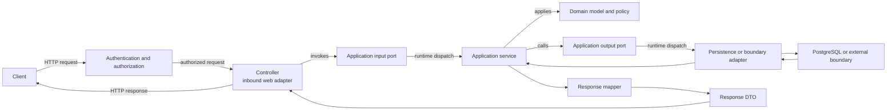
```mermaid
flowchart LR
    Client["Client"]
    Security["Authentication and authorization"]
    Controller["Controller<br/>inbound web adapter"]
    InPort["Application input port"]
    Service["Application service"]
    Domain["Domain model and policy"]
    OutPort["Application output port"]
    Adapter["Persistence or boundary adapter"]
    Store["PostgreSQL or external boundary"]
    Mapper["Response mapper"]
    DTO["Response DTO"]

    Client -->|"HTTP request"| Security
    Security -->|"authorized request"| Controller
    Controller -->|"invokes"| InPort
    InPort -->|"runtime dispatch"| Service
    Service -->|"applies"| Domain
    Service -->|"calls"| OutPort
    OutPort -->|"runtime dispatch"| Adapter
    Adapter --> Store
    Store --> Adapter
    Adapter --> Service
    Service --> Mapper
    Mapper --> DTO
    DTO --> Controller
    Controller -->|"HTTP response"| Client
```

The application service owns the transaction and business decision. A controller must not call a repository, JPA entity, or persistence adapter directly. An adapter must not decide a LoanApplication or LoanAccount transition.

---

## 3. Authentication, Authorization, and Ownership

Spring Security authenticates the Bearer token before a protected controller invokes its input port.

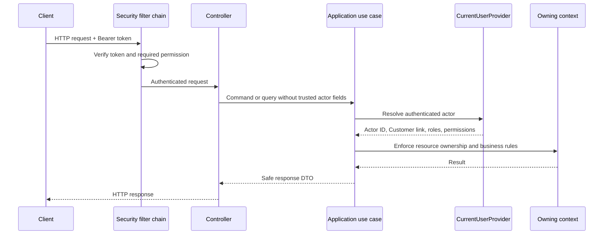
```mermaid
sequenceDiagram
    participant C as Client
    participant S as Security filter chain
    participant W as Controller
    participant U as Application use case
    participant P as CurrentUserProvider
    participant O as Owning context

    C->>S: HTTP request + Bearer token
    S->>S: Verify token and required permission
    S->>W: Authenticated request
    W->>U: Command or query without trusted actor fields
    U->>P: Resolve authenticated actor
    P-->>U: Actor ID, Customer link, roles, permissions
    U->>O: Enforce resource ownership and business rules
    O-->>U: Result
    U-->>W: Safe response DTO
    W-->>C: HTTP response
```

A permission authorizes an actor to attempt an operation. The owning context still verifies that the Customer, application, document, contract, or account belongs to that actor and is in a valid state.

Customer-owned endpoints derive `customerId` from `CurrentUserProvider`. They must not trust a Customer identifier supplied in the request when ownership is implied by the endpoint.

---

## 4. Representative Query Flows

Simple queries share one runtime pattern:

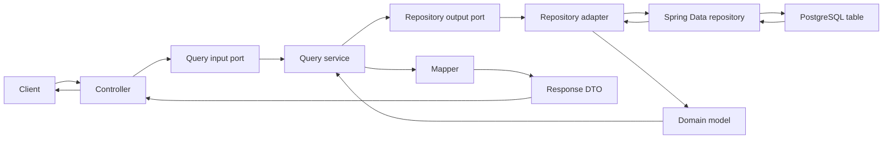
```mermaid
flowchart LR
    Client["Client"]
    Controller["Controller"]
    InPort["Query input port"]
    Service["Query service"]
    RepoPort["Repository output port"]
    Adapter["Repository adapter"]
    Jpa["Spring Data repository"]
    Table["PostgreSQL table"]
    Domain["Domain model"]
    Mapper["Mapper"]
    DTO["Response DTO"]

    Client --> Controller --> InPort --> Service --> RepoPort --> Adapter --> Jpa --> Table
    Table --> Jpa --> Adapter --> Domain --> Service --> Mapper --> DTO --> Controller --> Client
```

Representative variations:

| Request | Runtime rule |
|---|---|
| `GET /api/v1/loan-products` | The query service loads active products through the Loan-owned repository port and maps `LoanProduct` values to response DTOs. |
| `GET /api/v1/partner-companies/{partnerCompanyId}` | An empty repository result becomes `PARTNER_COMPANY_NOT_FOUND` through the global error boundary. |
| `GET /api/v1/partner-companies/{partnerCompanyId}/employees?activeOnly=true` | The protected query requires `partner:read`. The `activeOnly` condition is pushed into the persistence query rather than filtering a complete result in the controller. |
| `GET /api/v1/partner-companies/{partnerCompanyId}/employee-import-batches` | The service verifies the Partner Company before loading its import batches, so a missing parent returns a Partner Company error rather than an empty child collection. |
| `GET /api/v1/staff/loan-applications` | The Staff query requires exact `loan:read`, pushes optional product/status filtering and deterministic paging into Loan persistence, and returns only durable application facts. |
| `GET /api/v1/staff/loan-applications/{loanApplicationId}` | The Staff case query composes Loan-owned application and ordered-transition evidence with purpose-limited Customer readiness through a consumer-owned port. |

Detailed Partner Employee evidence and salary or limit fields remain restricted to authorized Staff responses. Customer-facing endpoints use purpose-limited DTOs and must not reuse the back-office representation.

---

## 5. Partner Employee Verification

`POST /api/v1/partner-companies/{partnerCompanyId}/employee-verifications` requires Bearer authentication and `partner:employee:verify:own`.

The flow derives `customerId` from the authenticated Customer. The request supplies matching input such as `employeeCode`; it does not supply the trusted Customer identity. Partner obtains the required identity reference through a narrow Customer contract.

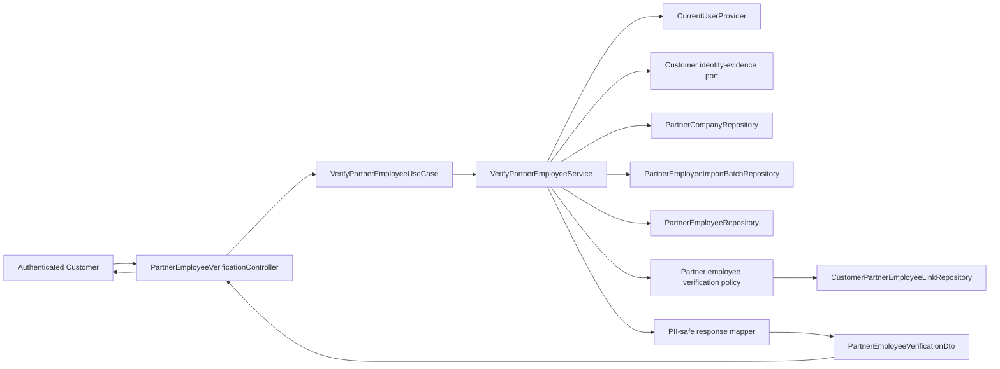
```mermaid
flowchart LR
    Client["Authenticated Customer"]
    Controller["PartnerEmployeeVerificationController"]
    InPort["VerifyPartnerEmployeeUseCase"]
    Service["VerifyPartnerEmployeeService"]
    Actor["CurrentUserProvider"]
    CustomerPort["Customer identity-evidence port"]
    CompanyRepo["PartnerCompanyRepository"]
    BatchRepo["PartnerEmployeeImportBatchRepository"]
    EmployeeRepo["PartnerEmployeeRepository"]
    Policy["Partner employee verification policy"]
    LinkRepo["CustomerPartnerEmployeeLinkRepository"]
    Mapper["PII-safe response mapper"]
    DTO["PartnerEmployeeVerificationDto"]

    Client --> Controller --> InPort --> Service
    Service --> Actor
    Service --> CustomerPort
    Service --> CompanyRepo
    Service --> BatchRepo
    Service --> EmployeeRepo
    Service --> Policy
    Policy --> LinkRepo
    Service --> Mapper --> DTO --> Controller --> Client
```

Runtime rules:

1. Partner Company existence and active status are checked before import-batch lookup, employee matching, link creation, or manual-review routing. Partner derives the current effective month from the shared UTC `Clock` and selects the latest valid `COMPLETED` batch for that Partner Company and exact month, ordered deterministically by creation time and identifier.
2. One active match may create or refresh the reusable Customer–Partner Employee link.
3. Missing or ambiguous current-month evidence follows the authorized manual-review policy during verification. A reused verified link whose source batch or employee batch is not authoritative fails closed as stale for lending eligibility.
4. An inactive Partner Company or Partner Employee is a hard stop. Re-verification may restore eligibility only by refreshing the link to matching active evidence in the authoritative batch.
5. The response may expose identifiers, outcome, link status, and whether manual review is required. It must not expose raw identity evidence, employee code, salary, Salary Advance limit, or matching evidence.

---

## 6. Product Origination and Salary Advance Readiness

### Advisory Readiness Query

`GET /api/v1/loan-products/salary-advance/readiness` requires an authenticated Customer with `loan:submit`. Loan derives the Customer from the actor, reads Customer readiness, product policy, the Partner-owned current eligibility assessment, current limit/exposure, blocking applications, and outstanding-account guard, then returns safe values and blocker codes. Partner owns the current-month authoritative-batch decision; Loan consumes only the purpose-limited status and eligible snapshot.

The query is read-only and non-locking. It does not initialize or refresh a persisted limit, reserve exposure, create a LoanApplication or verification, or append movements, history, or audit. A later submission command reacquires authoritative state and may reject after concurrent change.

### LoanApplication Status Query

`GET /api/v1/loan-applications/{loanApplicationId}` returns a minimal durable status projection. Customers require `loan:read:own`, must own the application, and receive the same not-found result for missing and foreign-owned IDs. Staff require `loan:read`. The service returns application identity, product, requested terms, status, and submission time without exposing Customer, Partner, limit, verification, actor, audit/history, or financial-servicing evidence. It does not infer next actions or mutate workflow state.

### Staff Discovery and Case Queries

`GET /api/v1/staff/loan-applications` and `GET /api/v1/staff/loan-applications/{loanApplicationId}` use a dedicated Staff input port and query service. Controller and service authorization require an authenticated Staff actor with exact `loan:read`; Customer ownership reads remain separate.

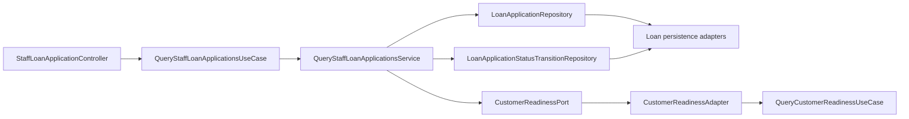
```mermaid
flowchart LR
    Controller["StaffLoanApplicationController"]
    InPort["QueryStaffLoanApplicationsUseCase"]
    Service["QueryStaffLoanApplicationsService"]
    ApplicationRepo["LoanApplicationRepository"]
    TransitionRepo["LoanApplicationStatusTransitionRepository"]
    CustomerPort["CustomerReadinessPort"]
    LoanPersistence["Loan persistence adapters"]
    CustomerAdapter["CustomerReadinessAdapter"]
    CustomerUseCase["QueryCustomerReadinessUseCase"]

    Controller --> InPort --> Service
    Service --> ApplicationRepo --> LoanPersistence
    Service --> TransitionRepo --> LoanPersistence
    Service --> CustomerPort --> CustomerAdapter --> CustomerUseCase
```

The index applies product/status predicates, `submittedAt DESC, id DESC` ordering, and page bounds in persistence. The case read is side-effect-free and composes the application header, the existing purpose-limited Customer readiness snapshot, and transitions loaded in authoritative sequence order. It neither reaches Customer persistence directly nor copies audit events into Loan's HTTP model. Exact fields, exclusions, and error behavior are defined in `MER-API-001`.

### Staff Document Checklist and History Query

`GET /api/v1/staff/loan-applications/{loanApplicationId}/documents` uses a dedicated Staff Document input port and query service. It requires `document:review` independently of the general `loan:read` case contract.

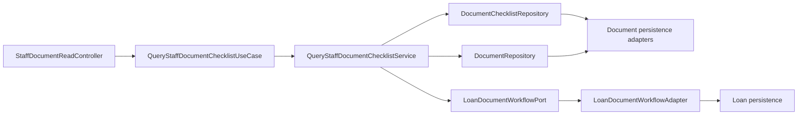
```mermaid
flowchart LR
    Controller["StaffDocumentReadController"]
    InPort["QueryStaffDocumentChecklistUseCase"]
    Service["QueryStaffDocumentChecklistService"]
    ChecklistRepo["DocumentChecklistRepository"]
    DocumentRepo["DocumentRepository"]
    LoanPort["LoanDocumentWorkflowPort"]
    DocumentPersistence["Document persistence adapters"]
    LoanAdapter["LoanDocumentWorkflowAdapter"]
    LoanPersistence["Loan persistence"]

    Controller --> InPort --> Service
    Service --> ChecklistRepo --> DocumentPersistence
    Service --> DocumentRepo --> DocumentPersistence
    Service --> LoanPort --> LoanAdapter --> LoanPersistence
```

Document owns checklist, version, and review-history projection. It obtains only application existence and safe status through the purpose-limited Loan contract. Deterministic repository queries read the existing immutable version and review rows; no parallel history store is created.

### Submission Command

`POST /api/v1/loan-applications/salary-advance` requires Bearer authentication and `loan:submit`. The application service derives the Customer from the authenticated actor and obtains Customer and Partner facts through their public contracts.

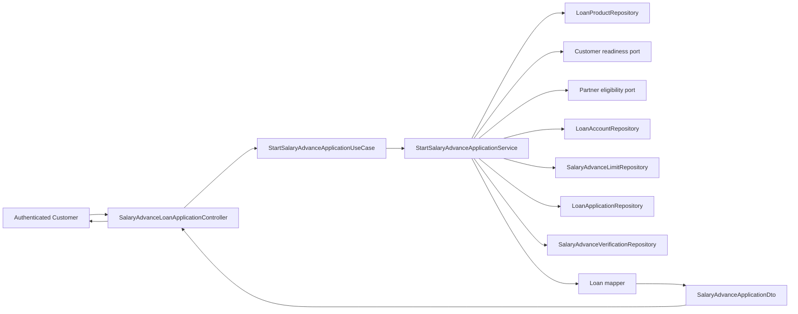
```mermaid
flowchart LR
    Client["Authenticated Customer"]
    Controller["SalaryAdvanceLoanApplicationController"]
    InPort["StartSalaryAdvanceApplicationUseCase"]
    Service["StartSalaryAdvanceApplicationService"]
    ProductRepo["LoanProductRepository"]
    CustomerPort["Customer readiness port"]
    PartnerPort["Partner eligibility port"]
    AccountRepo["LoanAccountRepository"]
    LimitRepo["SalaryAdvanceLimitRepository"]
    ApplicationRepo["LoanApplicationRepository"]
    VerificationRepo["SalaryAdvanceVerificationRepository"]
    Mapper["Loan mapper"]
    DTO["SalaryAdvanceApplicationDto"]

    Client --> Controller --> InPort --> Service
    Service --> ProductRepo
    Service --> CustomerPort
    Service --> PartnerPort
    Service --> AccountRepo
    Service --> LimitRepo
    Service --> ApplicationRepo
    Service --> VerificationRepo
    Service --> Mapper --> DTO --> Controller --> Client
```

The response contains the application identity, requested terms, product-verification outcome, and limit snapshots needed to explain the reservation. It must not expose Partner Employee salary, identity evidence, employee code, bank-account data, or raw matching evidence.

### Submission Serialization and Database Guard

The transaction follows this order:

1. validate Customer readiness and product/amount/term policy before workflow locks;
2. acquire the Customer-and-product advisory lock and perform the authoritative blocking-application check;
3. resolve Partner-owned current-month eligibility and calculate the effective limit;
4. acquire the Customer-and-employee-link advisory lock and repeat the blocking check;
5. inspect blocking LoanAccount evidence;
6. lock or initialize the Salary Advance limit;
7. reserve exposure and persist the application, verification snapshot, history, and audit atomically.

The partial unique constraint for one blocking application per Customer and product is the final database guard. Only a violation of that exact constraint maps to `BLOCKING_APPLICATION_EXISTS`; unrelated integrity failures remain system errors.

A matching `ACTIVE` or `OVERDUE` Salary Advance LoanAccount with positive contractual outstanding returns `OUTSTANDING_LOAN_ACCOUNT_EXISTS`. A zero-outstanding `SETTLED` account clears only this guard; the submission must still satisfy every other rule.

Submission does not lock an existing LoanAccount. When repayment and submission compete, the established advisory-lock order makes submission either observe the committed settlement or conservatively reject once and succeed after refresh.

### UCL and Collateral Submission Variants

UCL and Collateral submission use the same token-derived Customer identity, readiness checks, active product and policy validation, Customer-and-product advisory lock, blocking-application check, checklist creation, status history, and PII-safe audit boundary. Each transaction creates its application-owned pending manual-verification cycle atomically with the submitted product evidence.

UCL also evaluates the product-scoped outstanding-LoanAccount guard under the Customer-and-product lock. Document creates the income and employment checklist, while Loan creates the application-owned pending verification; neither path acquires a Partner or Salary Advance exposure lock.

Collateral validates and persists one structured asset with type, description, estimated value, ownership status, and condition facts, while Document creates the required ownership-evidence checklist item. It has no product-specific outstanding-LoanAccount guard and acquires no Partner or Salary Advance exposure lock.

### UCL Manual Verification

UCL verification start and completion acquire the LoanApplication workflow lock, the application row, and the authoritative latest UCL verification row. Completion rechecks Document processing readiness and atomically persists the verification result, LoanApplication transition, status history, PII-safe audit, and any structured `REQUIRES_MORE_INFORMATION` correction. `VERIFIED` opens Loan Officer review, `FAILED` ends the application as `VERIFICATION_FAILED`, and correctable evidence issues use `REQUIRES_MORE_INFORMATION` followed by a linked pending re-verification cycle after resubmission.

### Staff Product-Verification and Review Read Flow

The CP4 reads remain Loan-owned purpose-limited projections. They authorize an exact Staff `loan:review` capability in the web adapter and application service, then assemble only the evidence needed to verify a product or start/reconcile Loan Officer review.

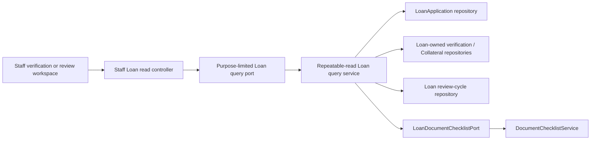
```mermaid
flowchart LR
    Client["Staff verification or review workspace"]
    Controller["Staff Loan read controller"]
    InPort["Purpose-limited Loan query port"]
    Service["Repeatable-read Loan query service"]
    ApplicationRepo["LoanApplication repository"]
    ProductRepos["Loan-owned verification / Collateral repositories"]
    ReviewRepo["Loan review-cycle repository"]
    DocumentPort["LoanDocumentChecklistPort"]
    DocumentService["DocumentChecklistService"]

    Client --> Controller --> InPort --> Service
    Service --> ApplicationRepo
    Service --> ProductRepos
    Service --> ReviewRepo
    Service --> DocumentPort --> DocumentService
```

Loan does not read Document persistence or Customer persistence. Document resolves readiness and current immutable version targets behind `LoanDocumentChecklistPort`. The verification projection orders immutable product cycles by sequence and treats the latest as authoritative; Collateral additionally requires exactly one application-owned assessment snapshot. The review projection reads the latest Loan-owned review cycle and product result. Both reads are advisory presentation evidence: every mutation reacquires its established workflow/application locks and revalidates authoritative state.

Because verification start/completion and review start have no client business UUID, Internal Web never automatically retries their POSTs. After a lost response it performs the corresponding purpose-limited GET and reports only what the refreshed durable state proves. Collateral completion carries the displayed `expectedVerificationId`; a stale conflict preserves the in-memory form, refreshes the latest cycle, and requires an explicit new confirmation.

---

## 7. Approval, Review, and Correction Coordination

Approval owns the immutable recommendation or decision record. Loan owns the active review cycle, correction workflow, and LoanApplication transition.

Revision-producing actions use synchronous transaction participation because a failure to apply the structured outcome must roll back the source Approval record and the resulting Loan, Document, Audit, and history changes.

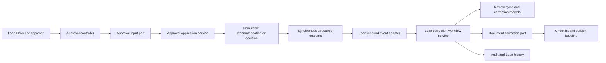
```mermaid
flowchart LR
    Staff["Loan Officer or Approver"]
    Controller["Approval controller"]
    InPort["Approval input port"]
    ApprovalService["Approval application service"]
    ApprovalStore["Immutable recommendation or decision"]
    Event["Synchronous structured outcome"]
    LoanListener["Loan inbound event adapter"]
    LoanService["Loan correction workflow service"]
    LoanStore["Review cycle and correction records"]
    DocumentPort["Document correction port"]
    DocumentStore["Checklist and version baseline"]
    Audit["Audit and Loan history"]

    Staff --> Controller --> InPort --> ApprovalService --> ApprovalStore --> Event
    Event --> LoanListener --> LoanService --> LoanStore
    LoanService --> DocumentPort --> DocumentStore
    LoanService --> Audit
```

Customer correction endpoints derive the exact owner from `CurrentUserProvider`. Staff queue, task completion, upload, content-read, review, waiver, and resubmission endpoints require their narrow permissions. Application services recheck task ownership and maker-checker constraints.

The Staff correction case query remains inside Loan because Loan owns the correction lifecycle:

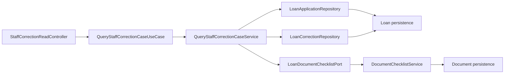
```mermaid
flowchart LR
    Controller["StaffCorrectionReadController"]
    InPort["QueryStaffCorrectionCaseUseCase"]
    Service["QueryStaffCorrectionCaseService"]
    ApplicationRepo["LoanApplicationRepository"]
    CorrectionRepo["LoanCorrectionRepository"]
    DocumentPort["LoanDocumentChecklistPort"]
    LoanPersistence["Loan persistence"]
    DocumentService["DocumentChecklistService"]
    DocumentPersistence["Document persistence"]

    Controller --> InPort --> Service
    Service --> ApplicationRepo --> LoanPersistence
    Service --> CorrectionRepo --> LoanPersistence
    Service --> DocumentPort --> DocumentService --> DocumentPersistence
```

The service computes current-actor maker-checker evidence without serializing actor IDs. It derives Staff task proof through `LoanDocumentChecklistPort`; Loan does not query Document tables or adapters. The read is advisory presentation evidence, while completion and resubmission commands revalidate locked state.

### Collateral Verification and Approval Coordination

Collateral manual-verification start and completion use the existing LoanApplication workflow serialization. Each command acquires the workflow lock, locks the application, and locks the authoritative latest `collateral_loan_verifications` row before it persists verification, status-history, correction, or audit effects. Start is a normal `SUBMITTED -> VERIFICATION_PENDING` transition: one concurrent request succeeds and later requests fail rather than replaying a successful response.

Completion carries `expectedVerificationId`. After locking the latest row, Loan rejects a mismatched identifier as stale before completing evidence. A successful command changes a pending cycle exactly once and atomically persists the terminal result, LoanApplication transition, history, audit, and any `REQUIRES_MORE_INFORMATION` correction. Document readiness is checked again inside the command. The database makes completed cycles immutable and reconciles each later cycle with the preceding completed cycle and its resubmitted source correction.

The latest `VERIFIED` cycle opens Loan Officer review and recommendation and must remain authoritative when an Approver acts. Approval writes the immutable decision before Loan handles the synchronous outcome in the same transaction. Loan rechecks the latest Collateral verification under the workflow/application lock. Missing or non-verified evidence, invalid or missing pricing policy, an invalid term, or a later mandatory write failure rolls back the ApprovalDecision together with every Loan transition, review-cycle, correction, audit, and ApprovedOffer effect.

`APPROVE` loads the active Collateral default policy and creates one exact-request immutable offer plus its reconciled provisional monthly items before reaching `CUSTOMER_ACCEPTANCE_PENDING`. The other three actions use the common reject, return, or document-only correction paths and create no offer. Competing decisions serialize to one authoritative outcome, and Collateral paths acquire no Salary Advance exposure locks or create Salary Advance movements. Customer offer responses then use the common ApprovedOffer lock and terminal-action semantics; acceptance reaches `CONTRACT_PENDING` and opens the common operational-contract flow.

### Correction Locking and Idempotency

1. Document replacement locks the Loan workflow, then the checklist item and logical document. It appends a version only when the expected current-version identifier still matches.
2. Manual review targets one immutable document version and rejects a stale review target.
3. Task completion locks the task and correction request. An identical completion is replay; different content after completion is a conflict.
4. Resubmission locks the Loan workflow first, followed by correction rows, Document readiness, and Customer-and-product scope. Salary Advance then locks its product exposure state; UCL and Collateral do not acquire Salary Advance limit or movement locks.
5. Salary Advance resubmission rechecks Partner-owned current-month freshness; stale evidence rejects the operation before a new verification or workflow effect and preserves the existing reservation.
6. One resubmission request is consumed exactly once.
7. Collateral resubmission preserves the completed cycle and structured facts, returns the application to `SUBMITTED`, and creates one next pending cycle linked to the resubmitted correction. Concurrent resubmission permits one transition/cycle; a delayed completion carrying the prior cycle ID fails stale.
8. Customer cancellation is defined only for Salary Advance and UCL returned corrections. It first serializes the request UUID, then locks the Loan workflow, application, and active correction request. Salary Advance additionally locks Customer-and-product scope, latest verification context, Customer-link scope, reservation movements, and the Salary Advance limit before recording its exact release. UCL proves that no Salary reservation or release evidence exists and records no exposure effect. Both products terminalize the correction and application and record history, audit, and immutable cancellation evidence.
9. Cancellation intentionally does not recheck Partner freshness: a Customer must be able to abandon a returned correction after its Partner evidence becomes stale. Resubmission and cancellation share the workflow/application/correction lock order, so a PostgreSQL race permits exactly one operation to win.
10. Failure in synchronous Approval-to-Loan coordination or any cancellation evidence write rolls back the entire transaction.

---

## 8. Contract Preparation and Readiness

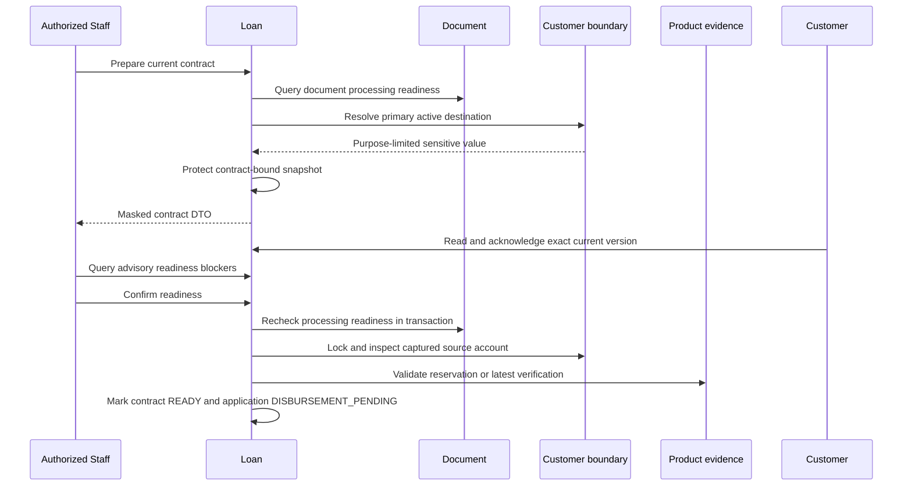
```mermaid
sequenceDiagram
    participant A as Authorized Staff
    participant L as Loan
    participant D as Document
    participant C as Customer boundary
    participant P as Product evidence
    participant U as Customer

    A->>L: Prepare current contract
    L->>D: Query document processing readiness
    L->>C: Resolve primary active destination
    C-->>L: Purpose-limited sensitive value
    L->>L: Protect contract-bound snapshot
    L-->>A: Masked contract DTO
    U->>L: Read and acknowledge exact current version
    A->>L: Query advisory readiness blockers
    A->>L: Confirm readiness
    L->>D: Recheck processing readiness in transaction
    L->>C: Lock and inspect captured source account
    L->>P: Validate reservation or latest verification
    L->>L: Mark contract READY and application DISBURSEMENT_PENDING
```

The advisory readiness query uses non-locking reads and does not persist a readiness Boolean. Confirmation acquires the workflow locks and recomputes every blocker before changing state.

Loan stores a protected contract-bound destination snapshot. Normal contract responses expose only the masked destination. Full destination data is available only through the dedicated audited reveal flow.

Salary Advance validates its exact unreleased reservation. UCL and Collateral Loan require the authoritative latest application-owned verification to be `VERIFIED`; contract preparation performs this product-evidence validation before reading or protecting bank-account data. Collateral contract versions copy the accepted offer's 1.5% monthly flat-rate terms and provisional items exactly. Destination refresh supersedes the prior version without repricing and requires fresh Customer acknowledgment. UCL and Collateral paths do not acquire Salary Advance exposure locks or create Salary Advance movements.

---

## 9. Destination Reveal and Manual Disbursement

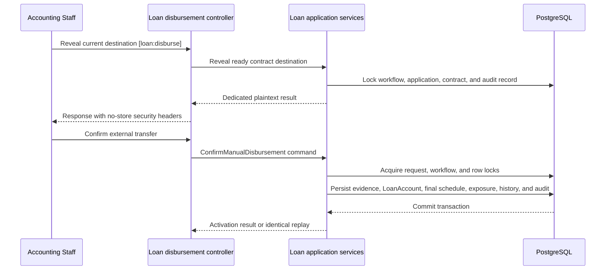
```mermaid
sequenceDiagram
    participant O as Accounting Staff
    participant API as Loan disbursement controller
    participant L as Loan application services
    participant DB as PostgreSQL

    O->>API: Reveal current destination [loan:disburse]
    API->>L: Reveal ready contract destination
    L->>DB: Lock workflow, application, contract, and audit record
    L-->>API: Dedicated plaintext result
    API-->>O: Response with no-store security headers

    O->>API: Confirm external transfer
    API->>L: ConfirmManualDisbursement command
    L->>DB: Acquire request, workflow, and row locks
    L->>DB: Persist evidence, LoanAccount, final schedule, exposure, history, and audit
    DB-->>L: Commit transaction
    L-->>API: Activation result or identical replay
```

The reveal endpoint is separate from ordinary reads and requires `loan:disburse`. Its response must use private, no-store, and content-sniffing protection and must not be retained in general DTOs or logs.

The disbursement command carries caller-supplied request identity and external transfer evidence. It does not accept authoritative actor, Customer, contract, product, destination, or contractual financial terms from the request. Loan resolves those facts from protected state.

Request and workflow advisory locks use separate categories. Identical request replay returns the original outcome without new writes. Reusing the request identity with different content returns an idempotency conflict.

The product activation policy revalidates the authoritative product evidence for both first execution and completed replay. Collateral activation requires the latest verification to remain `VERIFIED`, creates the common active LoanAccount and exact final dated monthly schedule, and reports zero product exposure without touching Salary Advance state.

---

## 10. LoanAccount Servicing Flows

| Request | Authorization | Runtime behavior |
|---|---|---|
| `GET /api/v1/loan-applications/{id}/loan-account` | `loan:read:own` or `loan:read` | Returns the activated account, masked contract destination, final schedule, and persisted servicing progress. |
| `POST /api/v1/loan-applications/{id}/repayments` | `repayment:update` | Serializes request and payment-reference identity, locks authoritative aggregates, applies allocation and exposure effects, and records history and audit in one transaction. |
| `GET /api/v1/loan-applications/{id}/repayments` | `loan:read:own` or `loan:read` | Reads immutable repayment and allocation evidence under a consistent read transaction. |
| `POST /api/v1/loan-applications/{id}/settlements` | `loan:settlement:approve` plus Approver role | Performs an Administrative Full-Balance Settlement through an exact full-outstanding payment, applies product-specific exposure semantics, and records immutable settlement, payment, history, and audit evidence. |
| `POST /api/v1/loan-applications/{id}/loan-account/closure` | `loan:account:close` plus Accounting Officer role | Verifies settled financial provenance and changes only administrative account status, closure evidence, history, and audit. |

Customer ownership concealment belongs in the application service. A Customer receives the same not-found behavior for a missing, foreign-owned, or not-yet-activated account.

Activated Collateral LoanAccounts participate in the common safe read and the common repayment, overdue evaluation, contractual-payoff, Administrative Full-Balance Settlement, and administrative-closure services. The Collateral repayment policy validates product identity and requires zero product-exposure release; it has no Partner, Salary Advance limit, or post-activation verification dependency.

Read operations must not:

- lock workflow rows;
- evaluate overdue state;
- recompute financial outcomes;
- publish business evidence;
- expose transfer references, full destinations, encryption envelopes, audit identifiers, employee evidence, or limit-movement internals.

The repayment and Administrative Full-Balance Settlement controllers forward external payment references without canonicalizing them. The Loan application services own normalization, operation-specific idempotency, and duplicate-reference handling. The canonical external payment reference remains internal financial evidence and is excluded from ordinary responses, logs, audit payloads, and errors.

Administrative Full-Balance Settlement is a Loan-owned payment operation even though its actor is an Approver. It starts from `ACTIVE` or `OVERDUE`, requires the caller's expected amount to equal locked total outstanding, applies the repayment allocator and servicing calculator, and commits `SETTLED` with immutable settlement, payment, outcome, history, and audit evidence. The selected repayment policy releases allocated principal exactly for Salary Advance and requires zero product-exposure release for UCL and Collateral Loan.

Administrative closure starts only from a fully reconciled `SETTLED` account. It accepts contractual-payoff provenance or Administrative Full-Balance Settlement provenance, verifies final progress, product-specific exposure semantics, status history, and durable evidence, then records `SETTLED -> CLOSED`. It does not acquire Salary Advance limit locks because it performs no financial or exposure mutation.

### Mutation Lock Order

Existing application and account mutations use this global order:

1. operation-specific request advisory lock;
2. LoanApplication workflow advisory lock;
3. LoanApplication, LoanAccount, final-schedule, and servicing-progress row locks in operation-specific order;
4. product-specific exposure locks when required;
5. Salary Advance Customer-and-employee-link, limit, and movement rows when the selected policy mutates Salary Advance exposure.

Activation, repayment, and Administrative Full-Balance Settlement must not acquire product-specific exposure locks before the LoanApplication workflow lock. Salary Advance Administrative Full-Balance Settlement follows request lock, workflow lock, application/account/schedule/progress row locks, payment validation, Customer-and-employee-link lock, then limit and movement locks. UCL and Collateral Loan use the same common financial locks but acquire no Salary Advance exposure lock or row. Canonical external payment-reference uniqueness is enforced by the payment insert and its database constraint; a conflict is resolved without exposing the reference. Administrative closure stops after workflow, application/account, and settlement-evidence verification because it does not mutate exposure. Submission and standalone limit refresh retain their Customer/product or Customer/employee-link to limit order and do not acquire an existing application workflow or account lock.

---

## 11. Overdue Evaluation

The overdue batch samples the injected clock once and derives one UTC business date. It selects stale `ACTIVE` or `OVERDUE` accounts with positive outstanding balances for the authoritative Salary Advance, UCL, and Collateral product allow-list, in deterministic evaluation-date and LoanAccount-ID order.

Each candidate runs in its own transaction and follows:

```text
LoanApplication workflow lock
  → LoanAccount lock
  → final schedule and servicing-progress locks
  → overdue calculation
  → persisted installment and account status changes
```

A previous evaluation date is a state conflict. Repeating the same date is a no-op. A later date advances only the persisted evaluation and derived status. An open account with zero outstanding balance is a system-state conflict.

The direct evaluator validates the application is `DISBURSED` and then resolves the product repayment policy before loading and mutating servicing state. Collateral evaluation follows the same persisted date/status calculation as UCL and creates no Salary Advance exposure evidence.

One overdue-evaluation operation identifier groups installment changes produced by the same evaluation. A real `ACTIVE` to `OVERDUE` or `OVERDUE` to `ACTIVE` account transition records account history and one `LOAN_ACCOUNT_STATUS_CHANGED` audit event. Date-only or installment-only advancement does not create a top-level account-status audit.

The scheduler uses an explicit UTC zone, a positive batch size, and explicit operational enablement.

---

## 12. Persistence and Flyway

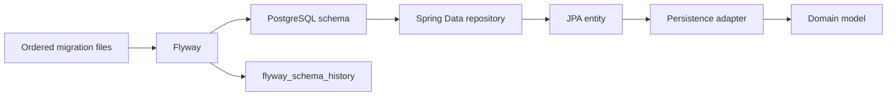
```mermaid
flowchart LR
    Sql["Ordered migration files"]
    Flyway["Flyway"]
    Schema["PostgreSQL schema"]
    History["flyway_schema_history"]
    Jpa["Spring Data repository"]
    Entity["JPA entity"]
    Adapter["Persistence adapter"]
    Domain["Domain model"]

    Sql --> Flyway
    Flyway --> Schema
    Flyway --> History
    Schema --> Jpa --> Entity --> Adapter --> Domain
```

Flyway owns schema evolution. JPA repositories access the resulting tables and hydrate persistence entities. Persistence adapters translate those entities into domain models before application mapping.

Released migrations are append-only. Runtime code must not depend on Hibernate schema generation as the database authority.

---

## 13. Runtime Rules Summary

- Security authenticates the request before the controller.
- Controllers invoke input ports and translate HTTP concerns.
- Application services resolve the authenticated actor, enforce ownership and business rules, and own transaction boundaries.
- Application services call output ports, not adapter implementations.
- Persistence adapters implement repository ports and map persistence entities to domain models.
- Boundary adapters implement consumer-owned ports and call provider public contracts.
- Mappers produce DTOs after the application result is complete.
- Customer-owned identity comes from authentication, not from trusted request fields.
- Reads remain side-effect-free unless the endpoint explicitly defines a command.
- Commands define lock order, idempotency, failure mapping, and audit behavior.
- Flyway owns database schema changes.
- Exact request and response contracts remain in `MER-API-001`; canonical error definitions remain in `MER-ARCH-004`.
