# MER-DB-001 — Data Model and ERD

## 1. Purpose

This document defines the high-level logical data model and entity relationship design for the Meridian Lending Platform backend.

## 2. Scope

The model supports the MVP lending workflow for:

- Customer and back-office identity, authentication, and role-based access.
- Customer profile, employment, bank account, and verification data.
- Partner Company and Partner Employee data for Salary Advance eligibility.
- One generic lending core for `SALARY_ADVANCE`, `UNSECURED_CONSUMER_LOAN`, and `COLLATERAL_LOAN`.
- Loan application submission, product verification, offers, disbursement confirmation, loan account activation, and repayment tracking.
- Loan Officer review, Approver decision, and maker-checker controls.
- Document upload, checklist completeness, manual review, waiver, replacement, and readiness checks.
- Audit events and status transition history.
- Planned Phase 2 OCR-assisted document processing under Document Management.

The MVP uses one PostgreSQL database. Tables are logically owned by modules, but Meridian does not use a database-per-service design.

## 3. Database Design Principles

1. Use one generic lending model. Product-specific behavior belongs in product policies, product type/code fields, and targeted detail tables such as `collaterals` and `employee_verifications`.
2. Keep bounded-context ownership visible. Each module owns its tables logically, even though all tables live in the same PostgreSQL database.
3. Use UUID-style primary keys conceptually for business entities.
4. Use `snake_case` table and column names in database examples.
5. Store relationships by identifiers across module boundaries. Do not model direct shared JPA entity ownership across modules.
6. Keep workflow status transitions explicit and auditable.
7. Treat document checklist completeness, manual document review, and product verification as separate controls.
8. Keep manual review authoritative for MVP document readiness and Phase 2 OCR-assisted results.
9. Avoid real financial-integration tables in the MVP model.
10. Prefer practical constraints and clear ownership over premature normalization.

## 4. High-Level ERD

```mermaid
erDiagram
    users {
        uuid id PK
        string email
        string password_hash
        string user_type
        string status
        datetime created_at
    }

    roles {
        uuid id PK
        string code
        string name
    }

    permissions {
        uuid id PK
        string code
        string description
    }

    role_assignments {
        uuid id PK
        uuid user_id FK
        uuid role_id FK
        datetime assigned_at
    }

    role_permissions {
        uuid role_id FK
        uuid permission_id FK
    }

    refresh_tokens {
        uuid id PK
        uuid user_id FK
        string token_hash
        datetime expires_at
        datetime revoked_at
    }

    customers {
        uuid id PK
        uuid user_id FK
        string customer_number
        string verification_status
        datetime created_at
    }

    customer_profiles {
        uuid id PK
        uuid customer_id FK
        string full_name
        string national_id_ref
        string phone_number
        string employment_status
        boolean profile_complete
    }

    bank_account_infos {
        uuid id PK
        uuid customer_id FK
        string bank_name
        string account_number_encrypted
        string account_holder_name
        boolean active
    }

    partner_companies {
        uuid id PK
        string company_code
        string name
        string status
        decimal salary_advance_policy_limit
    }

    partner_employee_import_batches {
        uuid id PK
        uuid partner_company_id FK
        string effective_month
        string status
        integer valid_row_count
        integer invalid_row_count
    }

    partner_employees {
        uuid id PK
        uuid partner_company_id FK
        uuid import_batch_id FK
        string employee_code
        string identity_reference
        decimal salary_amount
        decimal salary_advance_limit
        string employment_status
        boolean active
    }

    employee_verifications {
        uuid id PK
        uuid loan_application_id FK
        uuid partner_company_id FK
        uuid partner_employee_id FK
        string outcome
        string product_verification_result
        decimal available_limit
        datetime verified_at
    }

    loan_products {
        uuid id PK
        string product_code
        string product_type
        string name
        boolean active
        decimal min_amount
        decimal max_amount
    }

    loan_product_policies {
        uuid id PK
        uuid loan_product_id FK
        string policy_code
        jsonb policy_config
        integer offer_validity_days
        boolean active
    }

    loan_applications {
        uuid id PK
        uuid customer_id FK
        uuid loan_product_id FK
        string application_number
        string product_code
        string product_type
        string status
        decimal requested_amount
        integer requested_term_months
        jsonb product_details
        datetime submitted_at
    }

    offer_terms {
        uuid id PK
        uuid loan_application_id FK
        decimal approved_amount
        integer approved_term_months
        decimal interest_rate
        datetime expires_at
        string acceptance_status
    }

    loan_accounts {
        uuid id PK
        uuid loan_application_id FK
        uuid customer_id FK
        string account_number
        string status
        decimal principal_amount
        decimal outstanding_balance
        datetime activated_at
    }

    disbursement_records {
        uuid id PK
        uuid loan_application_id FK
        uuid loan_account_id FK
        uuid confirmed_by_user_id FK
        decimal amount
        string method_note
        datetime confirmed_at
    }

    repayment_schedules {
        uuid id PK
        uuid loan_application_id FK
        uuid loan_account_id FK
        string schedule_type
        integer version
        datetime generated_at
    }

    repayment_records {
        uuid id PK
        uuid repayment_schedule_id FK
        integer installment_number
        date due_date
        decimal amount_due
        decimal amount_paid
        string status
    }

    collaterals {
        uuid id PK
        uuid loan_application_id FK
        string collateral_type
        string ownership_status
        decimal estimated_value
        uuid ownership_document_id FK
        string review_note
    }

    document_checklists {
        uuid id PK
        uuid loan_application_id FK
        string status
        datetime created_at
    }

    document_checklist_items {
        uuid id PK
        uuid document_checklist_id FK
        string document_type
        string review_status
        boolean required
        uuid current_document_id FK
    }

    documents {
        uuid id PK
        uuid customer_id FK
        uuid loan_application_id FK
        string document_type
        string storage_reference
        string status
        integer version
    }

    document_reviews {
        uuid id PK
        uuid document_id FK
        uuid reviewer_user_id FK
        string outcome
        string review_status
        string reason
        datetime reviewed_at
    }

    document_replacement_requests {
        uuid id PK
        uuid document_id FK
        uuid requested_by_user_id FK
        string reason
        string status
        datetime requested_at
    }

    document_waivers {
        uuid id PK
        uuid document_checklist_item_id FK
        uuid waived_by_user_id FK
        string reason
        datetime waived_at
    }

    review_recommendations {
        uuid id PK
        uuid loan_application_id FK
        uuid loan_officer_user_id FK
        string recommendation
        string reason
        datetime submitted_at
    }

    approval_decisions {
        uuid id PK
        uuid loan_application_id FK
        uuid approver_user_id FK
        string decision
        string reason
        datetime decided_at
    }

    approval_history {
        uuid id PK
        uuid loan_application_id FK
        uuid actor_user_id FK
        string action
        string from_status
        string to_status
        datetime occurred_at
    }

    audit_events {
        uuid id PK
        uuid actor_user_id FK
        string entity_type
        uuid entity_id
        string action
        jsonb event_payload
        datetime occurred_at
    }

    status_transition_history {
        uuid id PK
        string entity_type
        uuid entity_id
        string from_status
        string to_status
        string reason
        uuid actor_user_id FK
        datetime occurred_at
    }

    ocr_jobs {
        uuid id PK
        uuid document_id FK
        string status
        string trace_id
        integer attempt_count
        datetime queued_at
    }

    ocr_results {
        uuid id PK
        uuid ocr_job_id FK
        uuid document_id FK
        string review_status
        decimal confidence_score
        jsonb extracted_fields
        string model_version
    }

    users ||--o{ refresh_tokens : owns
    users ||--o{ role_assignments : has
    roles ||--o{ role_assignments : assigned
    roles ||--o{ role_permissions : grants
    permissions ||--o{ role_permissions : included

    users ||--o| customers : maps_to
    customers ||--|| customer_profiles : has
    customers ||--o{ bank_account_infos : owns
    customers ||--o{ loan_applications : submits

    partner_companies ||--o{ partner_employee_import_batches : imports
    partner_companies ||--o{ partner_employees : employs
    partner_employee_import_batches ||--o{ partner_employees : loads
    partner_employees ||--o{ employee_verifications : used_by

    loan_products ||--o{ loan_product_policies : configured_by
    loan_products ||--o{ loan_applications : selected_for
    loan_applications ||--o{ employee_verifications : records
    loan_applications ||--o| offer_terms : produces
    loan_applications ||--o| loan_accounts : activates
    loan_applications ||--o| disbursement_records : confirms
    loan_accounts ||--o| disbursement_records : created_from
    loan_applications ||--o{ repayment_schedules : plans
    loan_accounts ||--o{ repayment_schedules : finalizes
    repayment_schedules ||--o{ repayment_records : contains
    loan_applications ||--o{ collaterals : may_have

    loan_applications ||--o| document_checklists : requires
    document_checklists ||--o{ document_checklist_items : contains
    document_checklist_items }o--o| documents : satisfied_by
    customers ||--o{ documents : uploads
    loan_applications ||--o{ documents : attaches
    documents ||--o{ document_reviews : reviewed_by
    documents ||--o{ document_replacement_requests : may_require
    document_checklist_items ||--o{ document_waivers : may_be_waived

    loan_applications ||--o{ review_recommendations : receives
    loan_applications ||--o{ approval_decisions : receives
    loan_applications ||--o{ approval_history : tracks
    loan_applications ||--o{ status_transition_history : changes
    loan_applications ||--o{ audit_events : audited_by

    documents ||--o{ ocr_jobs : queues_phase_2
    ocr_jobs ||--o| ocr_results : produces_phase_2
```

## 5. Entity Groups by Bounded Context

### 5.1 Identity & Access

Logical tables:

- `users` - customer and back-office login identities. Back-office users do not need a separate top-level table unless future HR/admin metadata requires it.
- `roles` - role catalog values such as Customer, Loan Officer, Approver, Accounting Officer, and Back-Office Admin.
- `permissions` - action-level permissions used by RBAC.
- `role_assignments` - user-to-role assignment history/current assignments.
- `role_permissions` - role-to-permission mapping.
- `refresh_tokens` - refresh token records with hashed token values, expiry, and revocation metadata.

The data model supports JWT authentication and refresh-token rotation while keeping permission enforcement tied to role/action policy.

### 5.2 Customer Management

Logical tables:

- `customers` - customer aggregate root linked to the owning `users` identity.
- `customer_profiles` - identity, contact, residential, employment, and consent-related profile data.
- `bank_account_infos` - customer bank account data used for disbursement confirmation, with sensitive fields encrypted or tokenized.

Customer profile completeness is a precondition for loan submission. Post-submission profile and bank-account changes are restricted by application status and must be audited.

### 5.3 Partner Management

Logical tables:

- `partner_companies` - employer records configured for Salary Advance.
- `partner_employee_import_batches` - monthly import batch metadata, row counts, validation status, and effective month.
- `partner_employees` - imported employee records used for Salary Advance verification and available-limit calculation.
- `employee_verifications` - verification result and available-limit snapshot associated with a submitted or in-progress `loan_application`.

`employee_verifications` bridges Partner Management and Loan Core by storing the outcome used by a specific loan application. It should snapshot enough evidence to preserve the decision even if later partner employee imports change.

### 5.4 Loan Core / Origination

Logical tables:

- `loan_products` - product catalog for `SALARY_ADVANCE`, `UNSECURED_CONSUMER_LOAN`, and `COLLATERAL_LOAN`.
- `loan_product_policies` - configurable product policy values such as amount ranges, allowed terms, required document rules, offer validity, and product-specific validation settings.
- `loan_applications` - common workflow aggregate for all supported lending products.
- `offer_terms` - approved terms generated after approval and before customer acceptance.
- `loan_accounts` - active loan record created only after manual disbursement confirmation.
- `disbursement_records` - manual disbursement confirmation details.
- `repayment_schedules` - provisional or final repayment schedule headers.
- `repayment_records` - installment-level repayment tracking.
- `collaterals` - collateral detail records for `COLLATERAL_LOAN`.

`loan_applications` keeps `product_code` and `product_type` snapshots for reporting and historical stability. Product-specific request details can start in `product_details` JSONB when they are simple; data with lifecycle rules, review notes, or reporting needs should graduate into dedicated tables.

### 5.5 Approval Workflow

Logical tables:

- `review_recommendations` - Loan Officer recommendation records.
- `approval_decisions` - Approver decision records.
- `approval_history` - ordered approval workflow trail for returns, corrections, recommendations, and decisions.

Approval remains separate from Loan Core behavior. The data model enforces maker-checker traceability by preserving the Loan Officer actor and Approver actor on separate records.

### 5.6 Document Management

Logical tables:

- `documents` - uploaded document metadata and storage references.
- `document_checklists` - application-level checklist header.
- `document_checklist_items` - required or optional document requirements, current status, and current accepted/uploaded document reference.
- `document_reviews` - manual review outcome, reviewer, reason, and resulting document status.
- `document_replacement_requests` - replacement requests for rejected, expired, or incorrect documents.
- `document_waivers` - authorized waiver records tied to checklist items.

Checklist completeness and manual document review are separate. Submission may require checklist completeness at upload level, while disbursement readiness requires required documents to be `ACCEPTED`, `NOT_REQUIRED`, or `WAIVED`.

### 5.7 Audit & Compliance Controls

Logical tables:

- `audit_events` - append-only business event log with actor, action, affected entity, timestamp, and JSONB payload snapshots.
- `status_transition_history` - explicit status transition history for loan applications, loan accounts, documents, approval work items, and OCR jobs where relevant.

Audit tables are terminal consumers of business events. They record history and support compliance-oriented traceability; they do not control workflow decisions.

### 5.8 OCR-Assisted Processing — Planned Phase 2

Logical tables:

- `ocr_jobs` - queued, claimed, completed, or failed OCR processing jobs for uploaded documents.
- `ocr_results` - extracted text/fields, confidence score, review status, model metadata, and trace correlation.

OCR belongs under Document Management. It is planned for Phase 2 and remains assistive only. Manual document review remains authoritative for checklist readiness, replacement, waiver, and acceptance decisions. MVP document readiness must not depend on OCR job completion.

## 6. Key Relationships

- One `users` record may map to one `customers` record for customer identities.
- One `users` record may have many `role_assignments`; roles grant permissions through `role_permissions`.
- One `customers` record owns one profile and may own multiple bank account records over time, with one active account selected for disbursement.
- One `customers` record may submit many `loan_applications`.
- One `loan_products` record may have multiple active/inactive `loan_product_policies` over time.
- One `loan_applications` record selects one product and uses one common lifecycle across all products.
- One `loan_applications` record may have one Salary Advance `employee_verifications` snapshot when product type is salary-based.
- One `loan_applications` record may have one or more `collaterals` when product code is `COLLATERAL_LOAN`.
- One approved and accepted `loan_applications` record may produce one `offer_terms` record.
- One manually disbursed `loan_applications` record creates one `loan_accounts` record.
- One `loan_accounts` record has a final `repayment_schedules` record and many `repayment_records`.
- One `loan_applications` record has one `document_checklists` header and many checklist items.
- A `document_checklist_items` record may be satisfied by a current `documents` record, waived by `document_waivers`, or marked not required by policy.
- One `documents` record may have many `document_reviews`, replacement requests, and Phase 2 OCR jobs.
- One `loan_applications` record has many review, approval, audit, and status transition records.

## 7. Status and Enum Reference

Status names are namespace-scoped. For example, `LoanApplicationStatus.UNDER_REVIEW` and `DocumentReviewStatus.UNDER_REVIEW` are separate values.

| Status / Enum Group | Values |
| --- | --- |
| `LoanApplicationStatus` | `DRAFT`, `SUBMITTED`, `VERIFICATION_PENDING`, `VERIFICATION_FAILED`, `DOCUMENTS_PENDING`, `UNDER_REVIEW`, `RETURNED_FOR_REVISION`, `RETURNED_TO_REVIEW`, `APPROVAL_PENDING`, `APPROVED`, `REJECTED`, `CUSTOMER_ACCEPTANCE_PENDING`, `CUSTOMER_DECLINED`, `CONTRACT_PENDING`, `DISBURSEMENT_PENDING`, `DISBURSED`, `CANCELLED`, `EXPIRED` |
| Terminal `LoanApplicationStatus` values | `REJECTED`, `CUSTOMER_DECLINED`, `DISBURSED`, `CANCELLED`, `EXPIRED` |
| `LoanAccountStatus` | `ACTIVE`, `OVERDUE`, `SETTLED`, `CLOSED` |
| `ProductVerificationResult` | `VERIFIED`, `FAILED`, `PENDING_MANUAL_REVIEW`, `REQUIRES_MORE_INFORMATION` |
| `DocumentReviewStatus` | `NOT_REQUIRED`, `PENDING_UPLOAD`, `UPLOADED`, `UNDER_REVIEW`, `ACCEPTED`, `REJECTED`, `EXPIRED`, `WAIVED` |
| Manual document review actions | `ACCEPT_DOCUMENT`, `REJECT_DOCUMENT`, `WAIVE_DOCUMENT`, `REQUEST_REPLACEMENT` |
| `RepaymentStatus` | `NOT_DUE`, `DUE`, `PARTIALLY_PAID`, `PAID`, `OVERDUE`, `SETTLED` |
| `MockVerificationStatus` | `NOT_CHECKED`, `MOCK_VERIFIED`, `MOCK_FAILED`, `MANUAL_REVIEW_REQUIRED` |
| `EmployeeVerificationOutcome` | `MATCHED_ACTIVE`, `MATCHED_INACTIVE`, `NOT_FOUND`, `MULTIPLE_MATCHES`, `PENDING_MANUAL_REVIEW`, `MANUAL_REVIEW_APPROVED`, `MANUAL_REVIEW_REJECTED` |
| `ProductCode` | `SALARY_ADVANCE`, `UNSECURED_CONSUMER_LOAN`, `COLLATERAL_LOAN` |
| `ProductType` | `SALARY_BASED`, `UNSECURED`, `SECURED` |
| `CollateralType` | `MOTORBIKE`, `CAR`, `ELECTRONICS`, `PROPERTY_DOCUMENT`, `OTHER` |
| `OcrJobStatus` - planned Phase 2 | `PENDING`, `PROCESSING`, `COMPLETED`, `FAILED` |
| `OcrResultReviewStatus` - planned Phase 2 | `AUTO_APPROVED`, `PENDING_REVIEW`, `REVIEWED` |

Salary Advance employee verification maps to `ProductVerificationResult` as follows:

| Employee Verification Outcome | Product Verification Result |
| --- | --- |
| `MATCHED_ACTIVE` | `VERIFIED` |
| `MATCHED_INACTIVE` | `FAILED` |
| `NOT_FOUND` | `PENDING_MANUAL_REVIEW` |
| `MULTIPLE_MATCHES` | `PENDING_MANUAL_REVIEW` |
| `PENDING_MANUAL_REVIEW` | `PENDING_MANUAL_REVIEW` |
| `MANUAL_REVIEW_APPROVED` | `VERIFIED` |
| `MANUAL_REVIEW_REJECTED` | `FAILED` |

## 8. Data Integrity Rules

- Primary business entities use UUID-style primary keys.
- `loan_products.product_code` must be unique.
- `loan_applications.application_number` and `loan_accounts.account_number` must be unique.
- A customer may keep multiple draft applications, but may not submit a new active non-terminal application for the same product while a blocking application exists for that product.
- `loan_applications.status` transitions must follow the business transition matrix.
- `loan_accounts` must be created only after manual disbursement confirmation.
- The transition to `DISBURSED`, `loan_accounts` creation, final repayment schedule generation, and account activation must happen as one controlled transaction.
- Required documents must be `ACCEPTED`, `NOT_REQUIRED`, or `WAIVED` before an application moves to `DISBURSEMENT_PENDING`.
- Manual review records must preserve reviewer, outcome, reason where required, and timestamp.
- Loan Officer recommendation and Approver decision must be recorded by different users for the same application.
- Inactive Partner Companies and inactive Partner Employee records cannot be used for normal Salary Advance eligibility.
- Salary Advance verification records must snapshot outcome, available limit, and evidence needed to explain the eligibility decision.
- Repayment roll-up must move a loan account to `OVERDUE` when any unpaid repayment is past due, to `SETTLED` when fully paid or settled, and to `CLOSED` only after administrative closure.

## 9. Audit and Traceability Rules

- `audit_events` are append-only and must not be modified by normal application workflows.
- Important business actions must record actor, action, affected entity, timestamp, and contextual payload.
- Status changes must create `status_transition_history` entries with previous status, new status, actor, timestamp, and reason when required.
- Rejection, return, staff cancellation, request-more-information, staff correction, waiver, manual override, and replacement-request actions must include a reason.
- Audit records should reference entity IDs and avoid storing unnecessary sensitive payloads.
- Audit event consumers must be idempotent because Spring Modulith event replay can deliver the same event more than once under failure recovery.
- Trace IDs should be stored where useful for request, document upload, and planned OCR processing correlation.

## 10. Privacy and Sensitive Data Notes

- Customer identity, contact, employment, bank account, document metadata, OCR outputs, and collateral information are sensitive.
- Bank account numbers, national identity references, and similarly sensitive values should be encrypted or tokenized at rest.
- Document binary content belongs in storage behind `storage_reference`; database rows should store metadata, ownership, review status, and storage pointers.
- OCR results may contain personal and financial data and must follow the same access controls as document records.
- Logs and audit summaries should use IDs and status metadata rather than raw personal data.
- Access to customer, document, approval, and audit records must respect role-based permissions and customer ownership rules.

## 11. Indexing Notes

Detailed index definitions are out of scope for this document. At implementation time, prioritize indexes that support:

- Authentication lookup by normalized email or username.
- Role and permission lookup by user ID.
- Customer lookup by user ID and customer number.
- Loan application queues by status, product code, customer ID, and submitted timestamp.
- Product lookup by product code and active status.
- Partner employee verification by partner company, identity reference, employee code, effective month, and active status.
- Document checklist and review queues by loan application ID, review status, and document type.
- Approval work queues by application ID, approver/reviewer ID, status, and created timestamp.
- Repayment operations by loan account ID, due date, and repayment status.
- Audit and status transition queries by entity type, entity ID, actor, action, and occurred timestamp.
- Phase 2 OCR job polling by job status, lease/attempt metadata, and queued timestamp.

## 12. Out of Scope

- Detailed SQL DDL.
- Flyway migration scripts.
- Exact physical index definitions.
- Real bank transfer, payment gateway, payroll provider, employer API, or credit bureau integration tables.
- Production compliance case-management tables beyond audit and status history.
- Double-entry ledger, journal entries, chart of accounts, or reconciliation tables.
- Savings, entrusted loan, corporate loan, or non-lending product models.
- Database-per-service or microservice-specific database ownership.
- Fully automated document approval, loan approval, or credit scoring.
- Phase 2 OCR implementation migrations.

## 13. Open Questions

- Which product-specific fields should remain in `loan_applications.product_details` and which should become dedicated tables after MVP usage stabilizes?
- What exact encryption and key-management approach will be used for bank account, identity, and OCR-extracted sensitive fields?
- Should `approval_history` remain a workflow-local trail, or should it be replaced by read models derived from `review_recommendations`, `approval_decisions`, and `status_transition_history`?
- What retention, archival, and deletion policy should apply to uploaded documents, OCR results, refresh tokens, and audit events?
- Should document versioning be expanded beyond `documents.version` if replacement workflows become more complex?
- What is the final Phase 2 OCR retry lease, worker ownership, and job locking strategy?
