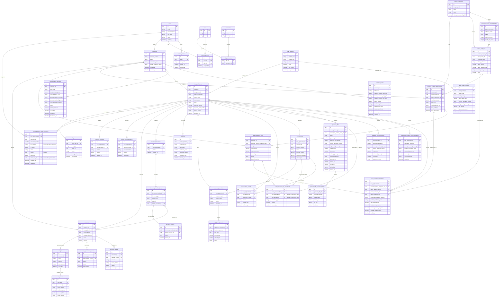

# MER-DB-001 — Data Model and ERD

## 1. Purpose

This document defines the high-level logical data model and entity relationship design for the Meridian Lending Platform backend.

## 2. Scope

The model supports the MVP lending workflow for:

- Customer and back-office identity, authentication, and role-based access.
- Customer profile, employment, bank account, and verification data.
- Partner Company and Partner Employee data for Salary Advance eligibility, including reusable customer employee links.
- One generic lending core for `SALARY_ADVANCE`, `UNSECURED_CONSUMER_LOAN`, and `COLLATERAL_LOAN`, with product-specific structures where their rules differ.
- Salary Advance limit tracking, loan application submission, product verification, offers, disbursement confirmation, loan account activation, and repayment tracking.
- Unsecured Consumer Loan origination, application-owned product-verification state, required evidence categories, operational contracts, manual-disbursement activation, final monthly schedules, repayment, overdue servicing, settlement, and closure.
- Loan Officer review, Approver decision, and maker-checker controls.
- Document upload, checklist completeness, manual review, waiver, replacement, and readiness checks.
- Audit events and Loan Application status transition history.
- Planned Phase 2 OCR-assisted document processing under Document Management.

The MVP uses one PostgreSQL database. Tables are logically owned by modules, but Meridian does not use a database-per-service design.

> **Model authority and state:** Sections 1-13 are a high-level logical/current-plus-target model; names in the ERD are not an exact physical-schema inventory. Executable Flyway migrations are authoritative for deployed structure, and `MER-DB-CURRENT-SCHEMA.sql` is the current human-readable V1-V45 snapshot. The current physical model has no `refresh_tokens` or OCR tables. It includes one or more Loan-owned `collaterals` fact rows per application at the database level, sequenced immutable application-owned `collateral_loan_verifications` cycles with source-correction and restricted completion evidence, and Document-owned `COLLATERAL_OWNERSHIP_EVIDENCE` checklist evidence. It also includes sequenced application-owned `unsecured_consumer_loan_verifications` rows for immutable UCL product-verification cycles and authoritative manual-review evidence, UCL-specific document categories, executable UCL default pricing and terms, immutable UCL approved-offer and operational-contract snapshots, and final UCL monthly schedules created during manual-disbursement activation. The platform uses `manual_disbursements` rather than the conceptual `disbursement_records`, and servicing uses `repayment_schedule_items`, typed `repayment_transactions`, `repayment_allocations`, `repayment_installment_progress`, `repayment_operation_outcomes`, immutable approved-settlement and closure evidence, LoanAccount/installment status-transition tables, and product-aware exposure reconciliation rather than a single `repayment_records` table.

## 3. Database Design Principles

1. Use one generic lending model. Product-specific behavior belongs in product policies, product type/code fields, and targeted detail tables such as `collaterals`, `customer_partner_employee_links`, `salary_advance_limits`, `salary_advance_verifications`, and `unsecured_consumer_loan_verifications`.
2. Keep bounded-context ownership visible. Each module owns its tables logically, even though all tables live in the same PostgreSQL database.
3. Use UUID-style primary keys conceptually for business entities.
4. Use `snake_case` table and column names in database examples.
5. Store relationships by identifiers across module boundaries. Do not model direct shared JPA entity ownership across modules.
6. Keep workflow status transitions explicit and auditable.
7. Treat document checklist completeness, manual document review, and product verification as separate controls.
8. Keep manual review authoritative for MVP document readiness and Phase 2 OCR-assisted results.
9. Avoid real financial-integration tables in the MVP model.
10. Prefer practical constraints and clear ownership over premature normalization.

## 4. High-Level ERD

```mermaid
erDiagram
    users {
        uuid id PK
        string email
        string password_hash
        string user_type
        string status
        datetime created_at
    }

    roles {
        uuid id PK
        string code
        string name
    }

    permissions {
        uuid id PK
        string code
        string description
    }

    role_assignments {
        uuid id PK
        uuid user_id FK
        uuid role_id FK
        datetime assigned_at
    }

    role_permissions {
        uuid role_id FK
        uuid permission_id FK
    }

    refresh_tokens {
        uuid id PK
        uuid user_id FK
        string token_hash
        datetime expires_at
        datetime revoked_at
    }

    customers {
        uuid id PK
        string customer_number
        string status
        string verification_status
        string profile_completion_status
        datetime created_at
        datetime updated_at
    }

    customer_profiles {
        uuid id PK
        uuid customer_id FK
        string full_name
        string identity_reference_ciphertext
        string identity_reference_fingerprint
        string identity_reference_last_four
        string phone_number
        string residential_address
        string employment_status
        boolean consent_confirmed
        datetime created_at
        datetime updated_at
    }

    customer_bank_accounts {
        uuid id PK
        uuid customer_id FK
        string bank_code
        string bank_name_snapshot
        string account_holder_name
        string account_number_ciphertext
        string account_number_fingerprint
        string account_number_last_four
        string status
        boolean primary_account
        datetime created_at
        datetime updated_at
        datetime deactivated_at
    }

    partner_companies {
        uuid id PK
        string company_code
        string name
        string status
        decimal salary_advance_policy_limit
    }

    partner_employee_import_batches {
        uuid id PK
        uuid partner_company_id FK
        string effective_month
        string status
        integer valid_row_count
        integer invalid_row_count
    }

    partner_employees {
        uuid id PK
        uuid partner_company_id FK
        uuid import_batch_id FK
        string employee_code
        string identity_reference
        decimal salary_amount
        decimal salary_advance_limit
        string employment_status
        boolean active
    }

    customer_partner_employee_links {
        uuid id PK
        uuid customer_id FK
        uuid partner_company_id FK
        uuid partner_employee_id FK
        string verification_status
        string link_status
        string verified_identity_ref
        datetime last_verified_at
        datetime last_refreshed_at
    }

    salary_advance_limits {
        uuid id PK
        uuid customer_id FK
        uuid customer_partner_employee_link_id FK
        decimal total_limit
        decimal used_amount
        decimal reserved_amount
        decimal available_amount
        string status
        datetime last_refreshed_at
    }

    salary_advance_limit_movements {
        uuid id PK
        uuid salary_advance_limit_id FK
        uuid loan_application_id FK "optional by movement type"
        uuid loan_account_id FK "optional by movement type"
        string movement_type
        decimal amount
        datetime occurred_at
    }

    salary_advance_verifications {
        uuid id PK
        uuid loan_application_id FK
        uuid customer_partner_employee_link_id FK
        uuid salary_advance_limit_id FK
        uuid partner_company_id FK
        uuid partner_employee_id FK
        string employee_verification_outcome
        string product_verification_result
        decimal total_limit_snapshot
        decimal used_amount_snapshot
        decimal reserved_amount_snapshot
        decimal available_limit_snapshot
        datetime verified_at
    }

    unsecured_consumer_loan_verifications {
        uuid id PK
        uuid loan_application_id FK
        int verification_sequence
        uuid source_correction_request_id FK
        string product_verification_result
        uuid reviewed_by_user_id FK
        datetime reviewed_at
        string assessment_note
        datetime created_at
    }

    loan_products {
        uuid id PK
        string product_code
        string product_type
        string name
        boolean active
        decimal min_amount
        decimal max_amount
    }

    loan_product_policies {
        uuid id PK
        uuid loan_product_id FK
        string policy_code
        jsonb policy_config
        integer offer_validity_days
        string interest_calculation_method
        decimal flat_monthly_interest_rate
        decimal fee_amount
        string repayment_method
        boolean active
    }

    loan_applications {
        uuid id PK
        uuid customer_id FK
        uuid loan_product_id FK
        string application_number
        string product_code
        string product_type
        string status
        decimal requested_amount
        integer requested_term_months
        jsonb product_details
        datetime submitted_at
    }

    approved_offers {
        uuid id PK
        uuid loan_application_id FK
        uuid source_loan_product_policy_id FK
        string status
        decimal approved_principal
        integer approved_term_months
        string interest_calculation_method
        decimal flat_monthly_interest_rate
        decimal total_interest
        decimal fee_amount
        decimal total_repayment_amount
        string repayment_method
        datetime generated_at
        datetime expires_at
        datetime accepted_at
        datetime declined_at
        datetime expired_at
    }

    approved_offer_repayment_items {
        uuid id PK
        uuid approved_offer_id FK
        integer installment_number
        decimal principal_due
        decimal interest_due
        decimal fee_due
        decimal total_due
    }

    loan_accounts {
        uuid id PK
        uuid loan_application_id FK
        uuid customer_id FK
        string account_number
        string status
        decimal principal_amount
        decimal outstanding_balance
        datetime activated_at
    }

    disbursement_records {
        uuid id PK
        uuid loan_application_id FK
        uuid loan_account_id FK
        uuid confirmed_by_user_id FK
        decimal amount
        string method_note
        datetime confirmed_at
    }

    repayment_schedules {
        uuid id PK
        uuid loan_application_id FK
        uuid loan_account_id FK
        string schedule_type
        integer version
        datetime generated_at
    }

    repayment_records {
        uuid id PK
        uuid repayment_schedule_id FK
        integer installment_number
        date due_date
        decimal amount_due
        decimal amount_paid
        string status
    }

    collaterals {
        uuid id PK
        uuid loan_application_id FK
        string collateral_type
        string description
        decimal estimated_value
        string ownership_status
        string condition_note
        datetime created_at
    }

    collateral_loan_verifications {
        uuid id PK
        uuid loan_application_id FK
        integer verification_sequence
        uuid source_correction_request_id FK
        string product_verification_result
        datetime created_at
        uuid reviewed_by_user_id FK
        datetime reviewed_at
        string assessment_note
    }

    document_checklists {
        uuid id PK
        uuid loan_application_id FK
        string status
        datetime created_at
    }

    document_checklist_items {
        uuid id PK
        uuid document_checklist_id FK
        string document_type
        string review_status
        boolean required
        uuid current_document_id FK
    }

    documents {
        uuid id PK
        uuid customer_id FK
        uuid loan_application_id FK
        string document_type
        string storage_reference
        string status
        integer version
    }

    document_reviews {
        uuid id PK
        uuid document_id FK
        uuid reviewer_user_id FK
        string outcome
        string review_status
        string reason
        datetime reviewed_at
    }

    document_replacement_requests {
        uuid id PK
        uuid document_id FK
        uuid requested_by_user_id FK
        string reason
        string status
        datetime requested_at
    }

    document_waivers {
        uuid id PK
        uuid document_checklist_item_id FK
        uuid waived_by_user_id FK
        string reason
        datetime waived_at
    }

    review_recommendations {
        uuid id PK
        uuid loan_application_id FK
        uuid loan_officer_user_id FK
        string recommendation
        string reason
        datetime submitted_at
    }

    approval_decisions {
        uuid id PK
        uuid loan_application_id FK
        uuid approver_user_id FK
        string decision
        string reason
        datetime decided_at
    }


    audit_events {
        uuid id PK
        uuid actor_user_id FK
        string entity_type
        uuid entity_id
        string action
        jsonb event_payload
        datetime occurred_at
    }

    loan_application_status_transitions {
        uuid id PK
        uuid loan_application_id FK
        uuid operation_id
        smallint sequence_number
        string from_status "nullable for initial submission"
        string to_status
        string action
        text reason "nullable"
        string actor_type
        uuid actor_user_id FK "nullable for system actions"
        datetime occurred_at
        datetime created_at
    }

    ocr_jobs {
        uuid id PK
        uuid document_id FK
        string status
        string trace_id
        integer attempt_count
        datetime queued_at
    }

    ocr_results {
        uuid id PK
        uuid ocr_job_id FK
        uuid document_id FK
        string review_status
        decimal confidence_score
        jsonb extracted_fields
        string model_version
    }

    users ||--o{ refresh_tokens : owns
    users ||--o{ role_assignments : has
    roles ||--o{ role_assignments : assigned
    roles ||--o{ role_permissions : grants
    permissions ||--o{ role_permissions : included

    users ||--o| customers : maps_to
    customers ||--|| customer_profiles : has
    customers ||--o{ customer_bank_accounts : owns
    customers ||--o{ loan_applications : submits
    customers ||--o{ customer_partner_employee_links : verifies_as
    customers ||--o{ salary_advance_limits : has

    partner_companies ||--o{ partner_employee_import_batches : imports
    partner_companies ||--o{ partner_employees : employs
    partner_companies ||--o{ customer_partner_employee_links : links
    partner_employee_import_batches ||--o{ partner_employees : loads
    partner_employees ||--o{ customer_partner_employee_links : verifies
    partner_employees ||--o{ salary_advance_verifications : snapshotted_by

    customer_partner_employee_links ||--o{ salary_advance_limits : supports
    customer_partner_employee_links ||--o{ salary_advance_verifications : snapshotted_by
    salary_advance_limits ||--o{ salary_advance_limit_movements : records
    salary_advance_limits ||--o{ salary_advance_verifications : snapshotted_by

    loan_products ||--o{ loan_product_policies : configured_by
    loan_products ||--o{ loan_applications : selected_for
    loan_applications ||--o{ salary_advance_verifications : records
    loan_applications ||--o{ unsecured_consumer_loan_verifications : records
    loan_applications ||--o{ collateral_loan_verifications : records
    loan_applications ||--o{ salary_advance_limit_movements : may_reserve_or_release
    loan_applications ||--o| approved_offers : produces
    approved_offers ||--o{ approved_offer_repayment_items : contains
    loan_applications ||--o| loan_accounts : activates
    loan_applications ||--o| disbursement_records : confirms
    loan_accounts ||--o| disbursement_records : created_from
    loan_accounts ||--o{ salary_advance_limit_movements : may_use_or_release
    loan_applications ||--o{ repayment_schedules : plans
    loan_accounts ||--o{ repayment_schedules : finalizes
    repayment_schedules ||--o{ repayment_records : contains
    loan_applications ||--o{ collaterals : may_have

    loan_applications ||--o| document_checklists : requires
    document_checklists ||--o{ document_checklist_items : contains
    document_checklist_items }o--o| documents : satisfied_by
    customers ||--o{ documents : uploads
    loan_applications ||--o{ documents : attaches
    documents ||--o{ document_reviews : reviewed_by
    documents ||--o{ document_replacement_requests : may_require
    document_checklist_items ||--o{ document_waivers : may_be_waived

    loan_applications ||--o{ review_recommendations : receives
    loan_applications ||--o{ approval_decisions : receives

    users o|--o{ loan_application_status_transitions : may_act_on
    loan_applications ||--o{ loan_application_status_transitions : changes
    loan_applications ||--o{ audit_events : audited_by

    documents ||--o{ ocr_jobs : queues_phase_2
    ocr_jobs ||--o| ocr_results : produces_phase_2
```

## 5. Entity Groups by Bounded Context

### 5.1 Identity & Access

Logical tables:

- `users` - customer and back-office login identities. Back-office users do not need a separate top-level table unless future HR/admin metadata requires it.
- `roles` - role catalog values such as Customer, Loan Officer, Approver, Accounting Officer, and Back-Office Admin.
- `permissions` - action-level permissions used by RBAC.
- `role_assignments` - user-to-role assignment history/current assignments.
- `role_permissions` - role-to-permission mapping.
- `refresh_tokens` - target refresh-token records with hashed values, expiry, and revocation metadata; this table is not present in the current V37 schema.

Current Identity persists users, roles, permissions, and assignments and issues/parses JWT access tokens. Refresh-token rotation and its persistence model remain deferred targets; permission enforcement is tied to role/action policy.

### 5.2 Customer Management

Logical tables:

- `customers` - customer aggregate root referenced by Identity through `users.customer_id`. The Customer table does not contain `user_id`; Identity owns the login-to-customer mapping.
- `customer_profiles` - identity, contact, residential, employment, and consent-related profile data.
- `customer_bank_accounts` - customer-owned bank account data used for readiness and later disbursement confirmation, with account numbers encrypted and deterministic fingerprints used for duplicate detection.

Customer profile completeness and bank-account readiness are separate facts. Normal Salary Advance submission requires an active Customer, complete profile, and one primary active bank account. Customer verification status remains separate and is not required until real Customer verification/KYC is implemented.

Purpose-specific immutable contract and disbursement destination snapshots now exist. Broader Loan-status-sensitive profile and bank-account mutation restrictions remain deferred until a non-circular snapshot or policy design is approved; Customer does not depend on Loan to decide mutation policy.

### 5.3 Partner Management

Logical tables:

- `partner_companies` - employer records configured for Salary Advance.
- `partner_employee_import_batches` - monthly import batch metadata, row counts, validation status, and effective month.
- `partner_employees` - imported employee source records used for Salary Advance eligibility checks and limit recalculation inputs.
- `customer_partner_employee_links` - reusable relationship between a customer and a verified Partner Employee record.

`customer_partner_employee_links` answers: "Is this customer verified as an employee of this partner company?" It is not a loan application and does not represent current lending exposure. It stores the customer ID, partner company ID, partner employee ID, verification/link status, and enough evidence to reuse the verified relationship for future Salary Advance applications. Partner employee source data remains owned by Partner Management; customer identity/profile data remains owned by Customer Management.

For normal Salary Advance eligibility, Partner resolves the authoritative latest valid `COMPLETED` import batch for the current UTC effective month from existing batch timestamps and identifiers. A link and its employee source must both reference that batch. This rule requires no new persisted freshness flag or migration; re-verification updates the existing reusable link when current matching evidence is available.

### 5.4 Loan Core / Origination

Logical tables:

- `loan_products` - product catalog for `SALARY_ADVANCE`, `UNSECURED_CONSUMER_LOAN`, and `COLLATERAL_LOAN`.
- `loan_product_policies` - configurable product policy values such as amount ranges, allowed terms, pricing method and rate, fee, repayment method, offer validity, and product-specific validation settings. The active UCL `DEFAULT_POLICY` stores `FLAT_ORIGINAL_PRINCIPAL`, `0.018000`, zero fee, `MONTHLY_INSTALLMENT`, and seven-day validity.
- `loan_applications` - common workflow aggregate for all supported lending products.
- `salary_advance_limits` - current Salary Advance limit state for a customer with a verified customer-partner employee link.
- `salary_advance_limit_movements` - lightweight history explaining limit changes such as refresh, reservation, release, disbursement usage, repayment release, suspension, and disablement. It is not a double-entry accounting ledger.
- `salary_advance_verifications` - application-specific Salary Advance employee and limit snapshot associated with a submitted or in-progress `loan_application`. This is the clearer name for the previous `employee_verifications` concept.
- `unsecured_consumer_loan_verifications` - sequenced application-owned UCL product-verification cycles, initialized as `PENDING_MANUAL_REVIEW` at origination and linked to the source correction on re-verification, with authoritative reviewer, completion-time, and restricted assessment evidence populated together when a decision is recorded.
- `loan_application_status_transitions` - ordered Loan-owned status transition history for `loan_applications`, keyed by `loan_application_id` rather than generic polymorphic entity references.
- `approved_offers` - immutable customer-facing approved-offer snapshots generated after approval and before customer acceptance. Repayment method permits the executable Salary Advance `ON_SALARY_DATE` and UCL `MONTHLY_INSTALLMENT` values.
- `approved_offer_repayment_items` - provisional installment-level principal, interest, fee, and total-due items owned by an approved offer.
- `loan_contracts` - immutable versioned operational contract snapshot, purpose-protected destination, command identities, and controlled lifecycle evidence. Executable repayment methods are Salary Advance `ON_SALARY_DATE` and UCL `MONTHLY_INSTALLMENT`.
- `loan_contract_repayment_items` - immutable exact copies of the accepted offer's provisional repayment items, reconciled to the contract totals.
- `loan_accounts` - active loan record created only after manual disbursement confirmation.
- `disbursement_records` - conceptual disbursement evidence; the current physical table is immutable `manual_disbursements`.
- `repayment_schedules` - provisional or final repayment schedule headers.
- `repayment_records` - conceptual repayment tracking; the current physical model separates immutable `repayment_transactions`/`repayment_allocations`, component progress, durable operation outcomes, and account/installment histories.
- `approved_loan_settlements` - one immutable Administrative Full-Balance Settlement identity linked to its authoritative payment transaction.
- `loan_account_closures` - one immutable administrative closure identity for a financially reconciled settled LoanAccount.
- `collaterals` - Loan-owned structured Customer-submitted Collateral facts. CP1 creates one row through the origination API, while the physical schema deliberately permits later multi-asset evolution.
- `collateral_loan_verifications` - sequenced application-owned Collateral verification cycles, initialized pending at origination or correction resubmission, with immutable terminal outcome, authoritative reviewer/time, restricted assessment note, and source-correction evidence.

`salary_advance_limits` answers: "How much Salary Advance limit does this customer currently have available?" It tracks total, used, reserved, and available amounts as ongoing lending state. It is recalculated when partner employee data changes and adjusted when applications reserve/release limit, disbursements convert reserved amount to used amount, and repayments release used amount.

`salary_advance_limit_movements` may reference a loan application, a loan account, both, or neither depending on movement type. Limit initialization and partner-data refresh normally do not need a loan reference. Reservation and reservation release normally reference a loan application. Disbursement usage and repayment release normally reference a loan account. Manual adjustments may reference neither or may reference a related business entity through the audit payload.

`salary_advance_verifications` answers: "What employee verification and limit snapshot was used for this specific loan application?" It should preserve the employee status and limit values used at application time even if the reusable customer employee link or current limit later changes.

`unsecured_consumer_loan_verifications` records immutable numbered product-verification cycles for a UCL application. The `(loan_application_id, verification_sequence)` tuple is unique, sequences are positive, and the highest sequence is authoritative. `PENDING_MANUAL_REVIEW` carries no decision evidence. Each terminal `VERIFIED`, `FAILED`, or `REQUIRES_MORE_INFORMATION` outcome requires `reviewed_by_user_id`, `reviewed_at`, and a nonblank `assessment_note`; the review time cannot precede row creation. A cycle may change exactly once from pending to a terminal outcome, after which its identity and evidence are immutable. A later cycle is linked by `source_correction_request_id` to a completed earlier cycle's resubmitted correction for the same application.

`collaterals` contains the structured facts owned by Loan: type, description, Customer-estimated value, Customer-submitted ownership status, condition note, and creation time. The estimate supports manual assessment only; no loan-to-value is persisted or calculated. CP2 leaves these submitted facts unversioned and immutable through the public correction workflow.

`collateral_loan_verifications` follows the established numbered-cycle model. The `(loan_application_id, verification_sequence)` tuple is unique; sequence 1 has no source correction, and each later cycle has one unique `source_correction_request_id` for the same application. Pending rows carry no completion evidence. Terminal `VERIFIED`, `FAILED`, and `REQUIRES_MORE_INFORMATION` rows require reviewer, review time, and a trimmed nonblank assessment note, with review time no earlier than creation. A pending row may complete exactly once; completed rows and all cycle identity fields are immutable. A deferred source-reconciliation trigger requires the immediately preceding cycle to be completed and the source correction to be resubmitted before the later cycle's creation time.

Collateral ownership evidence remains Document-owned. The required `COLLATERAL_OWNERSHIP_EVIDENCE` checklist item, uploaded document, immutable versions, and review or waiver state are associated with the same `loan_application` through the Document checklist/evidence workflow. This preserves the business binding between a Collateral application and its ownership evidence without a physical Loan-to-Document foreign key such as `collaterals.ownership_document_id`. A future assessment slice may snapshot safe evidence identifiers through a narrow cross-module contract if an approved exact-binding rule requires it.

`loan_applications` keeps `product_code` and `product_type` snapshots for reporting and historical stability. Product-specific request details can start in `product_details` JSONB when they are simple; data with lifecycle rules, review notes, or reporting needs should graduate into dedicated tables. UCL uses the active `DEFAULT_POLICY` and its exact 3, 6, 9, and 12-month term rows to create immutable offer terms and one provisional repayment item per month. Its operational contract copies those accepted terms and items exactly, while manual disbursement creates a common LoanAccount and authoritative final monthly schedule without Salary Advance limit or movement evidence.

### 5.5 Approval Workflow

Logical tables:

- `review_recommendations` - authoritative Loan Officer recommendation records.
- `approval_decisions` - authoritative Approver decision records.

Approval remains separate from Loan Core behavior. The data model enforces maker-checker traceability by preserving the Loan Officer actor and Approver actor on separate records. A combined Approval timeline, if later needed, should be derived as a query/read model from `review_recommendations`, `approval_decisions`, and related Loan lifecycle records rather than persisted in a duplicated Approval history table.

### 5.6 Document Management

Logical tables:

- `documents` - uploaded document metadata and storage references.
- `document_checklists` - application-level checklist header.
- `document_checklist_items` - required or optional document requirements, current status, and current accepted/uploaded document reference.
- `document_reviews` - manual review outcome, reviewer, reason, and resulting document status.
- `document_replacement_requests` - replacement requests for rejected, expired, or incorrect documents.
- `document_waivers` - authorized waiver records tied to checklist items.

Checklist completeness and manual document review are separate. Submission may require checklist completeness at upload level, while disbursement readiness requires required documents to be `ACCEPTED`, `NOT_REQUIRED`, or `WAIVED`.

### 5.7 Audit & Compliance Controls

Logical tables:

- `audit_events` - append-only business event log with actor, action, affected entity, timestamp, and JSONB payload snapshots.

`loan_application_status_transitions` records ordered Loan Application status changes and is owned by Loan Core. `audit_events` records important cross-cutting business actions. Audit events are observational and are not the authoritative source for current workflow or financial state.

### 5.8 OCR-Assisted Processing — Planned Phase 2

Logical tables:

- `ocr_jobs` - queued, claimed, completed, or failed OCR processing jobs for uploaded documents.
- `ocr_results` - extracted text/fields, confidence score, review status, model metadata, and trace correlation.

OCR belongs under Document Management. It is planned for Phase 2 and remains assistive only. Manual document review remains authoritative for checklist readiness, replacement, waiver, and acceptance decisions. MVP document readiness must not depend on OCR job completion.

## 6. Key Relationships

- One Customer `users` record maps to one `customers` record through `users.customer_id`; staff users have `customer_id = NULL`.
- One `users` record may have many `role_assignments`; roles grant permissions through `role_permissions`.
- One `customers` record owns one profile and may own multiple bank account records over time, with at most one primary active account selected for readiness/disbursement.
- One `customers` record may submit many `loan_applications`.
- One `customers` record may have many `customer_partner_employee_links` over time, but normal Salary Advance eligibility should use only an active verified link for a partner.
- One active verified `customer_partner_employee_links` record may support one current `salary_advance_limits` record for Salary Advance.
- One `loan_products` record may have multiple active/inactive `loan_product_policies` over time.
- One `loan_applications` record selects one product and uses one common lifecycle across all products.
- One Salary Advance `loan_applications` record may have one `salary_advance_verifications` snapshot that records the employee link, employee source reference, and limit values used for that application.
- One Unsecured Consumer Loan `loan_applications` record has one or more sequenced `unsecured_consumer_loan_verifications` rows; the latest row is authoritative and earlier completed cycles remain immutable evidence.
- One `salary_advance_limits` record may have many `salary_advance_limit_movements` explaining reservation, release, disbursement, repayment, refresh, suspension, or disablement changes. Movement references to `loan_applications` and `loan_accounts` are optional logical references based on movement type.
- One Collateral Loan `loan_applications` record has one or more `collaterals` rows at the physical-model level; current origination creates exactly one and verification fails safely if that API invariant is violated. It has one or more numbered `collateral_loan_verifications` rows; the latest cycle is authoritative and earlier completed cycles remain immutable evidence.
- A Collateral Loan application is associated with its required ownership evidence through its Document-owned submission checklist and `COLLATERAL_OWNERSHIP_EVIDENCE` item, not through a direct Loan-to-Document foreign key.
- One approved `loan_applications` record may produce one `approved_offers` record, and each approved offer contains one `approved_offer_repayment_items` row per approved term month.
- One accepted Salary Advance or UCL application may produce versioned `loan_contracts`; each version copies the accepted offer terms and repayment items and captures one purpose-protected disbursement destination.
- One manually disbursed `loan_applications` record creates one `loan_accounts` record.
- One current `loan_accounts` record has one authoritative final `repayment_schedules` version with items, many immutable repayment transactions/allocations and outcomes, one row of progress per installment, and ordered account/installment status histories. It may have one approved-settlement record linked to an `APPROVED_SETTLEMENT` transaction and one administrative closure record after financial settlement.
- One `loan_applications` record has one `document_checklists` header and many checklist items.
- A `document_checklist_items` record may be satisfied by a current `documents` record, waived by `document_waivers`, or marked not required by policy.
- One `documents` record may have many `document_reviews`, replacement requests, and Phase 2 OCR jobs.
- One `loan_applications` record has many review recommendation, approval decision, audit event, and Loan-owned status transition records.

## 7. Status and Enum Reference

Status names are namespace-scoped. For example, `LoanApplicationStatus.UNDER_REVIEW` and `DocumentReviewStatus.UNDER_REVIEW` are separate values.

| Status / Enum Group | Values |
| --- | --- |
| `LoanApplicationStatus` | `DRAFT`, `SUBMITTED`, `VERIFICATION_PENDING`, `VERIFICATION_FAILED`, `DOCUMENTS_PENDING`, `UNDER_REVIEW`, `RETURNED_FOR_REVISION`, `RETURNED_TO_REVIEW`, `APPROVAL_PENDING`, `APPROVED`, `REJECTED`, `CUSTOMER_ACCEPTANCE_PENDING`, `CUSTOMER_DECLINED`, `CONTRACT_PENDING`, `DISBURSEMENT_PENDING`, `DISBURSED`, `CANCELLED`, `EXPIRED` |
| Terminal `LoanApplicationStatus` values | `REJECTED`, `CUSTOMER_DECLINED`, `DISBURSED`, `CANCELLED`, `EXPIRED` |
| `LoanAccountStatus` | `ACTIVE`, `OVERDUE`, `SETTLED`, `CLOSED` |
| `RepaymentTransactionType` | `REPAYMENT`, `APPROVED_SETTLEMENT` |
| `ProductVerificationResult` | `VERIFIED`, `FAILED`, `PENDING_MANUAL_REVIEW`, `REQUIRES_MORE_INFORMATION` |
| `DocumentReviewStatus` | `NOT_REQUIRED`, `PENDING_UPLOAD`, `UPLOADED`, `UNDER_REVIEW`, `ACCEPTED`, `REJECTED`, `EXPIRED`, `WAIVED` |
| Manual document review actions | `ACCEPT_DOCUMENT`, `REJECT_DOCUMENT`, `WAIVE_DOCUMENT`, `REQUEST_REPLACEMENT` |
| `RepaymentStatus` | `NOT_DUE`, `DUE`, `PARTIALLY_PAID`, `PAID`, `OVERDUE`, `SETTLED` |
| `EmployeeVerificationOutcome` | `MATCHED_ACTIVE`, `MATCHED_INACTIVE`, `NOT_FOUND`, `MULTIPLE_MATCHES`, `PENDING_MANUAL_REVIEW`, `MANUAL_REVIEW_APPROVED`, `MANUAL_REVIEW_REJECTED` |
| `CustomerPartnerEmployeeLinkStatus` | `PENDING_VERIFICATION`, `VERIFIED`, `PENDING_MANUAL_REVIEW`, `SUSPENDED`, `DISABLED` |
| `SalaryAdvanceLimitStatus` | `ACTIVE`, `SUSPENDED`, `DISABLED`, `STALE` |
| `SalaryAdvanceLimitMovementType` | `INITIALIZED`, `REFRESHED`, `RESERVED`, `RESERVATION_RELEASED`, `DISBURSED_TO_USED`, `REPAID_RELEASED`, `SUSPENDED`, `DISABLED`, `MANUAL_ADJUSTMENT` |
| `ProductCode` | `SALARY_ADVANCE`, `UNSECURED_CONSUMER_LOAN`, `COLLATERAL_LOAN` |
| `ProductType` | `SALARY_BASED`, `UNSECURED`, `SECURED` |
| `CollateralType` | `MOTORBIKE`, `CAR`, `ELECTRONICS`, `PROPERTY_DOCUMENT`, `OTHER` |
| `OcrJobStatus` - planned Phase 2 | `PENDING`, `PROCESSING`, `COMPLETED`, `FAILED` |
| `OcrResultReviewStatus` - planned Phase 2 | `AUTO_APPROVED`, `PENDING_REVIEW`, `REVIEWED` |

Salary Advance employee verification maps to `ProductVerificationResult` as follows:

| Employee Verification Outcome | Product Verification Result |
| --- | --- |
| `MATCHED_ACTIVE` | `VERIFIED` |
| `MATCHED_INACTIVE` | `FAILED` |
| `NOT_FOUND` | `PENDING_MANUAL_REVIEW` |
| `MULTIPLE_MATCHES` | `PENDING_MANUAL_REVIEW` |
| `PENDING_MANUAL_REVIEW` | `PENDING_MANUAL_REVIEW` |
| `MANUAL_REVIEW_APPROVED` | `VERIFIED` |
| `MANUAL_REVIEW_REJECTED` | `FAILED` |

## 8. Data Integrity Rules

- Primary business entities use UUID-style primary keys.
- `loan_products.product_code` must be unique.
- `loan_applications.application_number` and `loan_accounts.account_number` must be unique.
- A customer may keep multiple draft applications, but may not submit a new active non-terminal application for the same product while a blocking application exists for that product.
- Salary Advance submission serializes by customer and product before its authoritative blocking check, then by customer and employee link before limit locking; `uq_loan_applications_customer_product_active` remains the database fallback.
- `loan_applications.requested_amount` must be mathematically whole VND; scale-only trailing zeros remain valid.
- `loan_applications.status` transitions must follow the business transition matrix.
- `loan_accounts` must be created only after manual disbursement confirmation.
- The transition to `DISBURSED`, `loan_accounts` creation, final repayment schedule generation, and account activation must happen as one controlled transaction.
- Required documents must be `ACCEPTED`, `NOT_REQUIRED`, or `WAIVED` before an application moves to `DISBURSEMENT_PENDING`.
- Manual review records must preserve reviewer, outcome, reason where required, and timestamp.
- Loan Officer recommendation and Approver decision must be recorded by different users for the same application.
- Inactive Partner Companies and inactive Partner Employee records cannot be used for normal Salary Advance eligibility.
- A reusable `customer_partner_employee_links` record must not be created as a side effect of a loan application unless the customer has completed the employee verification step or an authorized manual review has approved it.
- Normal Salary Advance application creation requires a verified active customer employee link and an active `salary_advance_limits` record with positive available limit.
- `salary_advance_limits.available_amount` should equal `total_limit - used_amount - reserved_amount`; implementations may store it for query speed but must keep it consistent in controlled transactions.
- Draft Salary Advance application creation does not reserve limit.
- Submitted or approved Salary Advance applications reserve limit until they are rejected, cancelled, declined, expired, disbursed, or otherwise released by workflow rules.
- Manual disbursement converts the reserved amount into used amount as part of the same controlled transaction that creates the `loan_accounts` record.
- Salary Advance ordinary repayment and Administrative Full-Balance Settlement release used exposure only for newly allocated principal, by exactly that amount; fee and interest release none. Administrative correction, discounted or negotiated settlement, waiver/write-off, reversal/refund, and manual exposure adjustment workflows remain deferred.
- `salary_advance_limit_movements.loan_application_id` and `loan_account_id` are nullable logical references. A movement should include the relevant reference when it is caused by an application or account event, but initialization, refresh, suspension, disablement, and some manual adjustments may not have either reference.
- Salary Advance verification snapshot records must preserve employee outcome, product verification result, employee/link references, and total/used/reserved/available limit values needed to explain the application decision.
- UTC date-driven evaluation moves a LoanAccount between `ACTIVE` and `OVERDUE`. Exact contractual payoff or payment-backed Administrative Full-Balance Settlement moves it to `SETTLED`. Only separate administrative closure moves an eligible reconciled account from `SETTLED` to `CLOSED`; both terminal states require zero contractual outstanding.
- Approved settlement evidence must reconcile reciprocally with one typed payment transaction, allocations, durable operation outcome, installment/account history, Salary Advance principal release, and audit evidence. It cannot extinguish an unpaid component.
- Closure evidence must reconcile reciprocally with a `SETTLED -> CLOSED` history transition and closure/status audits. Financial provenance may be ordinary payoff or approved settlement, and closure cannot mutate payment, schedule, progress, balance, exposure, or LoanApplication evidence.

## 9. Audit and Traceability Rules

- `audit_events` are append-only and must not be modified by normal application workflows.
- Important business actions must record actor, action, affected entity, timestamp, and contextual payload.
- Loan Application status changes must create `loan_application_status_transitions` entries with previous status, new status, actor type, optional actor user, timestamp, action, sequence, operation ID, and reason when required.
- `audit_events` are observational and are not the authoritative source for current workflow or financial state.
- Generic `audit_events.entity_id` intentionally has no polymorphic foreign key.
- System audit actors may have no `actor_user_id`.
- Rejection, return, staff cancellation, request-more-information, staff correction, waiver, manual override, and replacement-request actions must include a reason.
- Customer employee link verification, link suspension/disablement, Salary Advance limit refresh, reservation, release, disbursement usage, repayment release, suspension, and disablement must be auditable.
- `salary_advance_limit_movements` explain limit changes for operations and customer support; they do not replace `audit_events` for actor, reason, related business entity, and workflow traceability.
- Audit records should reference entity IDs and avoid storing unnecessary sensitive payloads.
- Current business audit listeners are synchronous and participate in the originating transaction; there is no asynchronous replay/retry consumer contract. Any future asynchronous or after-commit consumer must add explicit idempotency, durable processing state, failure tracking, retry behavior, and tests.
- Trace IDs should be stored where useful for request, document upload, and planned OCR processing correlation.

## 10. Privacy and Sensitive Data Notes

- Customer identity, contact, employment, bank account, document metadata, OCR outputs, and collateral information are sensitive.
- Bank account numbers, national identity references, and similarly sensitive values should be encrypted or tokenized at rest.
- Document binary content belongs in storage behind `storage_reference`; database rows should store metadata, ownership, review status, and storage pointers.
- OCR results may contain personal and financial data and must follow the same access controls as document records.
- Logs and audit summaries should use IDs and status metadata rather than raw personal data.
- Access to customer, document, approval, and audit records must respect role-based permissions and customer ownership rules.

## 11. Indexing Notes

Detailed index definitions are out of scope for this document. At implementation time, prioritize indexes that support:

- Authentication lookup by normalized email or username.
- Role and permission lookup by user ID.
- Customer lookup by user ID and customer number.
- Loan application queues by status, product code, customer ID, and submitted timestamp.
- Product lookup by product code and active status.
- Partner employee lookup by partner company, identity reference, employee code, effective month, and active status.
- Customer partner employee link lookup by customer ID, partner company ID, partner employee ID, link status, and last refreshed timestamp.
- Salary Advance limit lookup by customer ID, customer employee link ID, status, and last refreshed timestamp.
- Salary Advance limit movement lookup by limit ID, movement type, occurred timestamp, and optional loan application or loan account references where present.
- Document checklist and review queues by loan application ID, review status, and document type.
- Approval work queues by application ID, approver/reviewer ID, status, and created timestamp.
- Current repayment transactions/history by LoanAccount and recording order, allocations by transaction/installment/component, installment progress by due date/number/status, and bounded overdue candidates by account status/evaluation date.
- Audit event queries by entity type, entity ID, actor, action, and occurred timestamp; Loan Application status transition queries by loan application ID, sequence number, actor, action, and occurred timestamp.
- Phase 2 OCR job polling by job status, lease/attempt metadata, and queued timestamp.

## 12. Out of Scope

- Detailed SQL DDL.
- Flyway migration scripts.
- Exact physical index definitions.
- Real bank transfer, payment gateway, payroll provider, employer API, or credit bureau integration tables.
- Production compliance case-management tables beyond audit and status history.
- Double-entry ledger, journal entries, chart of accounts, or reconciliation tables.
- Savings, entrusted loan, corporate loan, or non-lending product models.
- Database-per-service or microservice-specific database ownership.
- Fully automated document approval, loan approval, or credit scoring.
- Phase 2 OCR implementation migrations.

## 13. Open Questions

- Which product-specific fields should remain in `loan_applications.product_details` and which should become dedicated tables after MVP usage stabilizes?
- What production key-management, rotation, retention, and operational recovery controls will govern the current purpose-specific encrypted bank/identity evidence and any future OCR-extracted sensitive fields?
- What retention, archival, and deletion policy should apply to current uploaded documents and audit events, and to future OCR results and refresh tokens if those targets are implemented?
- What production storage, malware-scanning, retention, and object-storage controls should replace or harden the current local document-storage adapter?
- Which additional dedicated physical structures, if any, should replace `product_details` JSONB when future product slices receive approved lifecycle and reporting rules?
- What exact retention policy should apply to inactive customer employee links and lightweight Salary Advance limit movements?
- What is the final Phase 2 OCR retry lease, worker ownership, and job locking strategy?

## 14. Implemented document and correction physical model (V22-V24)

- `document_checklists`: one per Loan Application and stage; every Salary Advance
  application owns a persisted empty `SUBMISSION` checklist.
- `document_checklist_items`: on-demand `RECENT_PAYSLIP` requirement and mutable
  pointer to the current review decision.
- `documents`: one logical document per checklist item and mutable
  `current_version_id` pointer.
- `document_versions`: immutable metadata rows with version sequence, upload
  idempotency key, safe display filename, MIME/size/hash metadata, opaque storage
  reference, uploader identity, and predecessor version.
- `document_review_decisions`: immutable version-targeted accept, waive, or
  replacement decisions with review idempotency and restricted notes.
- `loan_application_review_cycles`: one numbered history per application and at
  most one `ACTIVE` cycle.
- `loan_correction_requests` and `loan_correction_tasks`: explicit source,
  responsibility, scope, proof baseline, audience-specific instruction, task
  completion, resubmission idempotency, and terminal cancellation timestamp.
- `loan_application_cancellations`: immutable one-per-application Customer command
  evidence linking the terminal correction request, request UUID, Customer actor,
  and cancellation time. The release-movement reference is required for Salary
  Advance and absent for UCL, which has no cancellation exposure effect.

`review_recommendations.review_cycle_id` has a composite foreign key proving that
the recommendation and cycle belong to the same application. There is one
recommendation per cycle and one decision per recommendation; decisions do not
duplicate `review_cycle_id`. Important tuple, active-row, sequence, MIME, size, and
same-row lifecycle invariants remain database-authoritative.

V24 enables the Staff-owned and mixed-actor continuation without changing the
single-owner task aggregate introduced in V23:

- `SUPPORTING_DOCUMENT_UPLOAD` may be Customer- or Staff-owned;
- `DOCUMENT_REPLACEMENT` remains Customer-owned;
- `DOCUMENT_REVIEW` is Staff-owned and is constrained to `RECENT_PAYSLIP`;
- `idx_loan_correction_tasks_staff_queue` supports the bounded Staff queue;
- `loan:correction:staff`, `document:upload:staff`, and `document:waive` are
  seeded permissions with role-specific grants.

The task scope check is the database authority for allowed actor/scope/document
combinations. Application policy additionally enforces structured-plan shape,
maker-checker, ownership, workflow state, exact current-version proof, and
resubmission revalidation. Recommendation and decision rows remain immutable;
their review-cycle linkage determines historical supersession when the next
cycle is opened.

Document binaries use a local-filesystem adapter behind the Document storage port
for MVP. Database rows store only opaque references and safe metadata; retention,
malware scanning, object storage, and OCR remain explicit follow-ups.

## 15. Implemented operational contract physical model (V25-V26)

`loan_contracts` has unique application/version and command-specific request identities, plus a partial unique index allowing only one non-superseded current version. Composite ownership foreign keys prove that the accepted offer belongs to the application and the captured source bank account belongs to the application Customer.

Financial terms, repayment items, destination metadata, and the AES-GCM envelope are immutable. Deferred reconciliation triggers prove contract totals, exact accepted-offer source terms/items, and the `READY_FOR_DISBURSEMENT` / `DISBURSEMENT_PENDING` lifecycle pair at commit. Lifecycle metadata permits only:

- `PREPARED → ACKNOWLEDGED → READY_FOR_DISBURSEMENT`;
- `PREPARED` or `ACKNOWLEDGED → SUPERSEDED`.

The encrypted full account number is stored only in `protected_account_number` with its purpose-specific scheme, key ID, nonce, and AAD version. These fields are internal persistence data and are not REST, audit, error, or status-history fields. Customer ciphertext and deterministic fingerprint are not copied.

V26 adds four idempotent permission seeds:

- Customer: `loan:contract:acknowledge:own`;
- Accounting Officer: `loan:contract:prepare`, `loan:contract:read`, and `loan:disbursement:prepare`.

The existing `loan:disburse` permission is used by the completed manual-disbursement confirmation and narrow destination reveal. V25-V26 themselves introduce no LoanAccount, disbursement, or final repayment-schedule table.

## 16. Manual disbursement and LoanAccount activation (V28-V31 and V41)

V28 adds generic `loan_accounts`, immutable `manual_disbursements`, `repayment_schedules`, and `repayment_schedule_items`. Composite keys and foreign keys reconcile application, contract, Customer, account, disbursement, schedule, and source contract-item ownership. Unique constraints enforce one account, completed disbursement, and final version-1 schedule per application/contract/account, plus unique request UUID, account number, and canonical external transfer reference.

Deferred constraint triggers require every `DISBURSED` application to have exactly one ready contract and complete activation evidence; require schedule totals/items/dates to copy the contract and manual-disbursement dates; and require Salary Advance reserved-to-used balances and movement evidence to reconcile at commit. Account source/financial fields are immutable while the schema permits only future controlled `status` plus `updated_at` mutation. Manual disbursements and final schedules/items are insert-only evidence.

V28 also links `DISBURSED_TO_USED` movements to both Loan Application and LoanAccount, enforces one conversion per application, and prevents either mutation direction involving that movement type. It does not implement repayment posting, allocation, settlement, closure, or used-exposure release.

V29 allowlists `MANUAL_DISBURSEMENT_CONFIRMED` for the atomic activation audit. V30 makes the Loan Application product identity tuple immutable and foreign-keyed to the Loan Product, preventing product drift before policy selection. V31 adds only `LOAN_CONTRACT_DISBURSEMENT_DESTINATION_REVEALED` to the audit action whitelist.

V41 preserves every existing `loan_contracts` financial and whole-VND invariant while permitting both executable repayment methods: Salary Advance `ON_SALARY_DATE` and UCL `MONTHLY_INSTALLMENT`. The common activation tables and reconciliation constraints require no product-specific UCL schema or exposure artifact. UCL activation uses the existing account, disbursement, final schedule, progress, history, application-transition, and audit structures without a Salary Advance reserved-to-used movement.

The V29, V31, V37, V43, V44, and V45 migrations preflight the prior state they replace or extend. They reject missing, repeated, or incompatible constraint state before mutation. `MER-DB-CURRENT-SCHEMA.sql` reflects the stable V1-V45 physical result, including Collateral origination and sequenced manual-verification/correction structures, sequenced UCL verification and source-correction evidence, executable UCL offer and contract repayment-method support, product-aware servicing reconciliation, and product-aware returned-correction cancellation; migration preflight machinery is intentionally kept only in executable Flyway history.

## 17. Repayment, settlement, and closure servicing model

`repayment_transactions.transaction_type` distinguishes ordinary `REPAYMENT` from `APPROVED_SETTLEMENT` while retaining one authoritative payment/allocation model, globally unique canonical external payment references, and immutable durable operation outcomes. Component-level installment progress, LoanAccount servicing balances/dates, product-specific exposure results, and append-only installment/account histories reconcile reciprocally at commit. The final contractual schedule remains insert-only obligation evidence.

`approved_loan_settlements` stores only the distinct administrative operation identity: request identity, application/account, linked payment transaction, settlement amount, authorized actor, and time. Unique relationships permit at most one approved settlement per LoanAccount and prevent a transaction or request from representing multiple settlements. Deferred reciprocal checks require exact full-balance payment evidence, zero outstanding, fully paid progress, `APPROVED_SETTLEMENT` history, matching principal exposure release, and required audit evidence.

`loan_account_closures` stores request identity, application/account, authorized actor, and closure time, with one closure per LoanAccount. Deferred reciprocal checks accept ordinary contractual-payoff or approved-settlement provenance, require complete financial/exposure reconciliation and `SETTLED -> CLOSED` history/audit evidence, and reject closure without its reciprocal record. V42 makes repayment outcome, servicing, and closure reconciliation product-aware: Salary Advance requires exact allocated-principal release movements, while UCL requires `principal_released = 0` and forbids Salary Advance conversion or release movements. Unsupported products continue to fail closed. Evidence tables, payment transactions, allocations, outcomes, final schedules, and servicing histories are immutable; the closure operation changes only the LoanAccount administrative status and timestamp plus its evidence/history/audit records.

The secured history query pages by LoanAccount with deterministic `recorded_at DESC, id DESC` order and reconstructs each transaction from immutable allocation and outcome evidence. The LoanAccount query reads the immutable final schedule and stored progress in one repeatable-read snapshot.

## 18. Collateral Loan origination and evidence foundation (V44)

V44 adds Loan-owned `collaterals` and `collateral_loan_verifications` tables. Collateral type is constrained to `MOTORBIKE`, `CAR`, `ELECTRONICS`, `PROPERTY_DOCUMENT`, or `OTHER`; submitted text is trimmed and nonblank; estimated value is positive whole VND. The application foreign key is indexed but deliberately not unique, so the physical model does not permanently prohibit later multi-asset support. CP1 orchestration creates exactly one asset.

The verification table permits one row per application during CP1 and constrains its result to `PENDING_MANUAL_REVIEW`. It contains no reviewer, decision, assessment, correction, sequence, pricing, or valuation fields. Application review, recommendation, and approval remain fail-closed until a later checkpoint introduces an approved terminal verification lifecycle.

V44 also extends the existing Document checklist type constraint with required `COLLATERAL_OWNERSHIP_EVIDENCE` and extends the business-audit action constraint with `COLLATERAL_LOAN_APPLICATION_SUBMITTED`. Ownership evidence remains associated through the application-scoped Document checklist and upload/version/review workflow. No `ownership_document_id` or other physical cross-module Loan-to-Document foreign key is introduced.

## 19. Collateral Loan manual verification and correction safety (V45)

V45 evolves the existing verification table in place. It backfills CP1 rows as sequence 1, replaces application-wide uniqueness with `(loan_application_id, verification_sequence)`, adds unique same-application source-correction linkage, and adds reviewer, completion-time, and restricted assessment-note fields. Checks distinguish evidence-free pending rows from fully evidenced terminal outcomes and preserve review chronology. Trigger protection permits the single pending-to-terminal completion update, rejects deletion or later mutation, and defers later-cycle source reconciliation until transaction commit.

The migration extends correction-task document vocabulary with `COLLATERAL_OWNERSHIP_EVIDENCE` and narrows the product/document trigger so Collateral accepts only `DOCUMENT_REPLACEMENT` or `DOCUMENT_REVIEW` against an existing matching checklist item. It does not add Collateral pricing, loan-to-value, asset versioning, a valuation table, or a Loan-to-Document foreign key. `COLLATERAL_LOAN_VERIFICATION_STARTED` and `COLLATERAL_LOAN_VERIFICATION_COMPLETED` are added to the audit-action whitelist.
