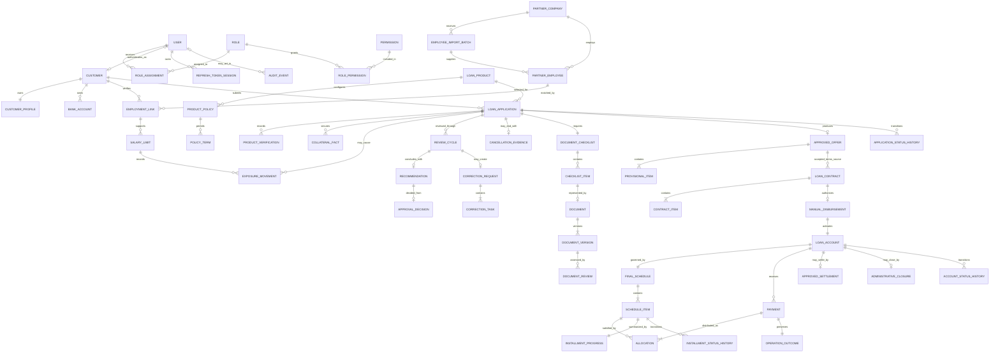

# MER-DB-001 — Data Model and ERD

## 1. Purpose and Authority

This document defines Meridian's high-level logical data model, important relationships, bounded-context ownership at rest, and durable integrity concepts.

Flyway migrations under `meridian-platform/src/main/resources/db/migration` are the executable physical-schema authority. `MER-DB-CURRENT-SCHEMA.sql` is the checked-in human-readable snapshot of the resulting physical schema. This document does not replace either source with a table-by-table DDL inventory or migration history.

`MER-BIZ-001-business-requirements-and-workflows.md` owns business workflow and policy. `MER-ARCH-001-bounded-contexts.md` owns bounded-context collaboration. This document explains how the important records and relationships preserve those decisions in the data model.

## 2. Model Boundary

The logical model covers:

- Identity users, roles, permissions, refresh-token sessions, access-token revocations, and the optional association from a login user to a Customer;
- Customer profile, protected identity evidence, and Customer-owned bank accounts;
- Partner Companies, employee imports, Partner Employees, and reusable Customer–Partner Employee links;
- the common LoanApplication lifecycle for Salary Advance, Unsecured Consumer Loan, and Collateral Loan;
- product-specific application facts, verification, and Salary Advance exposure;
- review, correction, recommendation, and approval evidence;
- document checklists, logical documents, immutable versions, and review decisions;
- approved offers, operational contracts, protected contract-bound destinations, manual disbursement, LoanAccounts, final schedules, repayment, overdue state, settlement, and closure;
- append-only business audit and lifecycle histories.

Meridian uses one PostgreSQL database. Sharing a database does not create shared aggregate ownership: each bounded context owns its records and exposes cross-context facts through application contracts rather than persistence access.

## 3. Current Physical Schema and Planned Concepts

The physical schema is the result of Flyway migrations V1 through V49. The schema snapshot covers that range and includes the executable data foundations for all three lending products through LoanAccount closure and Identity session invalidation.

The logical ERD in Section 5 uses singular business concepts rather than exact table and column names. Section 6 maps those concepts to the important physical record groups. Exact columns, constraints, triggers, indexes, seed values, and migration preflight logic remain in Flyway and `MER-DB-CURRENT-SCHEMA.sql`.

The V49 physical schema does not contain OCR tables, a general ledger, external-payment reconciliation tables, or production compliance case-management tables. Section 11 separates planned concepts from the current model.

The physical `event_publication` table is Spring Modulith infrastructure. It is omitted from the business ERD because it does not own lending state or redefine the synchronous transaction boundaries documented in `MER-ARCH-006-api-request-flow-and-dependencies.md`.

## 4. Design Principles

1. Common lending records represent shared lifecycle concepts; product-specific records exist where a product has distinct facts or invariants.
2. Cross-context relationships use stable identifiers. A foreign key does not transfer bounded-context ownership.
3. Mutable source data and immutable historical snapshots remain separate.
4. Workflow states, financial outcomes, and the evidence that authorizes them are explicit and auditable.
5. Accepted offer terms, operational contract versions, final schedules, payments, allocations, and terminal-operation outcomes are immutable historical evidence.
6. Customer identity references, Customer bank-account numbers, and Loan-owned contract destinations use their purpose-specific protection models.
7. Whole-VND and reconciliation invariants are enforced at the domain and database boundaries where a persistence defect could create inconsistent financial evidence.
8. Audit records observe business outcomes; they do not replace the authoritative aggregate or financial record.
9. Planned data concepts are labelled as planned and do not appear in the current ERD.

## 5. High-Level Logical ERD

```mermaid
erDiagram
    USER ||--o{ ROLE_ASSIGNMENT : receives
    ROLE ||--o{ ROLE_ASSIGNMENT : assigned_to
    ROLE ||--o{ ROLE_PERMISSION : grants
    PERMISSION ||--o{ ROLE_PERMISSION : included_in
    USER o|--o| CUSTOMER : authenticates_as
    USER ||--o{ REFRESH_TOKEN_SESSION : owns

    CUSTOMER ||--|| CUSTOMER_PROFILE : owns
    CUSTOMER ||--o{ BANK_ACCOUNT : owns
    CUSTOMER ||--o{ EMPLOYMENT_LINK : verifies
    PARTNER_COMPANY ||--o{ EMPLOYEE_IMPORT_BATCH : receives
    EMPLOYEE_IMPORT_BATCH ||--o{ PARTNER_EMPLOYEE : supplies
    PARTNER_COMPANY ||--o{ PARTNER_EMPLOYEE : employs
    PARTNER_EMPLOYEE ||--o{ EMPLOYMENT_LINK : matched_by

    LOAN_PRODUCT ||--o{ PRODUCT_POLICY : configures
    PRODUCT_POLICY ||--o{ POLICY_TERM : permits
    CUSTOMER ||--o{ LOAN_APPLICATION : submits
    LOAN_PRODUCT ||--o{ LOAN_APPLICATION : selected_for

    LOAN_APPLICATION ||--o{ PRODUCT_VERIFICATION : records
    LOAN_APPLICATION ||--o{ COLLATERAL_FACT : secures
    EMPLOYMENT_LINK ||--o{ SALARY_LIMIT : supports
    SALARY_LIMIT ||--o{ EXPOSURE_MOVEMENT : records
    LOAN_APPLICATION ||--o{ EXPOSURE_MOVEMENT : may_cause

    LOAN_APPLICATION ||--o{ REVIEW_CYCLE : reviewed_through
    REVIEW_CYCLE ||--o| RECOMMENDATION : concludes_with
    RECOMMENDATION ||--o| APPROVAL_DECISION : decided_from
    REVIEW_CYCLE ||--o| CORRECTION_REQUEST : may_create
    CORRECTION_REQUEST ||--|{ CORRECTION_TASK : contains
    LOAN_APPLICATION ||--o| CANCELLATION_EVIDENCE : may_end_with

    LOAN_APPLICATION ||--|| DOCUMENT_CHECKLIST : requires
    DOCUMENT_CHECKLIST ||--o{ CHECKLIST_ITEM : contains
    CHECKLIST_ITEM ||--o| DOCUMENT : represented_by
    DOCUMENT ||--|{ DOCUMENT_VERSION : versions
    DOCUMENT_VERSION ||--o{ DOCUMENT_REVIEW : assessed_by

    LOAN_APPLICATION ||--o| APPROVED_OFFER : produces
    APPROVED_OFFER ||--|{ PROVISIONAL_ITEM : contains
    APPROVED_OFFER ||--o{ LOAN_CONTRACT : accepted_terms_source
    LOAN_CONTRACT ||--|{ CONTRACT_ITEM : contains
    LOAN_CONTRACT ||--o| MANUAL_DISBURSEMENT : authorizes
    MANUAL_DISBURSEMENT ||--|| LOAN_ACCOUNT : activates
    LOAN_ACCOUNT ||--|| FINAL_SCHEDULE : governed_by
    FINAL_SCHEDULE ||--|{ SCHEDULE_ITEM : contains

    LOAN_ACCOUNT ||--o{ PAYMENT : receives
    PAYMENT ||--|{ ALLOCATION : distributed_as
    SCHEDULE_ITEM ||--o{ ALLOCATION : satisfied_by
    SCHEDULE_ITEM ||--|| INSTALLMENT_PROGRESS : summarized_by
    PAYMENT ||--|| OPERATION_OUTCOME : preserves
    LOAN_ACCOUNT ||--o| APPROVED_SETTLEMENT : may_settle_by
    LOAN_ACCOUNT ||--o| ADMINISTRATIVE_CLOSURE : may_close_by

    LOAN_APPLICATION ||--o{ APPLICATION_STATUS_HISTORY : transitions
    LOAN_ACCOUNT ||--o{ ACCOUNT_STATUS_HISTORY : transitions
    SCHEDULE_ITEM ||--o{ INSTALLMENT_STATUS_HISTORY : transitions
    USER o|--o{ AUDIT_EVENT : may_act_in
```

The diagram shows ownership-relevant relationships, not a required physical-table or foreign-key inventory. Product verification is realized by distinct Salary Advance, UCL, and Collateral records described below.

## 6. Record Groups and Ownership

### 6.1 Identity and Access

Identity owns `users`, `roles`, `permissions`, `role_assignments`, `role_permissions`, `refresh_token_sessions`, and `access_token_revocations`.

- A Customer login is associated through `users.customer_id`; Staff users have no Customer association.
- Roles and permissions preserve RBAC assignment separately from business records.
- Access tokens remain self-contained RS256 credentials. Current-session logout stores only the presented valid token's `jti`, revocation time, and expiry so authentication can reject that token until it expires.
- Refresh-token sessions store only a SHA-256 digest of each opaque token, its user and token-family relationship, issuance and expiry, and consumption or revocation state.
- Successful rotation consumes one locked session and creates one replacement in the same family. Detected reuse revokes the family so no replacement session remains active.
- Actor references from other contexts identify who performed an action; they do not make Identity the owner of the action's business evidence.

### 6.2 Customer

Customer owns `customers`, `customer_profiles`, and `customer_bank_accounts`.

- The Customer record preserves aggregate status, verification status, and profile-completion state.
- The profile preserves contact, employment, consent, and protected identity-reference evidence.
- Bank-account records preserve mutable source ownership, primary/active state, safe display fields, protected account number, and internal duplicate-detection fingerprint.
- One Customer may own multiple bank accounts, but Customer enforces the primary-account invariant for active accounts.

Customer owns the mutable source account. Loan does not share or copy Customer's ciphertext or fingerprint. When an accepted offer proceeds to contract, Loan obtains eligible destination facts through Customer's contract and owns a separate immutable, purpose-protected contract snapshot.

### 6.3 Partner

Partner owns `partner_companies`, `partner_employee_import_batches`, `partner_employees`, and `customer_partner_employee_links`.

- A Partner Company has ordered employee-import batches and Partner Employee source rows.
- The authoritative employment source is tied to its company and import batch.
- A Customer–Partner Employee link records a reusable verified relationship; it is not a loan application and does not represent lending exposure.
- Partner salary, employee code, source identity evidence, employment state, and import-batch evidence remain Partner-owned.

Loan consumes a purpose-limited eligibility snapshot for Salary Advance. Loan owns the resulting application verification and Salary Advance exposure; Partner does not.

### 6.4 Loan Product, Application, and Product Evidence

Loan owns `loan_products`, `loan_product_policies`, `loan_product_policy_terms`, and `loan_applications`.

- The product records define the active catalogue, amount range, pricing/configuration values, allowed terms, repayment method, and offer validity used by executable policies.
- A LoanApplication preserves product code/type and requested terms as historical application facts.
- Common application state is not split into product-specific application aggregates.

Product-specific Loan records preserve distinct evidence:

| Product | Logical records | Durable responsibility |
|---|---|---|
| Salary Advance | `salary_advance_limits`, `salary_advance_limit_movements`, `salary_advance_verifications` | Current total/used/reserved/available exposure, exact exposure movements, and the immutable Partner/limit snapshot used by one application. |
| UCL | `unsecured_consumer_loan_verifications` | Immutable numbered verification cycles; the highest sequence is authoritative and a later cycle links to its source correction. |
| Collateral Loan | `collaterals`, `collateral_loan_verifications` | Customer-submitted asset facts and immutable numbered manual-verification cycles. |

The public Collateral origination contract creates exactly one `collaterals` row. The physical relationship deliberately permits more than one row so the schema does not permanently prevent an approved multi-asset evolution. Current verification fails safely if the one-asset public invariant is violated. Estimated value supports manual assessment only; the model contains no loan-to-value decision or valuation result.

UCL and Collateral pending verification rows contain no completion evidence. A terminal `VERIFIED`, `FAILED`, or `REQUIRES_MORE_INFORMATION` result requires the authoritative reviewer, completion time, and restricted assessment note. Completed cycles and their identity/source linkage are immutable.

Collateral ownership evidence is Document-owned. Loan and Document associate the Collateral application and `COLLATERAL_OWNERSHIP_EVIDENCE` through the application checklist; `collaterals` has no ownership-document foreign key.

### 6.5 Review, Correction, and Cancellation

Loan owns `loan_application_review_cycles`, `loan_correction_requests`, `loan_correction_tasks`, and `loan_application_cancellations`.

- Review cycles provide ordered application-review history and identify the active cycle.
- A correction request records its source decision, audience, reason, lifecycle, and resubmission evidence.
- Correction tasks preserve responsible party, document scope, proof baseline, audience-specific instruction, and completion identity.
- Customer and Staff tasks remain distinct even when one mixed correction request contains both.
- Cancellation evidence records the idempotent Customer command that abandons a returned correction. It requires an exact reservation-release reference for Salary Advance and no exposure reference for UCL. Collateral cancellation is not part of this physical/application contract.

Requested terms and submitted Collateral facts remain outside correction-task mutation. Product-specific resubmission creates or reuses the verification evidence required by the business workflow.

### 6.6 Approval

Approval owns `review_recommendations` and `approval_decisions`.

- A recommendation belongs to one Loan-owned review cycle for the same application.
- A decision belongs to one recommendation.
- Separate Loan Officer and Approver actor evidence supports maker-checker validation.
- Recommendation and decision rows remain immutable historical authority; Loan owns the resulting application transition and approved offer.

### 6.7 Document

Document owns `document_checklists`, `document_checklist_items`, `documents`, `document_versions`, and `document_review_decisions`.

- A checklist belongs to one LoanApplication and checklist stage and contains product-resolved items.
- One logical document belongs to a checklist item and points to its current immutable version.
- A document version preserves upload request identity, predecessor, safe filename, detected media type, size/hash metadata, opaque storage key, uploader, and upload time.
- A review decision targets an exact immutable version and records accept, waive, or replacement outcome with its request identity and restricted evidence.
- Replacement is represented by a review decision plus the Loan-owned correction request/task; there is no separate document-replacement table.
- Waiver is represented by an authorized review decision; there is no separate document-waiver table.

Upload completeness and processing readiness are separate. Document owns document/version/review state; Loan owns product verification and application progression.

### 6.8 Offer, Contract, and Activation

Loan owns `approved_offers`, `approved_offer_repayment_items`, `loan_contracts`, `loan_contract_repayment_items`, `manual_disbursements`, `loan_accounts`, `repayment_schedules`, and `repayment_schedule_items`.

- One approved application may produce one immutable approved offer and its reconciled provisional items.
- An accepted offer may produce versioned operational contracts. Each contract copies the accepted financial terms and items and captures one immutable destination snapshot.
- Regeneration creates a new contract version rather than mutating an acknowledged version.
- A manual disbursement records one externally completed transfer and activates one LoanAccount.
- Activation creates one authoritative final schedule whose items copy the contract amounts and apply the controlled repayment dates.
- The operational contract and final schedule are backend evidence, not generated legal documents or e-signature records.

Salary Advance activation converts the exact reserved principal to used exposure. UCL and Collateral activation use the common account/disbursement/schedule model without any Salary Advance movement.

### 6.9 Repayment, Settlement, and Closure

Loan owns `repayment_transactions`, `repayment_allocations`, `repayment_installment_progress`, `repayment_operation_outcomes`, `loan_account_status_transitions`, `repayment_installment_status_transitions`, `approved_loan_settlements`, and `loan_account_closures`.

- Payment transactions distinguish ordinary `REPAYMENT` from `APPROVED_SETTLEMENT` while sharing allocation and reconciliation.
- Allocations preserve ordered installment/component application; progress records summarize paid and outstanding components without changing the final schedule.
- Durable operation outcomes preserve exact replay results independently of later LoanAccount state.
- Account and installment histories preserve ordered state changes.
- Administrative Full-Balance Settlement has a separate immutable authorization record linked to its payment transaction.
- Administrative closure has a separate immutable record and occurs only after financial settlement.

Ordinary exact payoff and Administrative Full-Balance Settlement produce `SETTLED`; only the separate administrative command produces `CLOSED`. Salary Advance repayment and settlement release exactly newly allocated principal. UCL and Collateral preserve `principal_released = 0` and no Salary Advance conversion or release movement.

### 6.10 Audit and Histories

Audit owns append-only `audit_events`. Loan owns `loan_application_status_transitions` and the account/installment histories described above.

Audit events preserve operation, actor, action, entity, time, and a controlled PII-safe payload. They are observational evidence, not the source of current application, account, document, approval, or financial state. Generic audit entity identity is intentionally not a polymorphic aggregate foreign key.

## 7. Cross-Context Relationship Rules

- `users.customer_id` associates authentication with a Customer; Customer remains the owner of the profile and bank accounts.
- LoanApplication references Customer and product identity, but Loan does not own Customer source data or Identity access state.
- Partner owns the reusable employment relationship and source evidence. Loan owns Salary Advance application verification, limits, movements, and lending exposure.
- Customer owns mutable source bank accounts. Loan owns only the immutable destination snapshot bound to a contract version.
- Document owns checklist, logical document, version, and review state. Loan owns application verification, correction orchestration, and lifecycle state.
- Approval owns recommendation and decision evidence. Loan owns review cycles, application transitions, offers, contracts, activation, and servicing.
- Audit observes important outcomes without becoming the owner of those outcomes.
- Cross-context actor and aggregate identifiers provide traceability. They do not authorize direct repository, JPA entity, or table access by another context.

## 8. Integrity Model

### 8.1 Identity, Customer, and Partner

- Normalized user email, Customer number, and stable business codes are unique within their namespaces.
- Refresh-token digests are unique, each token expires after issuance, and at most one unconsumed, unrevoked token remains active in a family.
- Access-token revocation identity is unique, and each revocation expires after it is recorded. Repeated invalidation cannot create duplicate revocation state.
- Customer protected identity evidence and bank-account fingerprints support duplicate detection without exposing plaintext through normal reads.
- A primary Customer bank account must be active and owned by that Customer.
- Partner Employee rows remain tied to their Partner Company and import batch.
- Reusable employment-link uniqueness and state prevent conflicting active relationships for the same authoritative source evidence.

### 8.2 Application and Product Evidence

- Product code/type on a LoanApplication must match the selected Loan Product and remain immutable.
- Requested amount and persisted financial terms use whole VND; allowed amount and term rules come from the selected product policy.
- Database uniqueness is the final persistence guard against conflicting blocking applications for the same Customer and product; runtime serialization is defined by the application transaction flow.
- Salary Advance total, used, reserved, and available balances reconcile with movements and application/account references.
- UCL and Collateral verification sequences are positive and unique per application; only the highest sequence is authoritative.
- A later verification cycle links to one resubmitted correction for the same application and follows a completed earlier cycle.
- Collateral fact text is trimmed and nonblank, type is controlled, and estimated value is positive whole VND.

### 8.3 Review, Correction, Document, and Approval

- At most one review cycle is active for an application.
- Recommendation/cycle and decision/recommendation relationships preserve same-application provenance.
- Maker-checker prevents the recommending Loan Officer from recording the Approver decision.
- Correction task actor, scope, document type, checklist item, and proof baseline must form an allowed product-specific combination.
- Logical documents have ordered immutable versions and one current-version pointer.
- Upload, review, completion, resubmission, and cancellation request identities cannot represent conflicting logical content.
- Review decisions target the exact current version where the operation requires current evidence.

### 8.4 Offer, Contract, and Activation

- One approved offer belongs to one application; provisional items reconcile to the approved principal, interest, fee, total, and term.
- Contract application/offer/customer relationships and copied financial items must reconcile.
- Contract financial terms, repayment items, and destination protection envelope are immutable. Only controlled lifecycle metadata changes.
- One application may have only one current non-superseded contract version.
- A `DISBURSED` application, manual disbursement, LoanAccount, final schedule, schedule items, status history, and required audit evidence reconcile as one activation outcome.
- External transfer references and command request identities are unique under their normalized semantics.

### 8.5 Servicing and Terminal State

- Payment amounts, allocations, balances, schedules, and progress use whole VND and reconcile by principal, interest, fee, and total.
- Canonical external payment references are unique; replay uses the durable operation outcome rather than recalculating later state.
- The immutable final schedule remains contractual obligation evidence. Payment and progress records do not rewrite it.
- `ACTIVE`/`OVERDUE` state follows stored servicing progress and the UTC evaluation date.
- `SETTLED` and `CLOSED` require zero contractual outstanding and fully reconciled installment progress.
- Approved settlement evidence reciprocally matches one full-balance payment, its allocations/outcome, account history, audit, and product-specific exposure effect.
- Closure evidence reciprocally matches one `SETTLED -> CLOSED` transition and its audit evidence without changing payments, schedules, progress, balances, exposure, or LoanApplication state.

Exact constraint and trigger definitions remain in Flyway and the current schema snapshot.

## 9. Sensitive Data at Rest

- Identity never persists a raw access or refresh token. Access-token revocation stores only `jti` and lifetime metadata. The refresh-token SHA-256 digest supports exact lookup and reuse detection for a cryptographically random high-entropy token.
- Customer identity references and source bank-account numbers use Customer-owned encryption envelopes. Deterministic fingerprints are internal duplicate-detection evidence.
- Loan contract destinations use a separate Loan-owned, purpose-bound protection envelope. Loan must not reuse Customer ciphertext or fingerprint as contract evidence.
- Partner salary, employee code, identity evidence, and import-source data are restricted Partner records.
- Document binaries remain behind the storage abstraction. Database records contain an opaque storage key and safe integrity/metadata fields, not document content or extracted OCR text.
- UCL and Collateral assessment notes, internal recommendation/decision notes, correction contents, canonical transfer/payment references, and operation actors are restricted evidence.
- Audit payloads use controlled identifiers, states, reason codes, and safe snapshots rather than raw sensitive values.

The API disclosure contract is defined in `../api/MER-API-001-endpoints-and-postman-scenarios.md`.

## 10. Query and Indexing Concerns

Physical indexes belong in Flyway and the schema snapshot. The logical model requires efficient access for:

- normalized authentication and RBAC lookup;
- unexpired access-token revocation lookup and expiry-based maintenance;
- refresh-token digest lookup, per-token locking, and family revocation;
- Customer profile, primary bank account, and product-readiness lookup;
- Partner Company/import/employee lookup and current employment-link resolution;
- Customer/product application serialization and lifecycle queues;
- authoritative product-verification and active review/correction lookup;
- current document versions and bounded document/Staff correction queues;
- offer, current contract, LoanAccount, and final-schedule reads by application;
- repayment history ordered by recording time and transaction identity;
- bounded overdue candidates and account/installment progress;
- application, account, installment, and audit histories ordered by their durable sequence/time keys.

## 11. Planned Extensions

Planned concepts remain outside the current ERD and physical-schema claim.

### 11.1 OCR-Assisted Document Processing

Document may later own OCR job and result records for claim/lease state, attempts, extracted fields, confidence, model metadata, and trace correlation. OCR remains advisory and asynchronous. Manual Document review remains authoritative for acceptance, waiver, replacement, and processing readiness.

### 11.2 External Financial and Operational Records

Payment-provider reconciliation, bank/payroll integration, general-ledger/journal records, collections, concessions/write-off, reversal/refund, suspense cash, production compliance case management, and broader analytics/read models require separately approved designs. They are not represented as deployed tables in this document.

`../project/MER-TRACK-001-follow-up-register.md` owns delivery gaps and deferred-work status.

## 12. References

- Business rules and lifecycle outcomes: `../business/MER-BIZ-001-business-requirements-and-workflows.md`
- Context ownership and collaboration: `../architecture/MER-ARCH-001-bounded-contexts.md`
- Runtime transactions and security boundaries: `../architecture/MER-ARCH-006-api-request-flow-and-dependencies.md`
- Client-facing HTTP contract: `../api/MER-API-001-endpoints-and-postman-scenarios.md`
- Executable schema history: `../../meridian-platform/src/main/resources/db/migration`
- Current physical schema snapshot: `MER-DB-CURRENT-SCHEMA.sql`
- Deferred work and unresolved decisions: `../project/MER-TRACK-001-follow-up-register.md`
